# Survey Engine Architecture Flows
## Product: Headless Multi-Tenant Survey Engine (SaaS)
## Version: 1.0
## Date: March 2, 2026

## 1. Purpose
This document describes implementation-facing system flows using both ASCII and Mermaid diagrams. It aligns with:
- `survey-engine-srs.md`
- `survey-engine-srs-implementation-ready.md`

Scope covered:
- Subscription bootstrap onboarding
- External authentication and internal authorization (RBAC)
- Survey authoring and publish lifecycle
- Campaign orchestration, roster sync, and assignment policy execution
- Respondent runtime and response ingestion
- Reporting and analytics
- Anonymity-preserving reporting and eligibility enforcement
- Webhook delivery and retries
- Setup-later fallback and expiry enforcement

---

## 2. Architecture Overview

### 2.1 ASCII Component View
```text
+------------------------+       +------------------------+
| Customer IdP (OIDC/    |       | Customer Systems       |
| SAML)                  |       | (CRM, Slack, ETL, etc) |
+-----------+------------+       +------------+-----------+
            |                                 ^
            | tokens/assertions               | webhooks/events
            v                                 |
+-----------+--------------------------------------------------+
|                 Survey Engine Platform                        |
|                                                               |
|  +-------------------+    +-------------------------------+   |
|  | API Gateway/Auth  |<-->| Tenant & Access Service      |   |
|  | (token verify)    |    | (RBAC, policies, onboarding) |   |
|  +---------+---------+    +---------------+---------------+   |
|            |                              |                   |
|            v                              v                   |
|  +-------------------+    +-------------------------------+   |
|  | Survey Definition |<-->| Rules/Validation Engine       |   |
|  | Service           |    | (logic graph, constraints)    |   |
|  +---------+---------+    +---------------+---------------+   |
|            |                              |                   |
|            v                              v                   |
|  +-------------------+    +-------------------------------+   |
|  | Survey Runtime    |--->| Response Ingestion Service    |   |
|  | Service           |    | (partial/complete, quality)   |   |
|  +---------+---------+    +---------------+---------------+   |
|            |                              |                   |
|            v                              v                   |
|  +-------------------+    +-------------------------------+   |
|  | Campaign &        |<-->| Audience/Roster Adapter       |   |
|  | Assignment Engine |    | (API/CSV/connectors)          |   |
|  +---------+---------+    +---------------+---------------+   |
|            |                              |                   |
|            v                              v                   |
|  +-------------------+    +-------------------------------+   |
|  | Analytics/Report  |<---| Data Stores (OLTP + analytics)|   |
|  | Service           |    | + object storage              |   |
|  +---------+---------+    +---------------+---------------+   |
|            |                              |                   |
|            v                              v                   |
|  +-------------------+    +-------------------------------+   |
|  | Integration &     |--->| Notification Service          |   |
|  | Webhook Service   |    | (email/invite)               |   |
|  +-------------------+    +-------------------------------+   |
|                                                               |
+---------------------------------------------------------------+
            ^
            |
            | REST/SDK/Embed
            |
+-----------+------------+
| Admin UI / SDK / Embed |
+------------------------+
```

### 2.2 Mermaid Component Diagram
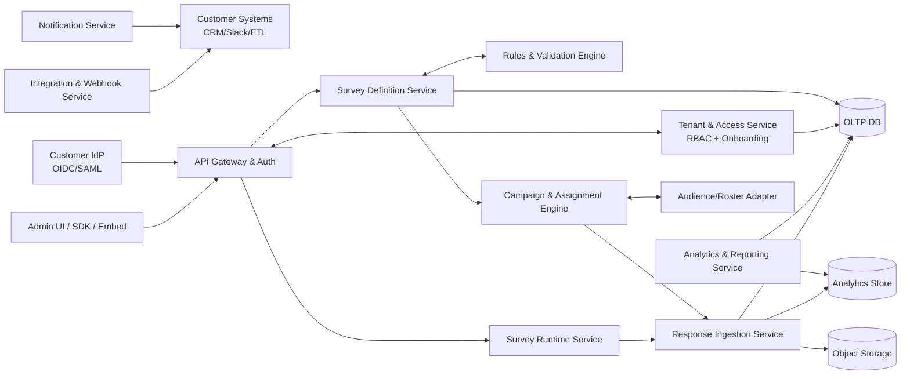

---

## 3. Flow: Subscription Bootstrap Onboarding

### 3.1 Intent
Enable a new subscriber to configure external authentication and activate tenant administration without platform-team manual steps.

### 3.2 ASCII Sequence
```text
Subscriber Admin     Subscription Svc   Survey Engine     Customer IdP
      |                     |                |                 |
1. Subscribe                |                |                 |
      |-------------------->|                |                 |
2. Create tenant(workspace,onboarding)       |                 |
      |                     |--------------->|                 |
3. Return onboarding URL                     |                 |
      |<--------------------|                |                 |
4. Open onboarding wizard                    |                 |
      |------------------------------------->|                 |
5. Enter IdP metadata + claim mappings       |                 |
      |------------------------------------->|                 |
6. Validate IdP config                                         |
      |------------------------------------->|---------------->|
      |                                      |<----------------|
7. Validation success/failure                |                 |
      |<-------------------------------------|                 |
8. First SSO login                           |                 |
      |------------------------------------->|---------------->|
      |                                      |<----------------|
9. Map claims->role (TenantAdmin), activate tenant            |
      |                                      |                 |
10. Access admin console                     |                 |
      |<-------------------------------------|                 |
```

### 3.3 Mermaid Sequence
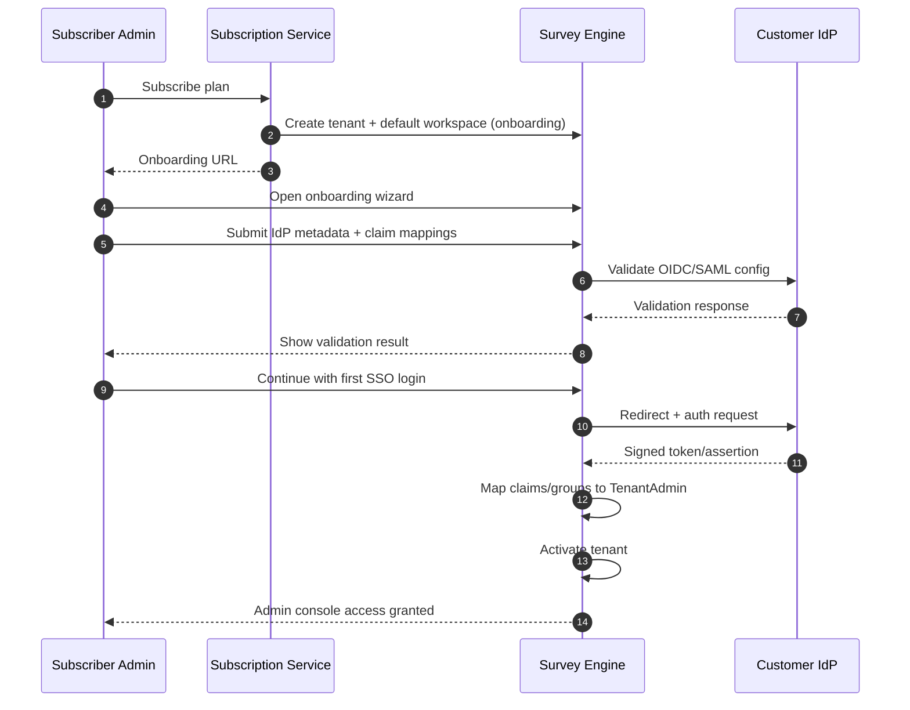

---

## 4. Flow: External Authentication + Internal RBAC Authorization

### 4.1 Key Rule
Authentication is external. Authorization is internal.

### 4.2 ASCII Decision Flow
```text
[Request to Admin API]
          |
          v
[Verify token/assertion with IdP trust config]
          |
    +-----+-----+
    | valid?    |
    +-----+-----+
          |yes
          v
[Extract claims: subject,email,groups,tenant_hint]
          |
          v
[Resolve tenant + workspace context]
          |
    +-----+-----+
    | mapped?   |
    +-----+-----+
          |yes
          v
[Map claims/groups -> platform role]
          |
          v
[Check permission for action]
          |
    +-----+-----+
    | allowed?  |
    +-----+-----+
      |yes |no
      v    v
   [200] [403]

invalid token -> [401]
unmapped tenant -> [403]
expired setup-later bootstrap -> [423/403]
```

### 4.3 Mermaid Flowchart
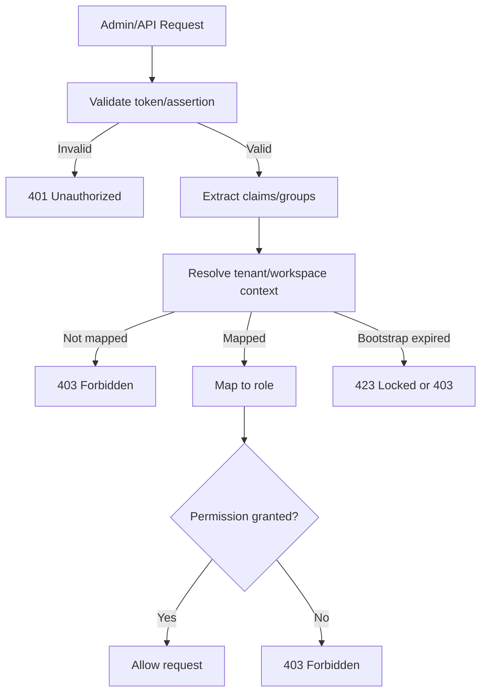

---

## 5. Flow: Survey Authoring and Publish Lifecycle

### 5.1 ASCII Sequence
```text
Manager/Admin       Admin UI        Survey Definition    Rules Engine
    |                  |                    |                |
1. Create draft        |                    |                |
    |----------------->|------------------->|                |
2. Add questions/media/logic               |                |
    |----------------->|------------------->|                |
3. Validate survey schema and logic graph                   |
    |----------------->|------------------->|--------------->|
    |                  |                    |<---------------|
4. Save draft/version                      |                |
    |                  |<-------------------|                |
5. Publish request                          |                |
    |----------------->|------------------->|                |
6. Optional approval path                   |                |
7. Publish immutable version                |                |
    |                  |<-------------------|                |
8. Generate link/embed config               |                |
```

### 5.2 Mermaid Sequence
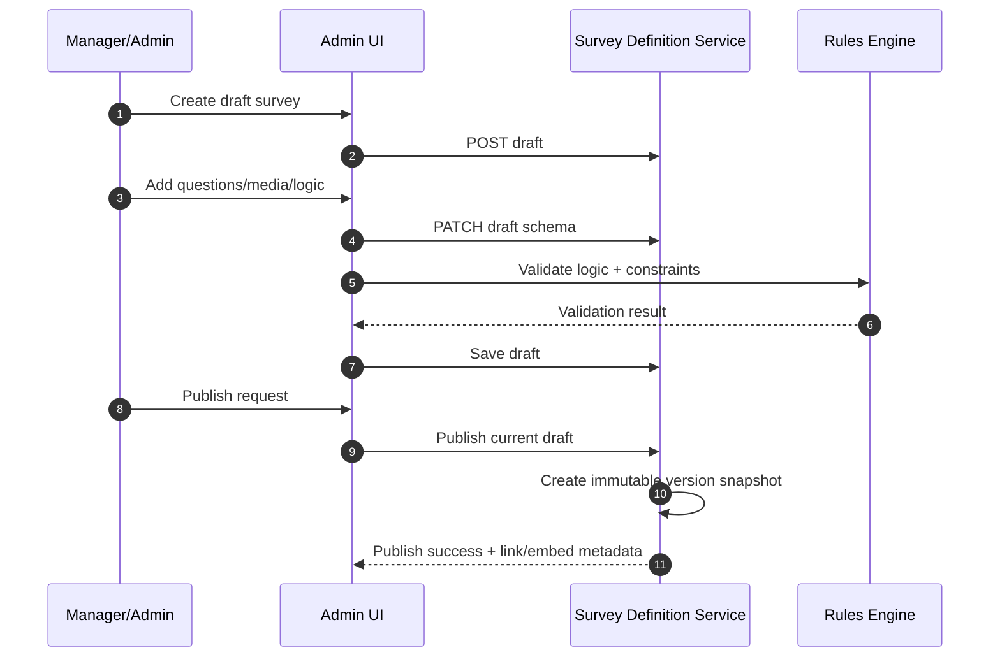

---

## 6. Flow: Respondent Runtime and Response Ingestion

### 6.1 ASCII Sequence
```text
Respondent      Runtime Service     Rules Engine    Response Ingestion   Storage
    |                 |                 |                 |               |
1. Open link/embed    |                 |                 |               |
    |---------------->|                 |                 |               |
2. Access checks (password/captcha/ip/email/quota/time)                  |
    |                 |---------------> |                 |               |
    |                 |<--------------- |                 |               |
3. Render first page with logic                               
    |<----------------|                 |                 |               |
4. Submit answers/page
    |---------------->|                 |                 |               |
5. Validate answer + apply skip/display logic
    |                 |---------------> |                 |               |
    |                 |<--------------- |                 |               |
6. Save partial (optional)
    |                 |----------------------------------->|------------->|
7. Final submit
    |---------------->|----------------------------------->|------------->|
8. Mark complete + quality flags
    |                 |                                    |------------->|
9. Show finish message
    |<----------------|                                    |               |
```

### 6.2 Mermaid Sequence
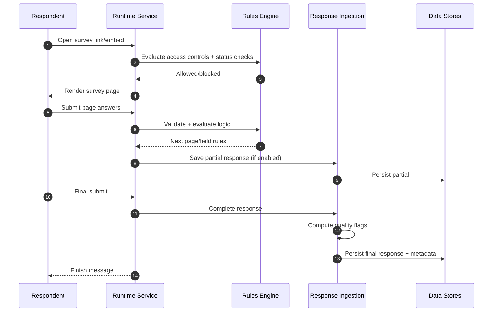

---

## 7. Flow: Campaign Setup, Roster Sync, and Assignment

### 7.1 ASCII Sequence
```text
Manager/Admin      Campaign Engine      Roster Adapter      External Source
    |                    |                    |                    |
1. Create campaign       |                    |                    |
    |------------------->|                    |                    |
2. Attach survey version |                    |                    |
    |------------------->|                    |                    |
3. Configure rules (evaluator->target, constraints)             |
    |------------------->|                    |                    |
4. Trigger roster sync                        |                    |
    |------------------->|------------------->|------------------->|
    |                    |                    |<-------------------|
5. Validate/map records  |<-------------------|                    |
6. Generate assignment instances + constraint keys               |
    |<-------------------|                    |                    |
7. Activate campaign     |                    |                    |
    |------------------->|                    |                    |
```

### 7.2 Mermaid Sequence
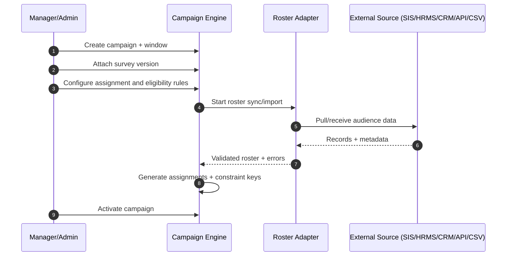

---

## 8. Flow: Reporting and Analytics

### 8.1 ASCII Pipeline
```text
[Responses + Metadata] --> [Ingestion/Normalization] --> [Analytics Store]
                                               |                  |
                                               v                  v
                                          [Quality Flags]   [Aggregations]
                                                                 |
                                                                 v
                                                   [Dashboard + Reports API]
                                                                 |
                                                                 v
                                                         [Admin UI / Export]
```

### 8.2 Mermaid Flowchart
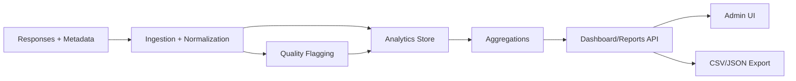

---

## 9. Flow: Anonymity-Preserving Reporting and Eligibility

### 9.1 ASCII Decision Flow
```text
[Incoming Response]
        |
        v
[Resolve campaign policy]
        |
   +----+----+
   | anonymous? |
   +----+----+
        |yes
        v
[Store identity-linking key in restricted store]
        |
        v
[Run dedup/eligibility check using protected key]
        |
        v
[Persist response payload without direct identity in report layer]
        |
        v
[Report query]
        |
   +----+----+
   | sample >= threshold? |
   +----+----+
     |yes |no
     v    v
 [show] [suppress segment]
```

### 9.2 Mermaid Flowchart
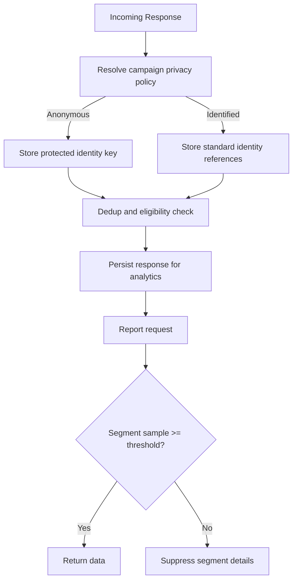

---

## 10. Flow: Webhook Delivery and Retry

### 10.1 ASCII Sequence
```text
Survey Engine       Webhook Service      Customer Endpoint
     |                     |                    |
1. Event occurs            |                    |
     |-------------------->|                    |
2. Sign payload + deliver  |------------------->|
3. 2xx?                    |<-------------------|
   | yes                                      
   v
 [mark delivered]

if non-2xx/timeout:
  retry with backoff -> attempt N -> dead-letter after max attempts
```

### 10.2 Mermaid Sequence
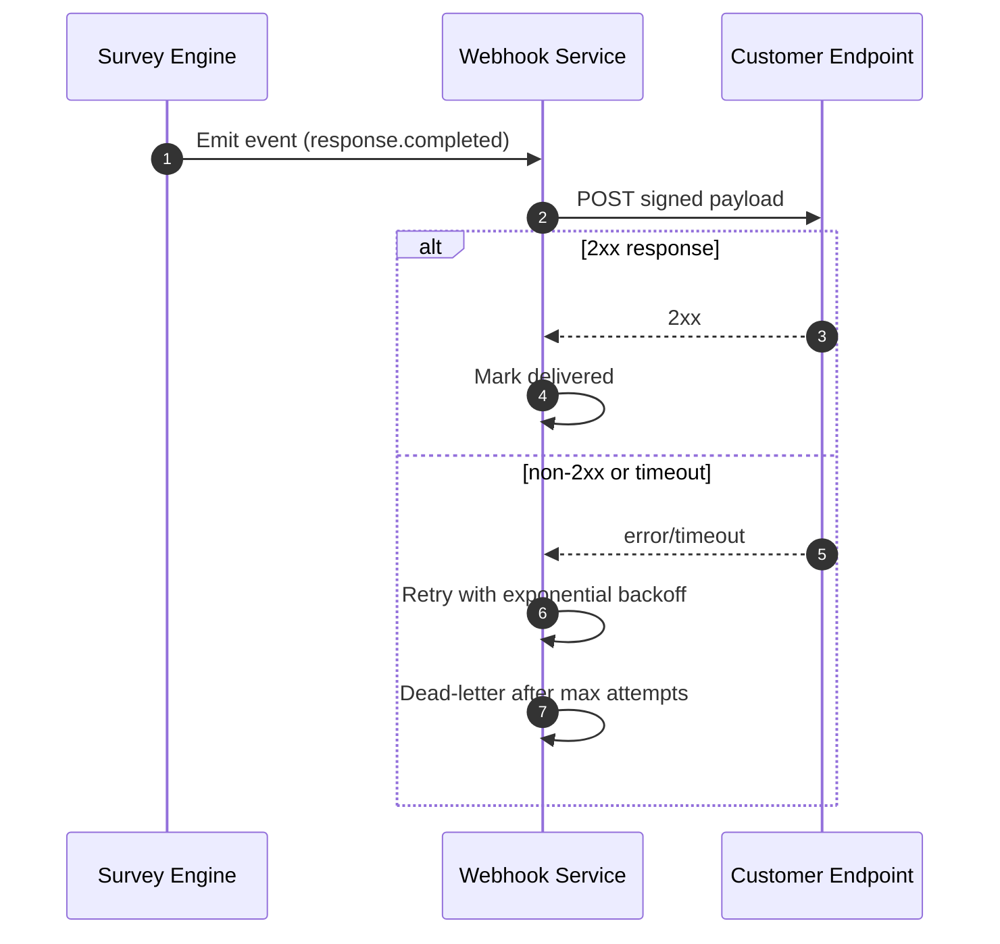

---

## 11. Flow: Setup-Later Mode and Enforcement

### 11.1 ASCII State Machine
```text
[onboarding]
    |
    | setup-later selected
    v
[bootstrap_active_until_T]
    |
    | time < T
    | allow limited admin actions
    v
[restricted_publish]
    |
    | complete IdP setup + first mapped admin login
    v
[active]

if time >= T and not configured:
[bootstrap_expired] -> block publish/distribution until resolved
```

### 11.2 Mermaid State Diagram
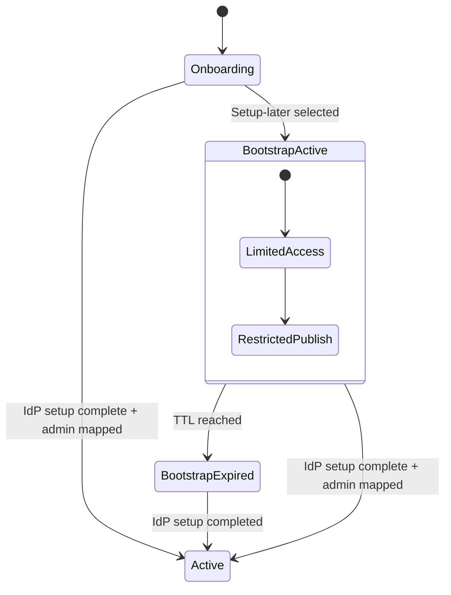

---

## 12. Deployment and Runtime Topology

### 12.1 ASCII Topology
```text
                    +----------------------+
Internet/API -----> | API Gateway / WAF    |
                    +----------+-----------+
                               |
                +--------------+---------------+
                |                              |
        +-------v--------+            +--------v--------+
        | App Services   |            | Async Workers   |
        | (stateless)    |            | (webhooks/jobs) |
        +-------+--------+            +--------+--------+
                |                              |
        +-------v------------------------------v-------+
        | Data Layer: OLTP DB, Cache, Queue, Object    |
        | Storage, Analytics Warehouse                  |
        +-------------------------+---------------------+
                                  |
                          +-------v-------+
                          | Observability |
                          | logs/metrics  |
                          +---------------+
```

### 12.2 Mermaid Deployment Diagram
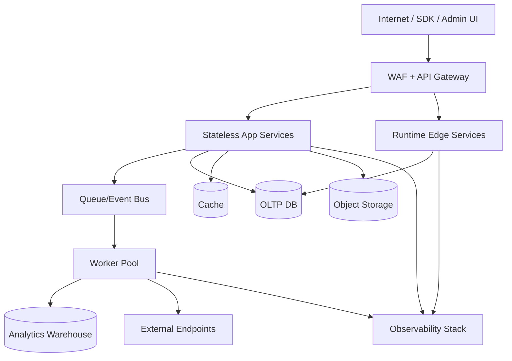

---

## 13. Operational Guardrails
- Every API request must carry tenant context resolved from trusted claims or scoped keys.
- All privileged mutations must produce audit events.
- Publish endpoints are blocked when tenant onboarding/auth setup is incomplete or expired.
- Webhooks must be signed and replay-protected.
- Survey versions are immutable post-publish.
- Data retention jobs must honor tenant policy and legal holds.
- Assignment and eligibility policies must be validated before campaign activation.
- Anonymous reporting must enforce threshold suppression to reduce re-identification risk.

## 14. Suggested Next Implementation Artifacts
1. `api-contracts/openapi-v1.yaml`
2. `adr/` entries for auth model, tenancy model, and data partition strategy
3. sequence tests for onboarding, campaign activation, and publish gating
4. load-test scenarios for response spikes, roster sync bursts, and webhook backlog
