# Survey Engine — Lifecycle Flows and Detailed Diagrams
## Product: Headless Multi-Tenant Survey Engine (SaaS)
## Version: 1.0
## Date: March 2, 2026

## Document Revision History

| Version | Date | Author | Description |
|---|---|---|---|
| 1.0 | March 2, 2026 | Engineering | Initial lifecycle flows with detailed diagrams and implementation notes |

## References
- `survey-engine-srs.md`: Board-level SRS
- `survey-engine-srs-implementation-ready.md`: Implementation-ready SRS
- `architecture-flow.md`: System architecture and component-level flows

---

## Table of Contents
1. [Survey Lifecycle](#1-survey-lifecycle)
2. [Campaign Lifecycle](#2-campaign-lifecycle)
3. [Response Lifecycle](#3-response-lifecycle)
4. [Audience and Roster Sync Flow](#4-audience-and-roster-sync-flow)
5. [Assignment and Eligibility Flow](#5-assignment-and-eligibility-flow)
6. [Distribution Flow](#6-distribution-flow)
7. [Reporting and Analytics Pipeline](#7-reporting-and-analytics-pipeline)
8. [Anonymity and Privacy Flow](#8-anonymity-and-privacy-flow)
9. [Webhook Delivery Flow](#9-webhook-delivery-flow)
10. [Tenant Onboarding Lifecycle](#10-tenant-onboarding-lifecycle)

---

## 1. Survey Lifecycle

### 1.1 Overview
A survey passes through a strict state machine from creation to eventual archival. Each state transition has validation gates that must be satisfied before proceeding. Published versions are immutable — any edits after publish create a new draft from the latest version.

### 1.2 State Diagram
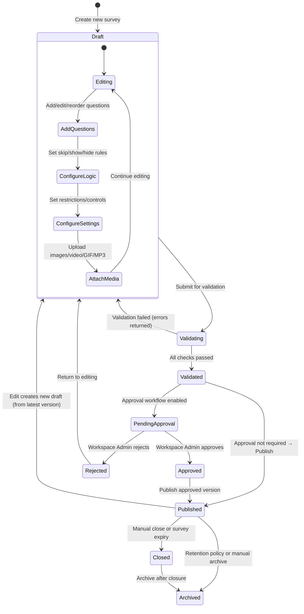
```mermaid
stateDiagram-v2
  [*] --> Draft: Create new survey

  Draft --> Validating: Submit for validation
  Validating --> Draft: Validation failed (errors returned)
  Validating --> Validated: All checks passed

  Validated --> PendingApproval: Approval workflow enabled
  Validated --> Published: Approval not required → Publish

  PendingApproval --> Approved: Workspace Admin approves
  PendingApproval --> Rejected: Workspace Admin rejects
  Rejected --> Draft: Return to editing

  Approved --> Published: Publish approved version

  Published --> Draft: Edit creates new draft (from latest version)
  Published --> Closed: Manual close or survey expiry
  Published --> Archived: Retention policy or manual archive

  Closed --> Archived: Archive after closure

  state Draft {
    [*] --> Editing
    Editing --> AddQuestions: Add/edit/reorder questions
    AddQuestions --> ConfigureLogic: Set skip/show/hide rules
    ConfigureLogic --> ConfigureSettings: Set restrictions/controls
    ConfigureSettings --> AttachMedia: Upload images/video/GIF/MP3
    AttachMedia --> Editing: Continue editing
  }
```

### 1.3 Detailed State Descriptions

| State | Description | Allowed Actions | Exit Conditions |
|---|---|---|---|
| **Draft** | Editable survey in progress. Cannot collect responses. | Add/edit/delete questions, configure logic, settings, styling, media | Submit for validation |
| **Validating** | System validates logic graph, required fields, media references, question dependencies | View validation results | Pass → Validated; Fail → Draft (with errors) |
| **Validated** | Schema and logic are verified correct | Submit for approval or publish directly | Approval enabled → PendingApproval; else → Published |
| **PendingApproval** | Awaiting Workspace Admin approval | Approve or reject | Approve → Published; Reject → Draft |
| **Published** | Immutable version. Can collect responses. | Distribute, view analytics, create new draft from this version | Edit → new Draft; Close; Archive |
| **Closed** | No longer accepting responses. Data intact. | View analytics, export data, archive | Archive |
| **Archived** | Retained per retention policy. Read-only. | View only (if retention allows) | Purge after retention expires |

### 1.4 Validation Rules Applied Before Publish
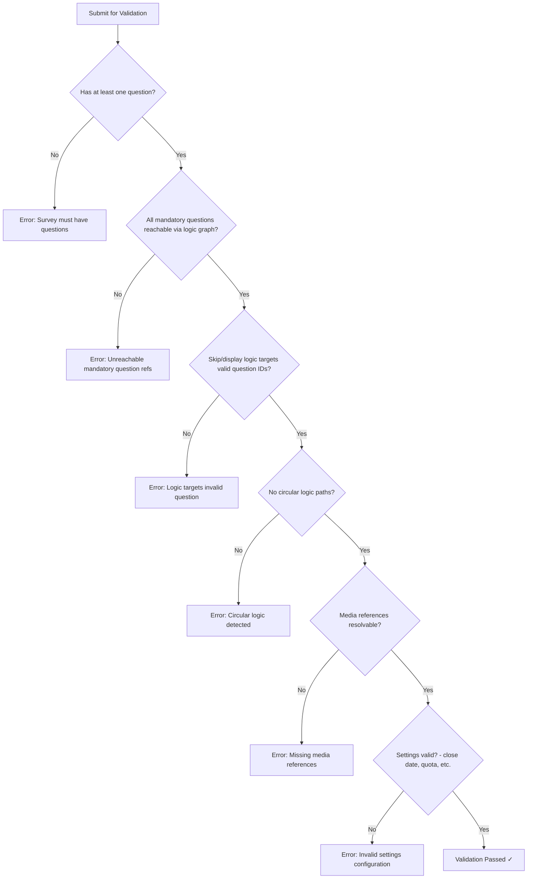
```mermaid
flowchart TD
  A[Submit for Validation] --> B{Has at least one question?}
  B -->|No| X1[Error: Survey must have questions]
  B -->|Yes| C{All mandatory questions reachable via logic graph?}
  C -->|No| X2[Error: Unreachable mandatory question refs]
  C -->|Yes| D{Skip/display logic targets valid question IDs?}
  D -->|No| X3[Error: Logic targets invalid question]
  D -->|Yes| E{No circular logic paths?}
  E -->|No| X4[Error: Circular logic detected]
  E -->|Yes| F{Media references resolvable?}
  F -->|No| X5[Error: Missing media references]
  F -->|Yes| G{Settings valid? - close date, quota, etc.}
  G -->|No| X6[Error: Invalid settings configuration]
  G -->|Yes| H[Validation Passed ✓]
```

### 1.5 Versioning Flow
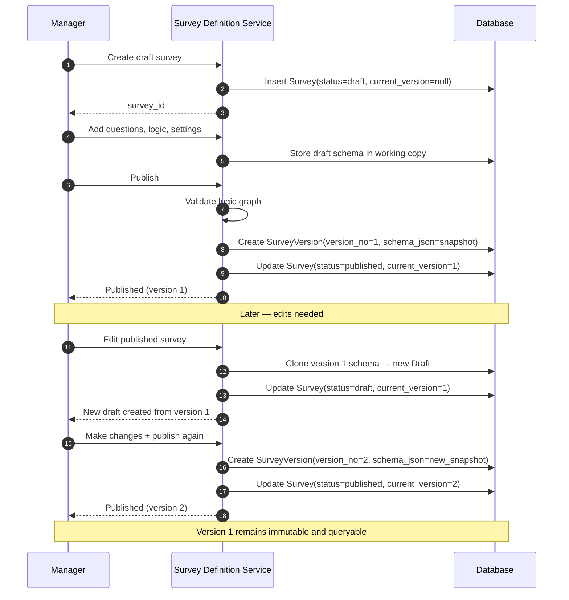
```mermaid
sequenceDiagram
  autonumber
  participant M as Manager
  participant SDS as Survey Definition Service
  participant DB as Database

  M->>SDS: Create draft survey
  SDS->>DB: Insert Survey(status=draft, current_version=null)
  SDS-->>M: survey_id

  M->>SDS: Add questions, logic, settings
  SDS->>DB: Store draft schema in working copy

  M->>SDS: Publish
  SDS->>SDS: Validate logic graph
  SDS->>DB: Create SurveyVersion(version_no=1, schema_json=snapshot)
  SDS->>DB: Update Survey(status=published, current_version=1)
  SDS-->>M: Published (version 1)

  Note over M,DB: Later — edits needed

  M->>SDS: Edit published survey
  SDS->>DB: Clone version 1 schema → new Draft
  SDS->>DB: Update Survey(status=draft, current_version=1)
  SDS-->>M: New draft created from version 1

  M->>SDS: Make changes + publish again
  SDS->>DB: Create SurveyVersion(version_no=2, schema_json=new_snapshot)
  SDS->>DB: Update Survey(status=published, current_version=2)
  SDS-->>M: Published (version 2)

  Note over M,DB: Version 1 remains immutable and queryable
```

### 1.6 Implementation Notes
- **Immutability**: Once a `SurveyVersion` record is created, its `schema_json` and `settings_json` must never be modified. All active responses and campaign bindings reference a specific `survey_version_id`.
- **Draft working copy**: Store the in-progress draft separately from published versions. On publish, snapshot the draft into a new `SurveyVersion` row.
- **Concurrent editing**: v1 does not support real-time collaboration. Use optimistic locking (version counter or `updated_at` timestamp) on the draft to prevent silent overwrites.
- **Cascading close**: When a survey is closed, all active campaigns bound to it should transition to `closing` state and stop accepting new responses.

---

## 2. Campaign Lifecycle

### 2.1 Overview
A campaign defines a time-bound window during which a specific survey version is distributed to respondents. Campaigns operate in one of two modes:

- **Open mode**: Public distribution — anyone with the survey link can respond. No roster, assignment rules, or eligibility constraints required. Access is governed by survey-level controls (quota, IP, CAPTCHA, device, email restrictions).
- **Assigned mode**: Roster-based distribution with respondent-subject assignment rules and eligibility constraints. Requires roster sync and assignment configuration before activation.

The lifecycle manages configuration, optional roster synchronization, assignment generation (assigned mode only), activation, monitoring, and closure.

### 2.2 State Diagram
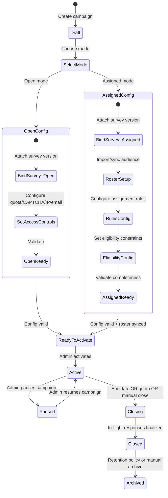
```mermaid
stateDiagram-v2
  [*] --> Draft: Create campaign

  Draft --> SelectMode: Choose mode
  SelectMode --> OpenConfig: Open mode
  SelectMode --> AssignedConfig: Assigned mode

  state OpenConfig {
    [*] --> BindSurvey_Open: Attach survey version
    BindSurvey_Open --> SetAccessControls: Configure quota/CAPTCHA/IP/email
    SetAccessControls --> OpenReady: Validate
  }

  state AssignedConfig {
    [*] --> BindSurvey_Assigned: Attach survey version
    BindSurvey_Assigned --> RosterSetup: Import/sync audience
    RosterSetup --> RulesConfig: Configure assignment rules
    RulesConfig --> EligibilityConfig: Set eligibility constraints
    EligibilityConfig --> AssignedReady: Validate completeness
  }

  OpenConfig --> ReadyToActivate: Config valid
  AssignedConfig --> ReadyToActivate: Config valid + roster synced
  ReadyToActivate --> Active: Admin activates

  Active --> Paused: Admin pauses campaign
  Paused --> Active: Admin resumes campaign

  Active --> Closing: End date OR quota OR manual close
  Closing --> Closed: In-flight responses finalized

  Closed --> Archived: Retention policy or manual archive
```

### 2.3 Detailed Sequence — Full Campaign Setup to Close
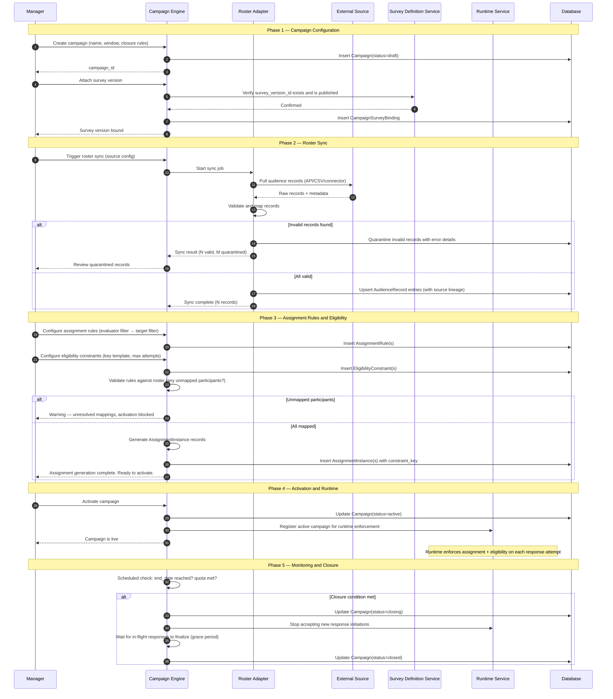
```mermaid
sequenceDiagram
  autonumber
  participant M as Manager
  participant CE as Campaign Engine
  participant RA as Roster Adapter
  participant ES as External Source
  participant SDS as Survey Definition Service
  participant RT as Runtime Service
  participant DB as Database

  Note over M,DB: Phase 1 — Campaign Configuration
    M->>CE: Create campaign (name, window, closure rules)
    CE->>DB: Insert Campaign(status=draft)
    CE-->>M: campaign_id

    M->>CE: Attach survey version
    CE->>SDS: Verify survey_version_id exists and is published
    SDS-->>CE: Confirmed
    CE->>DB: Insert CampaignSurveyBinding
  CE-->>M: Survey version bound

  Note over M,DB: Phase 2 — Roster Sync
    M->>CE: Trigger roster sync (source config)
    CE->>RA: Start sync job
    RA->>ES: Pull audience records (API/CSV/connector)
    ES-->>RA: Raw records + metadata

    RA->>RA: Validate and map records
    alt Invalid records found
      RA->>DB: Quarantine invalid records with error details
      RA-->>CE: Sync result (N valid, M quarantined)
      CE-->>M: Review quarantined records
    else All valid
      RA->>DB: Upsert AudienceRecord entries (with source lineage)
    RA-->>CE: Sync complete (N records)
  end

  Note over M,DB: Phase 3 — Assignment Rules and Eligibility
    M->>CE: Configure assignment rules (evaluator filter → target filter)
    CE->>DB: Insert AssignmentRule(s)

    M->>CE: Configure eligibility constraints (key template, max attempts)
    CE->>DB: Insert EligibilityConstraint(s)

    CE->>CE: Validate rules against roster (any unmapped participants?)
    alt Unmapped participants
      CE-->>M: Warning — unresolved mappings, activation blocked
    else All mapped
      CE->>CE: Generate AssignmentInstance records
      CE->>DB: Insert AssignmentInstance(s) with constraint_key
    CE-->>M: Assignment generation complete. Ready to activate.
  end

  Note over M,DB: Phase 4 — Activation and Runtime
    M->>CE: Activate campaign
    CE->>DB: Update Campaign(status=active)
    CE->>RT: Register active campaign for runtime enforcement
    CE-->>M: Campaign is live

  Note over RT: Runtime enforces assignment + eligibility on each response attempt

  Note over M,DB: Phase 5 — Monitoring and Closure
    CE->>CE: Scheduled check: end_date reached? quota met?
    alt Closure condition met
      CE->>DB: Update Campaign(status=closing)
      CE->>RT: Stop accepting new response initiations
      CE->>CE: Wait for in-flight responses to finalize (grace period)
      CE->>DB: Update Campaign(status=closed)
  end
```

### 2.4 Campaign Configuration Checklist (Activation Gate)

| # | Check | Open Mode | Assigned Mode | Details |
|---|---|---|---|---|
| 1 | Survey version bound | Required | Required | Must reference a published, non-archived survey version |
| 2 | Campaign window set | Required | Required | `start_at` and `end_at` must be valid; `end_at > start_at` |
| 3 | Access controls configured | Recommended | Recommended | Quota, CAPTCHA, IP, email, device restrictions |
| 4 | Roster synced | N/A | Required | At least one valid audience record present |
| 5 | Assignment rules configured | N/A | Required | At least one rule mapping respondents to subjects |
| 6 | Eligibility constraints set | N/A | Recommended | Default: one attempt per constraint_key if not configured |
| 7 | No unresolved roster mappings | N/A | Required | All respondent/subject references must resolve to valid audience records |
| 8 | Closure rules configured | Recommended | Recommended | Date-based closure auto-set from window; quota optional |
| 9 | Survey not closed/archived | Required | Required | Bound survey must still be in `published` state |

### 2.5 Closure Conditions
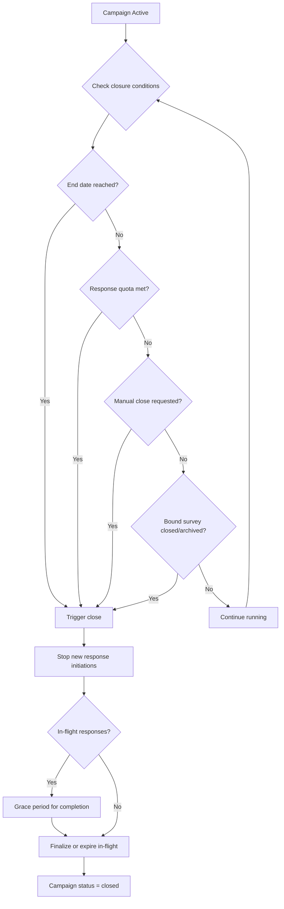
```mermaid
flowchart TD
  A[Campaign Active] --> B{Check closure conditions}
  B --> C{End date reached?}
  C -->|Yes| H[Trigger close]
  C -->|No| D{Response quota met?}
  D -->|Yes| H
  D -->|No| E{Manual close requested?}
  E -->|Yes| H
  E -->|No| F{Bound survey closed/archived?}
  F -->|Yes| H
  F -->|No| G[Continue running]
  G --> B

  H --> I[Stop new response initiations]
  I --> J{In-flight responses?}
  J -->|Yes| K[Grace period for completion]
  K --> L[Finalize or expire in-flight]
  J -->|No| L
  L --> M[Campaign status = closed]
```

### 2.6 Implementation Notes
- **Campaign modes**: The `mode` field on `Campaign` entity (`open` or `assigned`) determines which configuration steps and runtime checks apply. Open mode bypasses roster sync, assignment generation, and eligibility enforcement.
- **Campaign–Survey binding**: A campaign binds to a specific `survey_version_id`, not to the survey itself. If the survey is republished (new version), existing campaigns continue using their bound version. New campaigns can bind to the new version.
- **Roster sync jobs** (assigned mode): Roster syncs should be idempotent. Use `external_subject_id` + `source_ref` as the upsert key. Maintain `hash_key` on `AudienceRecord` for efficient change detection on re-sync.
- **Assignment instance generation** (assigned mode): When rules are configured and roster is present, the engine generates all valid `(respondent, subject)` pairs as `AssignmentInstance` records. Each gets a `constraint_key` (e.g., `respondent:{rid}:subject:{sid}:campaign:{cid}`) used for dedup and attempt tracking.
- **Pause semantics**: Pausing stops new response initiations but does not expire in-flight responses. Resuming picks up where it left off with no data loss.
- **Grace period**: Configurable per campaign. Default: 30 minutes after closure trigger. In-flight responses not completed within the grace period are marked `expired`.

---

## 3. Response Lifecycle

### 3.1 Overview
The response lifecycle begins when a respondent accesses a published survey and ends when the response is finalized with quality flags. The system supports partial save (resume later), session timeout, and configurable validation rules at every step.

### 3.2 State Diagram
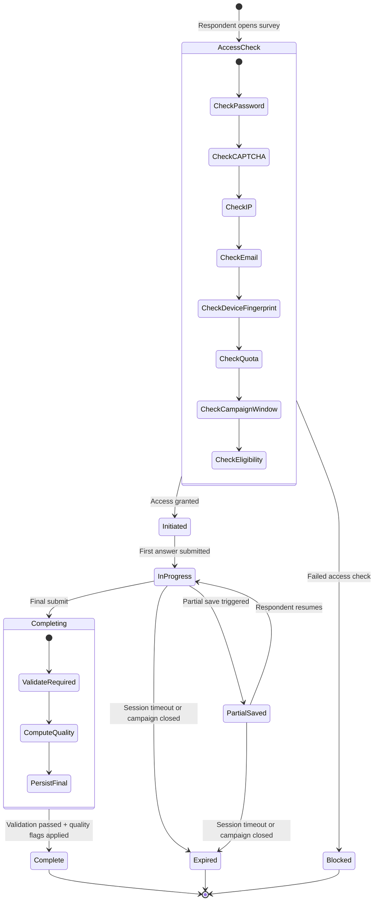
```mermaid
stateDiagram-v2
  [*] --> AccessCheck: Respondent opens survey

  AccessCheck --> Blocked: Failed access check
  AccessCheck --> Initiated: Access granted

  Initiated --> InProgress: First answer submitted

  InProgress --> PartialSaved: Partial save triggered
  PartialSaved --> InProgress: Respondent resumes

  InProgress --> Completing: Final submit
  Completing --> Complete: Validation passed + quality flags applied


  InProgress --> Expired: Session timeout or campaign closed
  PartialSaved --> Expired: Session timeout or campaign closed

  Complete --> [*]
  Expired --> [*]
  Blocked --> [*]

  state AccessCheck {
    [*] --> CheckPassword
    CheckPassword --> CheckCAPTCHA
    CheckCAPTCHA --> CheckIP
    CheckIP --> CheckEmail
    CheckEmail --> CheckDeviceFingerprint
    CheckDeviceFingerprint --> CheckQuota
    CheckQuota --> CheckCampaignWindow
    CheckCampaignWindow --> CheckEligibility
  }

  state Completing {
    [*] --> ValidateRequired
    ValidateRequired --> ComputeQuality
    ComputeQuality --> PersistFinal
  }
```

### 3.3 Detailed Sequence — Full Response Flow
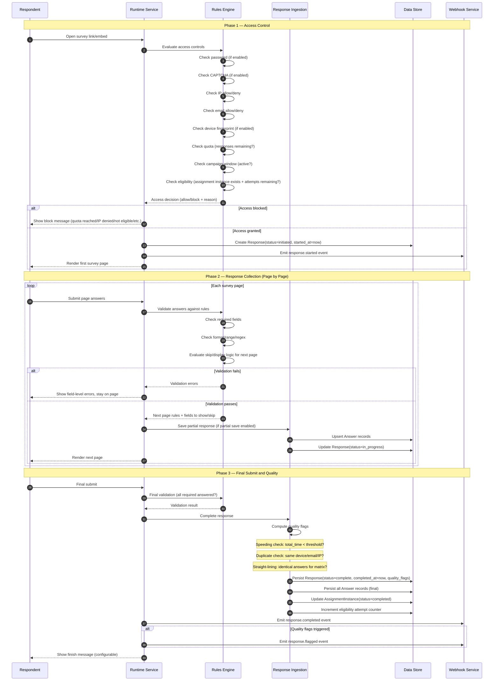
```mermaid
sequenceDiagram
  autonumber
  participant R as Respondent
  participant RT as Runtime Service
  participant RE as Rules Engine
  participant RI as Response Ingestion
  participant DB as Data Store
  participant WH as Webhook Service

  Note over R,WH: Phase 1 — Access Control
    R->>RT: Open survey link/embed
    RT->>RE: Evaluate access controls
    RE->>RE: Check password (if enabled)
    RE->>RE: Check CAPTCHA (if enabled)
    RE->>RE: Check IP allow/deny
    RE->>RE: Check email allow/deny
    RE->>RE: Check device fingerprint (if enabled)
    RE->>RE: Check quota (responses remaining?)
    RE->>RE: Check campaign window (active?)
    RE->>RE: Check eligibility (assignment instance exists + attempts remaining?)
    RE-->>RT: Access decision (allow/block + reason)

    alt Access blocked
      RT-->>R: Show block message (quota reached/IP denied/not eligible/etc.)
    else Access granted
      RT->>DB: Create Response(status=initiated, started_at=now)
      RT->>WH: Emit response.started event
      RT-->>R: Render first survey page
  end

  Note over R,WH: Phase 2 — Response Collection (Page by Page)
    loop Each survey page
      R->>RT: Submit page answers
      RT->>RE: Validate answers against rules
      RE->>RE: Check required fields
      RE->>RE: Check format/range/regex
      RE->>RE: Evaluate skip/display logic for next page

      alt Validation fails
        RE-->>RT: Validation errors
        RT-->>R: Show field-level errors, stay on page
      else Validation passes
        RE-->>RT: Next page rules + fields to show/skip
        RT->>RI: Save partial response (if partial save enabled)
        RI->>DB: Upsert Answer records
        RI->>DB: Update Response(status=in_progress)
        RT-->>R: Render next page
      end
  end

  Note over R,WH: Phase 3 — Final Submit and Quality
    R->>RT: Final submit
    RT->>RE: Final validation (all required answered?)
    RE-->>RT: Validation result

    RT->>RI: Complete response
    RI->>RI: Compute quality flags
    Note over RI: Speeding check: total_time < threshold?
    Note over RI: Duplicate check: same device/email/IP?
    Note over RI: Straight-lining: identical answers for matrix?
    RI->>DB: Persist Response(status=complete, completed_at=now, quality_flags)
    RI->>DB: Persist all Answer records (final)
    RI->>DB: Update AssignmentInstance(status=completed)
    RI->>DB: Increment eligibility attempt counter

    RT->>WH: Emit response.completed event
    alt Quality flags triggered
      RT->>WH: Emit response.flagged event
    end

  RT-->>R: Show finish message (configurable)
```

### 3.4 Access Control Pipeline (Evaluation Order)

| Step | Control | Failure Response | Config Source |
|---|---|---|---|
| 1 | Survey status check | 404 or closure message | Survey state |
| 2 | Campaign window check | "Survey not yet open" / "Survey closed" | Campaign `start_at`, `end_at` |
| 3 | Password | Password prompt page | Survey settings |
| 4 | CAPTCHA | CAPTCHA challenge | Survey settings |
| 5 | IP allow/deny | "Access denied from your location" | Survey settings |
| 6 | Email allow/deny | "Email not authorized" | Survey settings |
| 7 | Device fingerprint | "One response per device" | Survey settings |
| 8 | Quota | "Survey has reached maximum responses" | Survey settings or campaign rules |
| 9 | Eligibility | "You are not eligible" or "Already completed" | AssignmentInstance + EligibilityConstraint |

### 3.5 Quality Flag Definitions

| Flag | Detection Method | Threshold (configurable) | Default |
|---|---|---|---|
| `speeding` | `completed_at - started_at < threshold` | Median expected time × 0.3 | Flag (do not block) |
| `duplicate_device` | Same browser fingerprint hash | Exact match | Flag |
| `duplicate_email` | Same email in metadata | Exact match | Flag |
| `duplicate_ip` | Same IP address | Exact match within window | Flag |
| `straight_lining` | All matrix/Likert answers identical | All same for ≥ 5 items | Flag |
| `bot_suspected` | Honeypot field filled or CAPTCHA behavior | Any indicator | Flag |

### 3.6 Session Timeout Flow
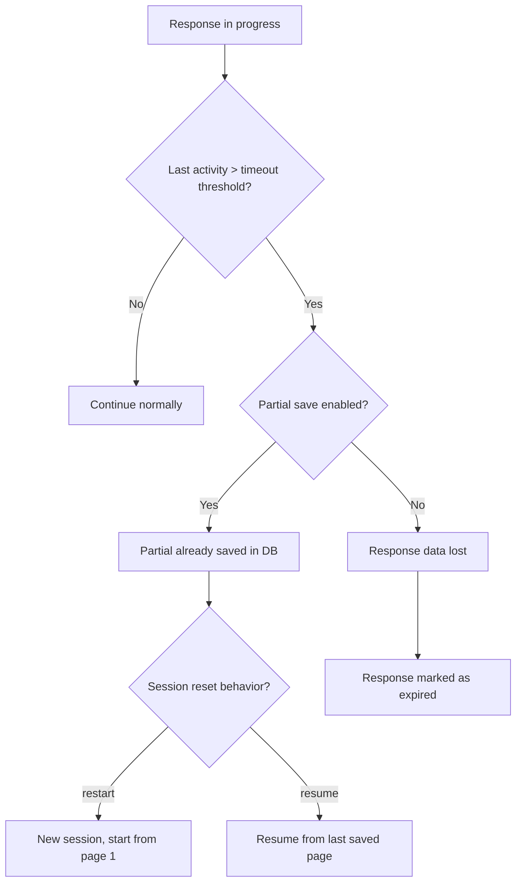
```mermaid
flowchart TD
  A[Response in progress] --> B{Last activity > timeout threshold?}
  B -->|No| C[Continue normally]
  B -->|Yes| D{Partial save enabled?}
  D -->|Yes| E[Partial already saved in DB]
  D -->|No| F[Response data lost]
  E --> G{Session reset behavior?}
  G -->|restart| H[New session, start from page 1]
  G -->|resume| I[Resume from last saved page]
  F --> J[Response marked as expired]
```

### 3.7 Implementation Notes
- **Partial save timing**: If enabled, save after each page submission. Do not auto-save on every field change (performance concern).
- **Response locking**: On final submit, acquire a short lock on the `Response` row to prevent double-submit race conditions.
- **Quality flags are non-blocking**: v1 flags responses but does not auto-discard them. Analysts see flags in reports and can filter on them.
- **Device fingerprint**: Best-effort using browser signals (canvas, WebGL, user-agent, screen resolution). Not a security guarantee — documented as heuristic.
- **Idempotent final submit**: If the respondent double-clicks submit, the second request should return the same `response_id` and `complete` status without creating a duplicate.

---

## 4. Audience and Roster Sync Flow

### 4.1 Overview
The roster sync flow ingests participant records from external systems into the platform. These records become the audience pool from which campaign assignments are generated. The flow supports API push, CSV upload, and scheduled connector-based sync.

### 4.2 Sync Modes
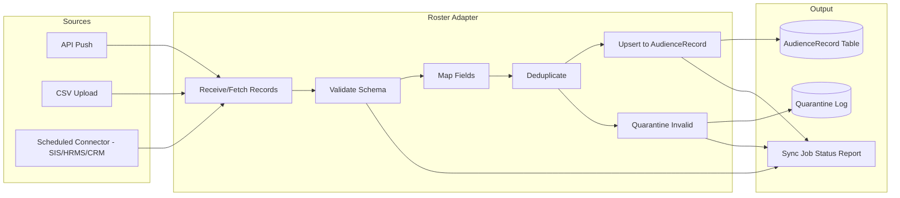
```mermaid
flowchart LR
  subgraph Sources
    A1[API Push]
    A2[CSV Upload]
    A3[Scheduled Connector - SIS/HRMS/CRM]
  end

  subgraph Roster Adapter
    B1[Receive/Fetch Records]
    B2[Validate Schema]
    B3[Map Fields]
    B4[Deduplicate]
    B5[Upsert to AudienceRecord]
    B6[Quarantine Invalid]
  end

  subgraph Output
    C1[(AudienceRecord Table)]
    C2[(Quarantine Log)]
    C3[Sync Job Status Report]
  end

  A1 --> B1
  A2 --> B1
  A3 --> B1
  B1 --> B2
  B2 --> B3
  B3 --> B4
  B4 --> B5
  B4 --> B6
  B5 --> C1
  B6 --> C2
  B2 --> C3
  B5 --> C3
  B6 --> C3
```

### 4.3 Detailed Sequence — Connector-Based Sync
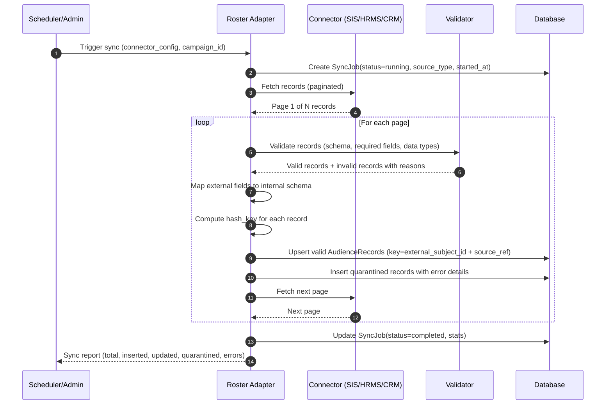
```mermaid
sequenceDiagram
  autonumber
  participant S as Scheduler/Admin
  participant RA as Roster Adapter
  participant C as Connector (SIS/HRMS/CRM)
  participant V as Validator
  participant DB as Database

  S->>RA: Trigger sync (connector_config, campaign_id)
  RA->>DB: Create SyncJob(status=running, source_type, started_at)
  RA->>C: Fetch records (paginated)
  C-->>RA: Page 1 of N records

  loop For each page
    RA->>V: Validate records (schema, required fields, data types)
    V-->>RA: Valid records + invalid records with reasons

    RA->>RA: Map external fields to internal schema
    RA->>RA: Compute hash_key for each record
    RA->>DB: Upsert valid AudienceRecords (key=external_subject_id + source_ref)
    RA->>DB: Insert quarantined records with error details

    RA->>C: Fetch next page
    C-->>RA: Next page
  end

  RA->>DB: Update SyncJob(status=completed, stats)
  RA-->>S: Sync report (total, inserted, updated, quarantined, errors)
```

### 4.4 Record Validation Rules

| Field | Validation | On Failure |
|---|---|---|
| `external_subject_id` | Required, non-empty | Quarantine |
| `email` | Valid email format (if provided) | Quarantine |
| `attributes_json` | Valid JSON, max size 64KB | Quarantine |
| Duplicate `external_subject_id` within same `source_ref` | Deduplicate (keep latest) | Log dedup action |
| Schema mismatch | Fields don't match expected connector schema | Quarantine with details |

### 4.5 Source Lineage Tracking
Every `AudienceRecord` stores:
- `source_type`: API / CSV / connector name
- `source_ref`: reference to the sync job or upload batch
- `hash_key`: SHA-256 of normalized record content (for efficient change detection on re-sync)
- `synced_at`: last sync timestamp

### 4.6 Implementation Notes
- **Idempotent upsert**: Use `(external_subject_id, source_ref, tenant_id)` as the natural key. On re-sync, compare `hash_key` — skip unchanged records.
- **Large imports**: For CSV uploads exceeding 10K records, process asynchronously via a job queue. Return a `sync_job_id` for status polling.
- **Connector extensibility**: Define a `RosterConnector` interface (source identification, authentication, pagination, field mapping). New connectors plug into this interface.
- **Quarantine review**: Quarantined records should be reviewable and retryable by the admin after fixing source data.

---

## 5. Assignment and Eligibility Flow

### 5.1 Overview
The assignment engine generates specific `(respondent, subject)` pairs from the audience roster based on configured rules. Eligibility constraints control how many times each unique combination can submit a response. This flow is the core mechanism that enables structured survey campaigns (e.g., 360° feedback, peer review, manager evaluations) while remaining domain-agnostic.

> **Note**: This entire flow applies only to **assigned mode** campaigns. Open mode campaigns skip assignment and eligibility entirely.

### 5.2 Assignment Generation Flow
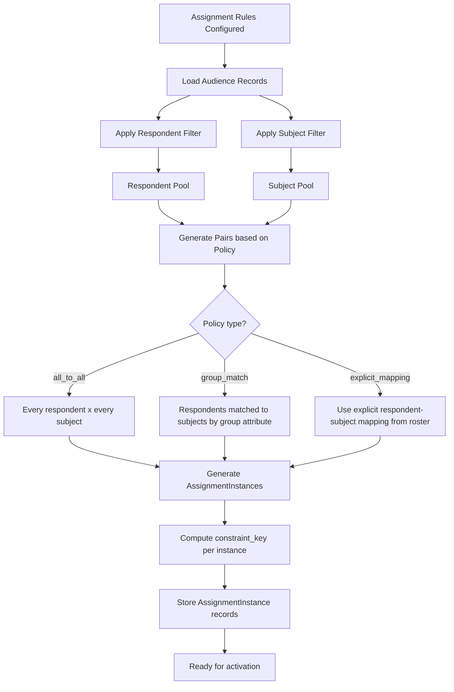
```mermaid
flowchart TD
  A[Assignment Rules Configured] --> B[Load Audience Records]
  B --> C[Apply Respondent Filter]
  C --> D[Respondent Pool]
  B --> E[Apply Subject Filter]
  E --> F[Subject Pool]
  D --> G[Generate Pairs based on Policy]
  F --> G
  G --> H{Policy type?}
  H -->|all_to_all| I[Every respondent x every subject]
  H -->|group_match| J[Respondents matched to subjects by group attribute]
  H -->|explicit_mapping| K[Use explicit respondent-subject mapping from roster]
  I --> L[Generate AssignmentInstances]
  J --> L
  K --> L
  L --> M[Compute constraint_key per instance]
  M --> N[Store AssignmentInstance records]
  N --> O[Ready for activation]
```

### 5.3 Eligibility Enforcement at Runtime
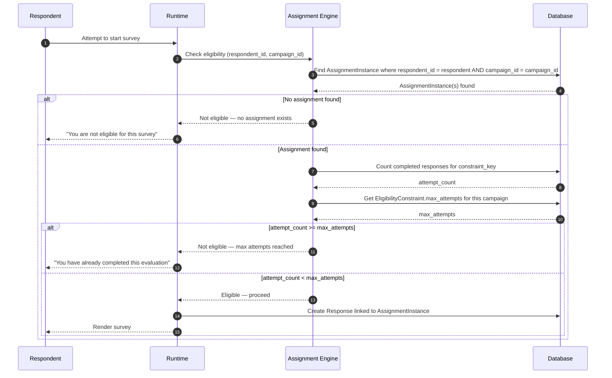
```mermaid
sequenceDiagram
  autonumber
  participant R as Respondent
  participant RT as Runtime
  participant AE as Assignment Engine
  participant DB as Database

  R->>RT: Attempt to start survey
  RT->>AE: Check eligibility (respondent_id, campaign_id)

  AE->>DB: Find AssignmentInstance where respondent_id = respondent AND campaign_id = campaign_id
  DB-->>AE: AssignmentInstance(s) found

  alt No assignment found
    AE-->>RT: Not eligible — no assignment exists
    RT-->>R: "You are not eligible for this survey"
  else Assignment found
    AE->>DB: Count completed responses for constraint_key
    DB-->>AE: attempt_count

    AE->>DB: Get EligibilityConstraint.max_attempts for this campaign
    DB-->>AE: max_attempts

    alt attempt_count >= max_attempts
      AE-->>RT: Not eligible — max attempts reached
      RT-->>R: "You have already completed this evaluation"
    else attempt_count < max_attempts
      AE-->>RT: Eligible — proceed
      RT->>DB: Create Response linked to AssignmentInstance
      RT-->>R: Render survey
    end
  end
```

### 5.4 Constraint Key Patterns

| Campaign Type | Key Template | Example |
|---|---|---|
| Simple survey (one per person) | `campaign:{cid}:respondent:{rid}` | `campaign:42:respondent:user_101` |
| Structured review (one per pair) | `campaign:{cid}:respondent:{rid}:subject:{sid}` | `campaign:42:respondent:user_101:subject:user_205` |
| Multi-attempt allowed | Same key + `max_attempts > 1` | Allow up to 3 submissions per key |

### 5.5 Assignment Rule Example
```json
{
  "id": "rule_001",
  "campaign_id": "campaign_42",
  "evaluator_filter": {
    "attribute": "role",
    "operator": "in",
    "values": ["student", "peer"]
  },
  "target_filter": {
    "attribute": "role",
    "operator": "eq",
    "value": "instructor"
  },
  "policy": {
    "type": "group_match",
    "match_attribute": "department_id"
  }
}
```
This rule means: *"All students and peers evaluate instructors within their same department."*

> **Note**: The `evaluator_filter` and `target_filter` naming in the JSON is a convention for the rule engine. In domain-neutral terms, these map to "respondent group" and "subject group" respectively.

### 5.6 Implementation Notes
- **Assigned mode only**: This entire flow applies only to campaigns with `mode=assigned`. Open mode campaigns skip assignment and eligibility entirely — the runtime service allows any authenticated or anonymous access per survey settings.
- **Lazy vs. eager generation**: Eager generation (pre-compute all pairs at activation) is recommended for campaigns with < 100K assignments. For larger campaigns, consider lazy evaluation at runtime.
- **Constraint key uniqueness**: The `constraint_key` column on `AssignmentInstance` must be indexed for fast lookups during response initiation.
- **Re-assignment on roster change**: If a roster re-sync adds new participants mid-campaign, the engine should generate new `AssignmentInstance` records without affecting existing ones. Removed participants' assignments are soft-deleted.

---

## 6. Distribution Flow

### 6.1 Overview
Published surveys reach respondents through three channels: direct link, embed (iframe/JS SDK), and email invitation. Each channel carries metadata for tracking and access control. Webhooks notify external systems of lifecycle events.

### 6.2 Distribution Channels
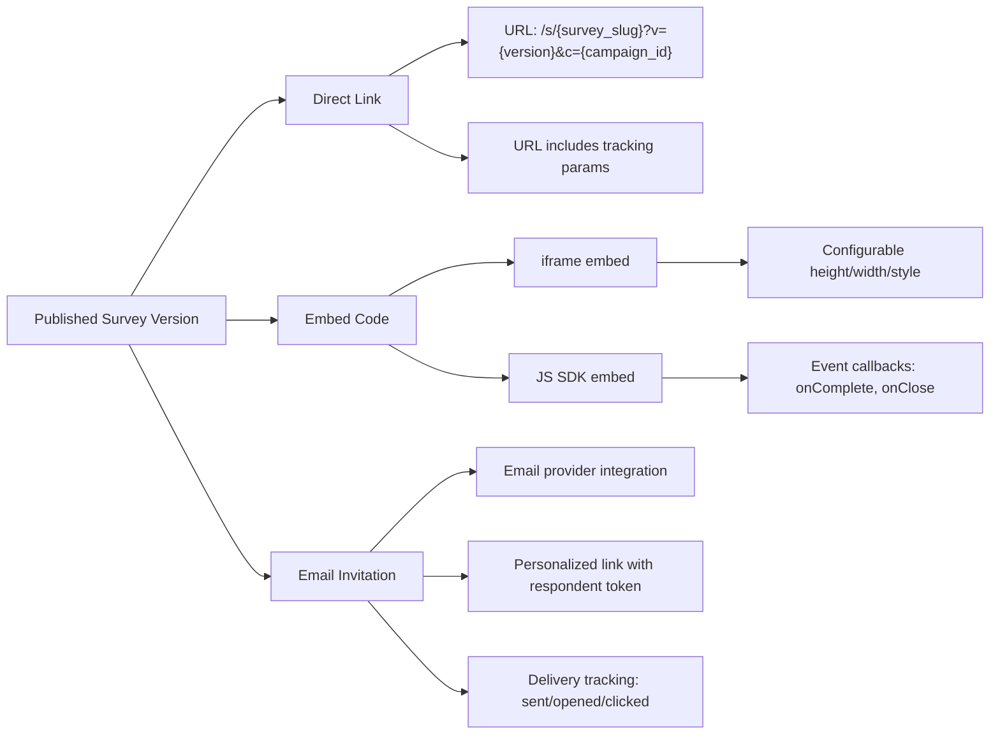
```mermaid
flowchart LR
  P[Published Survey Version] --> L[Direct Link]
  P --> E[Embed Code]
  P --> EM[Email Invitation]

  L --> L1["URL: /s/{survey_slug}?v={version}&c={campaign_id}"]
  L --> L2[URL includes tracking params]

  E --> E1[iframe embed]
  E --> E2[JS SDK embed]
  E1 --> E3[Configurable height/width/style]
  E2 --> E4[Event callbacks: onComplete, onClose]

  EM --> EM1[Email provider integration]
  EM --> EM2[Personalized link with respondent token]
  EM --> EM3[Delivery tracking: sent/opened/clicked]
```

### 6.3 Link Generation Sequence
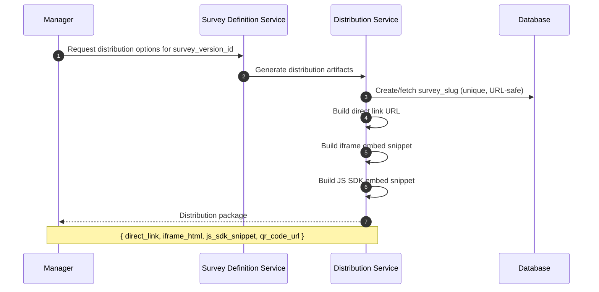
```mermaid
sequenceDiagram
  autonumber
  participant M as Manager
  participant SDS as Survey Definition Service
  participant DS as Distribution Service
  participant DB as Database

  M->>SDS: Request distribution options for survey_version_id
  SDS->>DS: Generate distribution artifacts

  DS->>DB: Create/fetch survey_slug (unique, URL-safe)
  DS->>DS: Build direct link URL
  DS->>DS: Build iframe embed snippet
  DS->>DS: Build JS SDK embed snippet

  DS-->>M: Distribution package
  Note over DS,M: { direct_link, iframe_html, js_sdk_snippet, qr_code_url }
```

### 6.4 Email Distribution Sequence
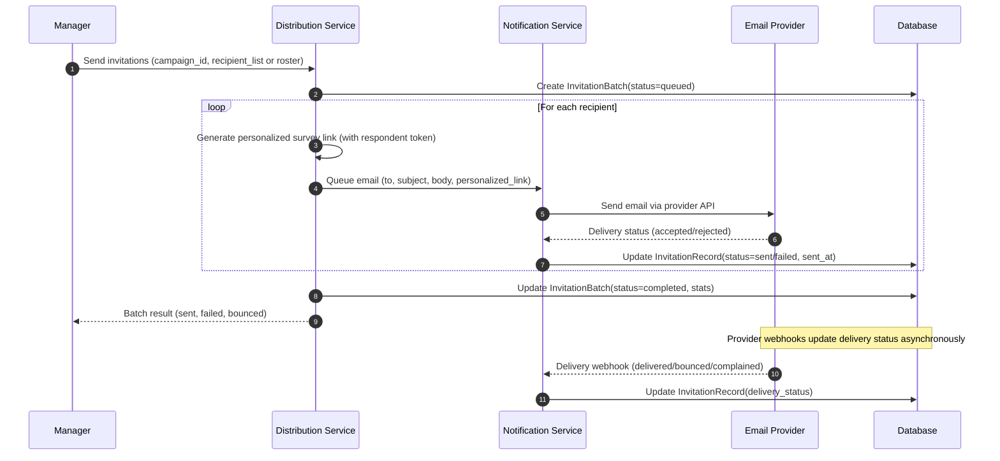
```mermaid
sequenceDiagram
  autonumber
  participant M as Manager
  participant DS as Distribution Service
  participant NS as Notification Service
  participant EP as Email Provider
  participant DB as Database

  M->>DS: Send invitations (campaign_id, recipient_list or roster)
  DS->>DB: Create InvitationBatch(status=queued)

  loop For each recipient
    DS->>DS: Generate personalized survey link (with respondent token)
    DS->>NS: Queue email (to, subject, body, personalized_link)
    NS->>EP: Send email via provider API
    EP-->>NS: Delivery status (accepted/rejected)
    NS->>DB: Update InvitationRecord(status=sent/failed, sent_at)
  end

  DS->>DB: Update InvitationBatch(status=completed, stats)
  DS-->>M: Batch result (sent, failed, bounced)

  Note over EP,DB: Provider webhooks update delivery status asynchronously
  EP-->>NS: Delivery webhook (delivered/bounced/complained)
  NS->>DB: Update InvitationRecord(delivery_status)
```

### 6.5 Channel Comparison

| Feature | Direct Link | Embed (iframe/SDK) | Email |
|---|---|---|---|
| Authentication | URL params or session | Parent page context | Personalized token |
| Tracking | UTM params, referrer | SDK callbacks | Open/click tracking |
| Branding | Survey styles apply | Inherits or overrides parent styles | Email template + survey styles |
| Resume support | Cookie/session-based | Cookie/session-based | Token-based (best) |
| Offline support | No | No | No |

### 6.6 Implementation Notes
- **Survey slug**: Generate a short, URL-safe, unique slug per survey (e.g., `abc123xy`). Do not expose internal IDs in URLs.
- **Respondent tokens**: For email distribution, generate a signed, time-limited JWT containing `respondent_id`, `campaign_id`, `survey_version_id`. This enables token-based resume and identity linking without requiring login.
- **JS SDK events**: The embed SDK should emit JavaScript events (`survey.loaded`, `survey.completed`, `survey.closed`) so the host page can react (e.g., close modal, redirect).
- **Rate limiting**: Email sending must be rate-limited per tenant to prevent abuse and maintain email deliverability reputation.

---

## 7. Reporting and Analytics Pipeline

### 7.1 Overview
The reporting pipeline transforms raw response data into actionable analytics. It supports overview dashboards, question-level breakdowns, participant views, segment filtering, hierarchical rollups, and data exports.

### 7.2 Data Pipeline
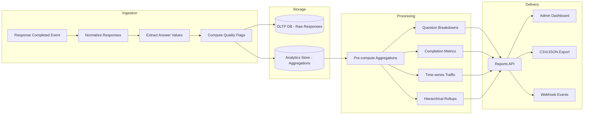
```mermaid
flowchart LR
  subgraph Ingestion
    A[Response Completed Event] --> B[Normalize Responses]
    B --> C[Extract Answer Values]
    C --> D[Compute Quality Flags]
  end

  subgraph Storage
    D --> E[(OLTP DB - Raw Responses)]
    D --> F[(Analytics Store - Aggregations)]
  end

  subgraph Processing
    F --> G[Pre-compute Aggregations]
    G --> H[Question Breakdowns]
    G --> I[Completion Metrics]
    G --> J[Time-series Traffic]
    G --> K[Hierarchical Rollups]
  end

  subgraph Delivery
    H --> L[Reports API]
    I --> L
    J --> L
    K --> L
    L --> M[Admin Dashboard]
    L --> N[CSV/JSON Export]
    L --> O[Webhook Events]
  end
```

### 7.3 Report Types and Data Sources

| Report | Data Source | Key Metrics | Filters |
|---|---|---|---|
| **Overview Dashboard** | Aggregation store | Total responses, completion rate, traffic by day/hour, avg completion time | Date range, campaign, survey version |
| **Question Breakdown** | Raw answers + aggregations | Per-question: response distribution, counts, percentages, word clouds (text) | Date range, segment, quality flags |
| **Participant Table** | OLTP responses + metadata | Per-respondent: status, timestamps, quality flags, metadata fields | Status, date, flags, metadata |
| **Segment Analysis** | Aggregations + metadata | Metrics grouped by metadata dimensions (role, department, region) | Segment dimensions, date range |
| **Hierarchical Rollup** | Aggregations + org hierarchy | Metrics rolled up across configurable dimensions | Hierarchy level, date range, campaign |
| **Campaign Comparison** | Aggregations across campaigns | Side-by-side metrics for two time windows / campaigns | Campaign pair, date range |

### 7.4 Hierarchical Rollup Flow
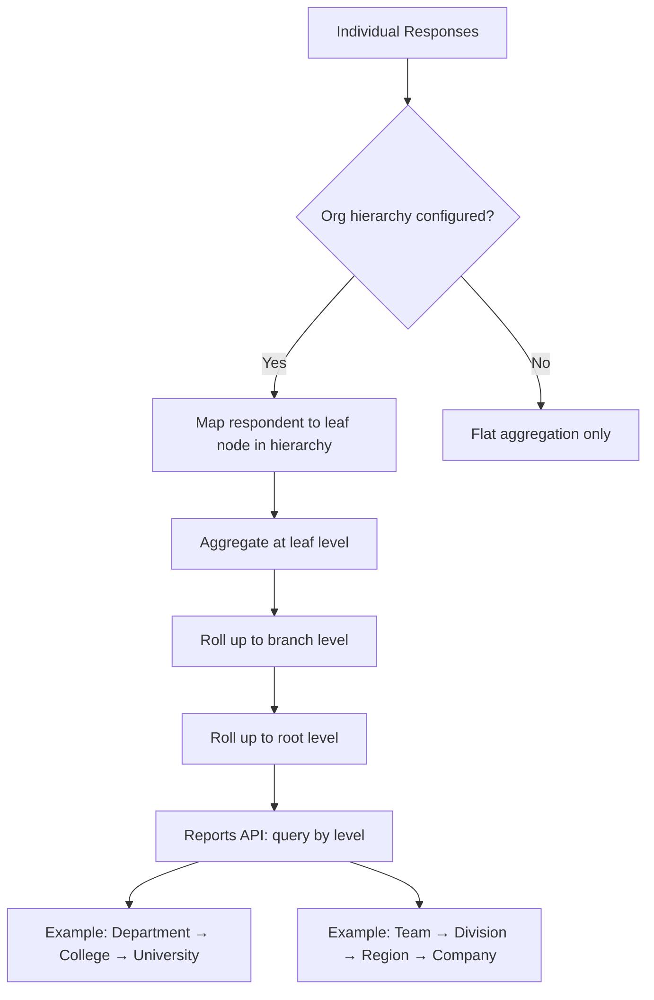
```mermaid
flowchart TD
  A[Individual Responses] --> B{Org hierarchy configured?}
  B -->|Yes| C[Map respondent to leaf node in hierarchy]
  C --> D[Aggregate at leaf level]
  D --> E[Roll up to branch level]
  E --> F[Roll up to root level]
  F --> G[Reports API: query by level]

  B -->|No| H[Flat aggregation only]

  G --> I[Example: Department → College → University]
  G --> J[Example: Team → Division → Region → Company]
```

### 7.5 Export Flow
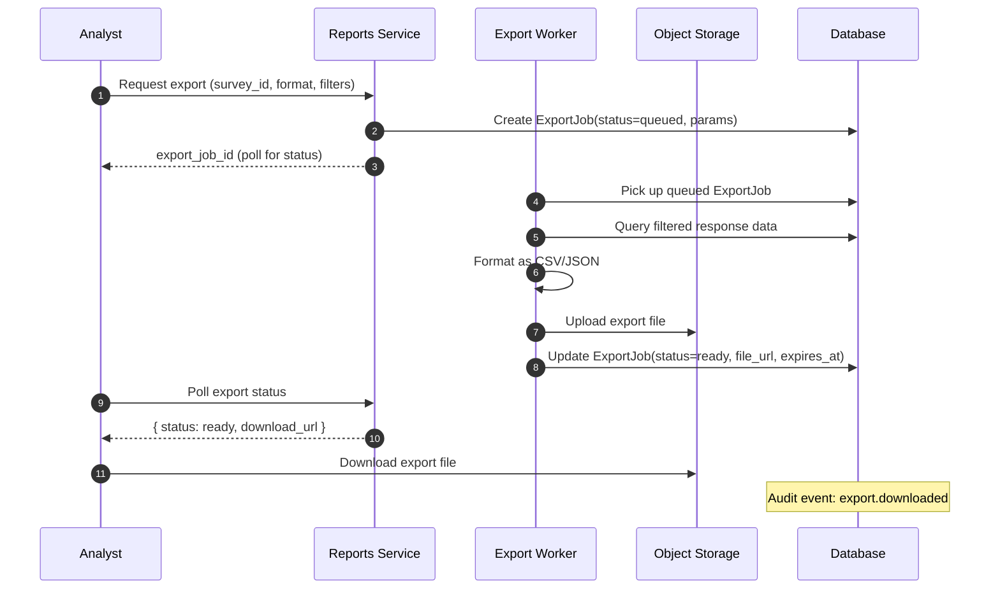
```mermaid
sequenceDiagram
  autonumber
  participant A as Analyst
  participant RS as Reports Service
  participant EX as Export Worker
  participant OS as Object Storage
  participant DB as Database

  A->>RS: Request export (survey_id, format, filters)
  RS->>DB: Create ExportJob(status=queued, params)
  RS-->>A: export_job_id (poll for status)

  EX->>DB: Pick up queued ExportJob
  EX->>DB: Query filtered response data
  EX->>EX: Format as CSV/JSON
  EX->>OS: Upload export file
  EX->>DB: Update ExportJob(status=ready, file_url, expires_at)

  A->>RS: Poll export status
  RS-->>A: { status: ready, download_url }
  A->>OS: Download export file

  Note over DB: Audit event: export.downloaded
```

### 7.6 Implementation Notes
- **Pre-computation**: For surveys with > 10K responses, pre-compute question-level aggregations on response completion (incrementally). Do not recompute on every dashboard load.
- **Hierarchical rollup config**: Admin defines the hierarchy tree as a configuration document (JSON). The rollup engine walks the tree bottom-up.
- **Export size limits**: Large exports (> 100K rows) should be chunked and zipped. Set a TTL on export files (default: 24 hours).
- **Real-time vs. near-real-time**: v1 uses near-real-time analytics (< 60 second delay). Real-time streaming analytics is out of scope for v1.

---

## 8. Anonymity and Privacy Flow

### 8.1 Overview
The anonymity flow ensures that respondent identity is protected in reports while still allowing the system to enforce eligibility, dedup, and quality controls. This is achieved by separating the identity-linking key from the reportable dataset.

### 8.2 Data Separation Architecture
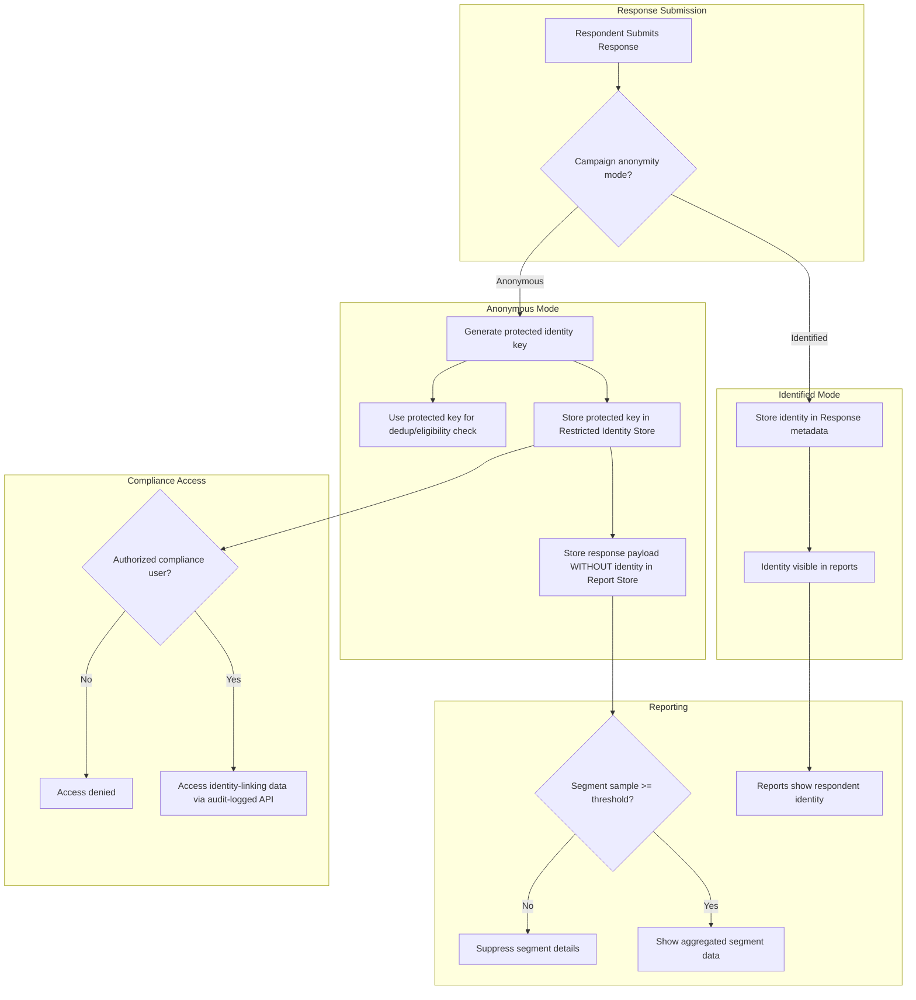
```mermaid
flowchart TD
  subgraph Response Submission
    A[Respondent Submits Response] --> B{Campaign anonymity mode?}
  end

  subgraph Identified Mode
    B -->|Identified| C[Store identity in Response metadata]
    C --> D[Identity visible in reports]
  end

  subgraph Anonymous Mode
    B -->|Anonymous| E[Generate protected identity key]
    E --> F[Store protected key in Restricted Identity Store]
    F --> G[Store response payload WITHOUT identity in Report Store]
    E --> H[Use protected key for dedup/eligibility check]
  end

  subgraph Reporting
    D --> I[Reports show respondent identity]
    G --> J{Segment sample >= threshold?}
    J -->|Yes| K[Show aggregated segment data]
    J -->|No| L[Suppress segment details]
  end

  subgraph Compliance Access
    F --> M{Authorized compliance user?}
    M -->|Yes| N[Access identity-linking data via audit-logged API]
    M -->|No| O[Access denied]
  end
```

### 8.3 Protected Identity Key Generation
```mermaid
sequenceDiagram
  autonumber
  participant RI as Response Ingestion
  participant KS as Key Service
  participant RIS as Restricted Identity Store
  participant RS as Report Store

  RI->>KS: Generate protected key (respondent_id, campaign_id, salt)
  KS->>KS: protected_key = HMAC-SHA256(respondent_id + campaign_id, tenant_secret)
  KS-->>RI: protected_key

  RI->>RIS: Store (protected_key → respondent_id) mapping
  Note over RIS: Restricted store — separate access controls, separate retention

  RI->>RS: Store response with protected_key (no respondent_id, no email, no name)
  Note over RS: Report store — accessible to Analyst/Viewer roles
```

### 8.4 Threshold Suppression Logic

| Scenario | Segment Size | Threshold (configurable, default: 5) | Action |
|---|---|---|---|
| Department A has 15 responses | 15 | 5 | Show full segment breakdown |
| Department B has 3 responses | 3 | 5 | Suppress — show "insufficient data" |
| Cross-segment comparison | Both ≥ threshold | 5 | Show comparison |
| Cross-segment comparison | One < threshold | 5 | Suppress the small segment |
| Export request | Segment < threshold | 5 | Exclude segment from export |

### 8.5 Implementation Notes
- **Key derivation**: Use HMAC-SHA256 with a tenant-specific secret. The same respondent in the same campaign always produces the same key → enables dedup. Different campaigns produce different keys → prevents cross-campaign tracking.
- **Restricted Identity Store**: This should be a separate database table (or separate schema) with its own access control. Only users with `compliance:identity_access` permission can query it. All access is audit-logged.
- **Retention**: Identity-linking keys should have a shorter retention period than response data. Default: delete identity links 90 days after campaign closure while keeping anonymized response data for the full retention period.
- **Threshold configuration**: Configurable per campaign. Some regulatory frameworks require higher thresholds (e.g., FERPA in education may require ≥ 10).

---

## 9. Webhook Delivery Flow

### 9.1 Overview
The webhook system delivers signed event payloads to customer-registered endpoints. It supports retry with exponential backoff, dead-lettering, and delivery status tracking.

### 9.2 Event Types

| Event | Trigger | Payload Summary |
|---|---|---|
| `survey.published` | Survey version published | survey_id, version_no, published_at |
| `response.started` | New response initiated | response_id, survey_id, campaign_id, started_at |
| `response.completed` | Response finalized | response_id, survey_id, campaign_id, completed_at, quality_flags |
| `response.flagged` | Quality flag triggered | response_id, flag_type, flag_details |
| `campaign.activated` | Campaign goes live | campaign_id, survey_version_id, activated_at |
| `campaign.closed` | Campaign closes | campaign_id, closure_reason, closed_at |
| `roster.sync_completed` | Roster sync job finishes | sync_job_id, campaign_id, stats |

### 9.3 Delivery Sequence with Retry
```mermaid
sequenceDiagram
  autonumber
  participant SE as Survey Engine
  participant Q as Event Queue
  participant WS as Webhook Service
  participant CE as Customer Endpoint
  participant DL as Dead Letter Store
  participant DB as Database

  SE->>Q: Publish event (response.completed)
  Q->>WS: Dequeue event

  WS->>DB: Lookup WebhookSubscription(s) for event_type + tenant_id
  DB-->>WS: Subscription(s) with endpoint + secret

  WS->>WS: Build payload + sign (HMAC-SHA256 with subscription secret)
  WS->>WS: Add headers: X-Webhook-Id, X-Webhook-Timestamp, X-Webhook-Signature

  WS->>CE: POST signed payload to endpoint
  WS->>DB: Insert WebhookDelivery(attempt=1)

  alt 2xx response
    CE-->>WS: 200 OK
    WS->>DB: Update WebhookDelivery(status=delivered)
  else Non-2xx or timeout
    CE-->>WS: 500 / timeout
    WS->>DB: Update WebhookDelivery(status=failed, response_code)

    loop Retry attempts (2 through max_attempts)
      WS->>WS: Wait exponential backoff (2^attempt × base_delay)
      Note over WS: Attempt 2: 30s, Attempt 3: 60s, Attempt 4: 120s, Attempt 5: 240s
      WS->>CE: POST signed payload (retry)
      WS->>DB: Insert WebhookDelivery(attempt=N)

      alt 2xx response
        CE-->>WS: 200 OK
        WS->>DB: Update WebhookDelivery(status=delivered)
        Note over WS: Stop retrying
      else Still failing
        CE-->>WS: error
        WS->>DB: Update WebhookDelivery(status=failed)
      end
    end

    WS->>DL: Move to dead letter after max_attempts
    WS->>DB: Update WebhookDelivery(status=dead_lettered)
  end
```

### 9.4 Retry Schedule

| Attempt | Delay | Cumulative Time |
|---|---|---|
| 1 (initial) | Immediate | 0s |
| 2 | 30 seconds | 30s |
| 3 | 1 minute | 1m 30s |
| 4 | 2 minutes | 3m 30s |
| 5 | 4 minutes | 7m 30s |
| 6 (max, dead-letter) | — | — |

### 9.5 Webhook Signature Verification (Customer Side)
```text
Expected-Signature = HMAC-SHA256(
  key = subscription_secret,
  message = webhook_id + "." + webhook_timestamp + "." + raw_body
)

Verify:
1. Compute expected signature using shared secret
2. Compare with X-Webhook-Signature header (constant-time comparison)
3. Reject if timestamp is > 5 minutes old (replay protection)
```

### 9.6 Implementation Notes
- **Idempotency**: Include a unique `webhook_id` in every delivery. Customers should deduplicate on this ID.
- **Dead letter review**: Provide an admin API to list dead-lettered events and manually retry them.
- **Secret rotation**: Support two active secrets per subscription during rotation. Accept signatures from either secret.
- **Payload size limit**: Max payload 256KB. For large events (e.g., full response data), include a `data_url` pointing to a time-limited download endpoint instead of inline data.
- **Circuit breaker**: If an endpoint fails consecutively for > 24 hours, auto-disable the subscription and notify the tenant admin.

---

## 10. Tenant Onboarding Lifecycle

### 10.1 Overview
Tenant onboarding begins at subscription time and ends when the tenant has a working external IdP integration and an active Tenant Admin. The flow supports both immediate setup and a setup-later mode with time-limited bootstrap access.

### 10.2 State Diagram
```mermaid
stateDiagram-v2
  [*] --> SubscriptionCreated: New subscription

  SubscriptionCreated --> Onboarding: Platform creates tenant + default workspace

  Onboarding --> IdPSetup: Admin starts onboarding wizard
  Onboarding --> BootstrapActive: Admin selects "setup later"

  state IdPSetup {
    [*] --> RegisterIdP: Submit IdP metadata
    RegisterIdP --> ConfigureClaims: Map claims to fields
    ConfigureClaims --> ConfigureRoles: Map groups/claims to roles
    ConfigureRoles --> TestConnection: Validate IdP connection
    TestConnection --> ConnectionFailed: Validation failed
    ConnectionFailed --> RegisterIdP: Fix and retry
    TestConnection --> ConnectionValid: Validation passed
  }

  IdPSetup --> FirstLogin: IdP validated → attempt first SSO login
  FirstLogin --> Active: Claims mapped → Tenant Admin assigned → Tenant activated

  BootstrapActive --> IdPSetup: Admin returns to complete setup
  BootstrapActive --> BootstrapExpired: TTL reached without IdP setup

  BootstrapExpired --> IdPSetup: Admin completes setup (required)

  state BootstrapActive {
    [*] --> LimitedAccess
    LimitedAccess: Can create surveys, configure settings
    LimitedAccess --> RestrictedPublish
    RestrictedPublish: Cannot publish or distribute surveys
  }

  state BootstrapExpired {
    [*] --> Blocked
    Blocked: Publish and distribution blocked until IdP setup completed
  }

  Active --> [*]
```

### 10.3 Detailed Onboarding Sequence
```mermaid
sequenceDiagram
  autonumber
  participant SA as Subscriber Admin
  participant SS as Subscription Service
  participant SE as Survey Engine
  participant IDP as Customer IdP

  Note over SA,IDP: Phase 1 — Tenant Provisioning
    SA->>SS: Subscribe to plan
    SS->>SE: Create tenant (plan_id, admin_email)
    SE->>SE: Create Tenant(status=onboarding)
    SE->>SE: Create default Workspace
    SE->>SE: Create TenantOnboardingState(status=onboarding)
    SE-->>SS: Onboarding URL + tenant_id
  SS-->>SA: Welcome email with onboarding link

  Note over SA,IDP: Phase 2 — IdP Configuration
    SA->>SE: Open onboarding wizard
    SE-->>SA: Step 1: Enter IdP metadata

    SA->>SE: Submit IdP metadata (issuer, discovery URL, client_id/secret or SAML metadata)
    SE->>SE: Store TenantIdentityConfig(protocol, issuer, metadata_json, status=pending)

    SE-->>SA: Step 2: Configure claim mappings
    SA->>SE: Submit claim mappings (subject, email, groups, tenant_hint)
    SE->>SE: Store mapping_json in TenantIdentityConfig

    SE-->>SA: Step 3: Configure role mappings
  SA->>SE: Submit group-to-role mappings (e.g., "admins" to TenantAdmin)

  Note over SA,IDP: Phase 3 — Validation
    SA->>SE: Test IdP connection
    SE->>IDP: Attempt OIDC discovery / SAML metadata fetch
    IDP-->>SE: IdP metadata response

    SE->>SE: Validate issuer, signing keys, supported scopes/claims
    alt Validation failed
      SE-->>SA: Error details (unreachable, invalid metadata, missing claims)
    else Validation passed
      SE->>SE: Update TenantIdentityConfig(status=validated, validated_at)
    SE-->>SA: Connection valid — proceed to first login
  end

  Note over SA,IDP: Phase 4 — First Login and Activation
    SA->>SE: Initiate first SSO login
    SE->>IDP: Redirect with auth request (OIDC code flow / SAML AuthnRequest)
    IDP-->>SA: Login page
    SA->>IDP: Authenticate
    IDP-->>SE: Token/assertion with claims

    SE->>SE: Extract claims (subject, email, groups)
    SE->>SE: Match groups to role mappings
    SE->>SE: Create User record (JIT provisioning)
    SE->>SE: Assign TenantAdmin role
    SE->>SE: Update Tenant(status=active)
  SE->>SE: Update TenantOnboardingState(status=completed, completed_at)
  SE-->>SA: Admin console access granted
```

### 10.4 Setup-Later Mode Timeline
```text
Time ─────────────────────────────────────────────────────────────►

|← Subscription →|← Bootstrap Active (TTL) →|← Expired →|
|                 |                           |            |
|  Create tenant  | Can: create surveys       | BLOCKED:   |
|  + workspace    |     configure settings    |  publish   |
|                 |     import roster         |  distribute|
|                 | Cannot: publish            |  new survey|
|                 |         distribute         |  creation  |
|                 |         activate campaigns |            |
|                 |                           |            |
|                 | Admin returns to          | Must setup |
|                 | complete IdP setup → ──────→ Active    |
```

### 10.5 Implementation Notes
- **Bootstrap access**: Use a temporary, time-limited authentication mechanism (e.g., email magic link or one-time setup token) for the bootstrap period. This is replaced by SSO once IdP is configured.
- **TTL default**: Setup-later bootstrap TTL should be 14 days (configurable per plan). After expiry, all publish/distribution actions are blocked but existing drafts and data are preserved.
- **Gradual restriction**: During bootstrap, allow survey creation and configuration to keep the admin productive, but block publish/distribution since respondent authentication cannot be enforced without IdP.
- **Reactivation**: If bootstrap expires, completing IdP setup immediately reactivates the tenant. No data is lost.
- **Audit**: All onboarding state transitions must generate audit events for compliance tracking.

---

## Appendix: Cross-Flow Dependencies

```mermaid
flowchart TB
  TenantOnboarding[10. Tenant Onboarding] --> SurveyLifecycle[1. Survey Lifecycle]
  SurveyLifecycle --> Distribution[6. Distribution]
  SurveyLifecycle --> CampaignLifecycle[2. Campaign Lifecycle]

  CampaignLifecycle --> RosterSync[4. Roster Sync]
  RosterSync --> AssignmentEligibility[5. Assignment & Eligibility]
  AssignmentEligibility --> CampaignLifecycle

  CampaignLifecycle --> ResponseLifecycle[3. Response Lifecycle]
  Distribution --> ResponseLifecycle
  AssignmentEligibility --> ResponseLifecycle

  ResponseLifecycle --> AnonymityPrivacy[8. Anonymity & Privacy]
  ResponseLifecycle --> ReportingAnalytics[7. Reporting & Analytics]
  AnonymityPrivacy --> ReportingAnalytics

  ResponseLifecycle --> WebhookDelivery[9. Webhook Delivery]
  CampaignLifecycle --> WebhookDelivery
  SurveyLifecycle --> WebhookDelivery
  RosterSync --> WebhookDelivery
```

This diagram shows the dependency chain:
1. **Tenant Onboarding** must complete before surveys can be published
2. **Survey Lifecycle** feeds into both Campaigns and Distribution
3. **Campaign** depends on Roster Sync and Assignment/Eligibility
4. **Response Lifecycle** depends on Distribution, Campaign, and Assignment for access and eligibility
5. **Reporting** consumes data from Responses, filtered through Anonymity rules
6. **Webhooks** are triggered by events across Survey, Campaign, Response, and Roster flows
