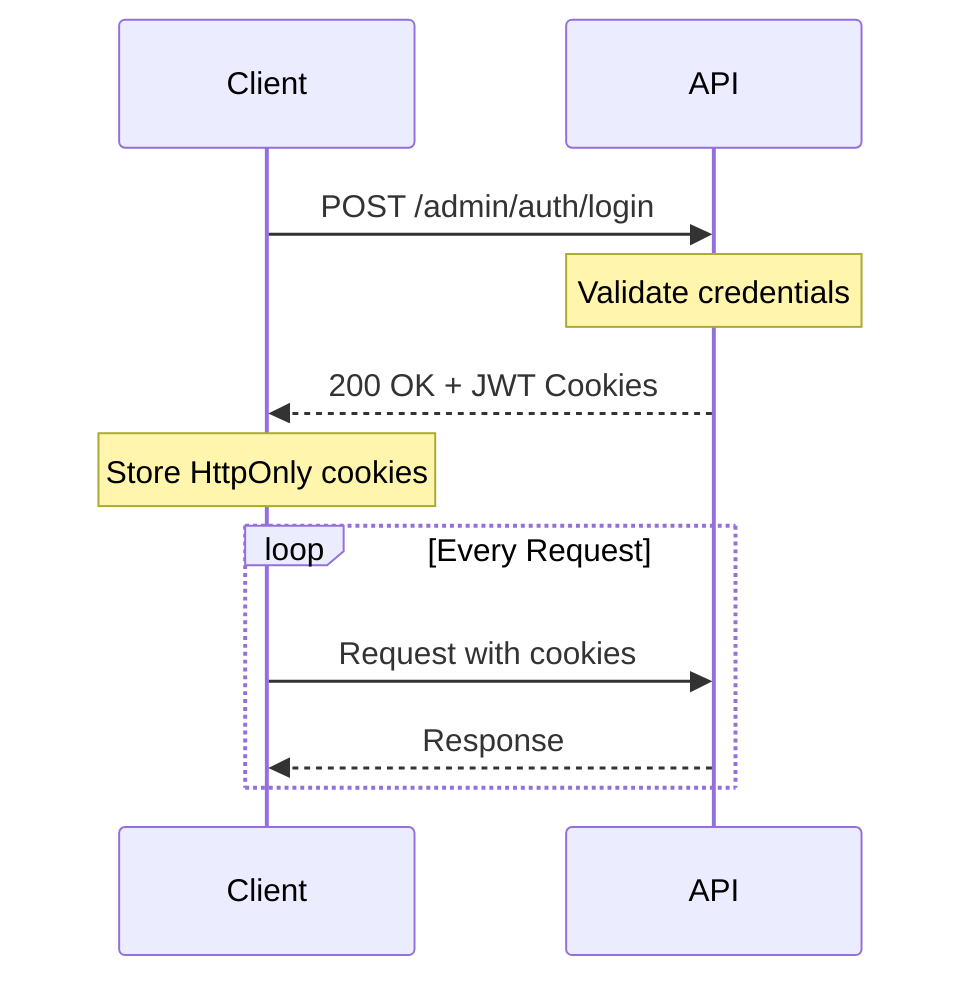

# Survey Engine API Documentation

**Version:** 1.0.0  
**Base URL:** `https://api.survey-engine.com/api/v1`  
**Last Updated:** March 9, 2026

---

## Table of Contents

1. [Introduction](#introduction)
2. [Authentication](#authentication)
3. [Rate Limiting](#rate-limiting)
4. [Error Handling](#error-handling)
5. [API Reference](#api-reference)
   - [Admin Authentication](#admin-authentication)
   - [Surveys](#surveys)
   - [Campaigns](#campaigns)
   - [Question Bank](#question-bank)
   - [Responses](#responses)
   - [Analytics](#analytics)
   - [Scoring](#scoring)
   - [Subscriptions](#subscriptions)
   - [Respondent Authentication](#respondent-authentication)
6. [Webhooks](#webhooks)
7. [SDKs & Libraries](#sdks--libraries)

---

## Introduction

Welcome to the Survey Engine API documentation. This API provides programmatic access to all Survey Engine features, enabling you to:

- Create and manage surveys programmatically
- Distribute campaigns and collect responses
- Analyze results with advanced analytics
- Manage multi-tenant subscriptions
- Integrate respondent authentication

### Base URLs

| Environment | URL |
|-------------|-----|
| **Production** | `https://api.survey-engine.com/api/v1` |
| **Sandbox** | `https://sandbox-api.survey-engine.com/api/v1` |

### Request Format

All requests must include:
```http
Content-Type: application/json
Authorization: Bearer <access_token>
```

### Response Format

All responses are returned in JSON format:
```json
{
  "data": { ... },
  "meta": {
    "requestId": "req_abc123",
    "timestamp": "2026-03-09T10:30:00Z"
  }
}
```

---

## Authentication

### Overview

Survey Engine uses JWT (JSON Web Tokens) for authentication. There are two types of authentication:

1. **Admin Authentication** - For platform administrators
2. **Respondent Authentication** - For survey respondents

### Admin Authentication Flow



### Obtaining Access Tokens

#### Register a New Account

```http
POST /api/v1/admin/auth/register
Content-Type: application/json
```

**Request Body:**
```json
{
  "fullName": "John Doe",
  "email": "john@example.com",
  "password": "SecureP@ssw0rd123",
  "confirmPassword": "SecureP@ssw0rd123"
}
```

**Validation Rules:**

| Field | Requirements |
|-------|--------------|
| `fullName` | 2-120 characters |
| `email` | Valid email format, max 255 characters |
| `password` | 8-64 characters, must include uppercase, lowercase, number, and special character |
| `confirmPassword` | Must match password |

**Response (201 Created):**
```json
{
  "userId": "550e8400-e29b-41d4-a716-446655440000",
  "email": "john@example.com",
  "fullName": "John Doe",
  "tenantId": "tenant-abc123",
  "role": "ADMIN"
}
```

**Cookies Set:**
- `access_token` (HttpOnly, Secure, SameSite=Strict) - Expires in 1 hour
- `refresh_token` (HttpOnly, Secure, SameSite=Strict) - Expires in 7 days

#### Login

```http
POST /api/v1/admin/auth/login
Content-Type: application/json
```

**Request Body:**
```json
{
  "email": "john@example.com",
  "password": "SecureP@ssw0rd123"
}
```

**Response (200 OK):**
```json
{
  "userId": "550e8400-e29b-41d4-a716-446655440000",
  "email": "john@example.com",
  "fullName": "John Doe",
  "tenantId": "tenant-abc123",
  "role": "ADMIN"
}
```

### Token Refresh

Access tokens expire after 1 hour. Use the refresh token to obtain new access tokens:

```http
POST /api/v1/admin/auth/refresh
```

**Response (200 OK):**
```json
{
  "userId": "550e8400-e29b-41d4-a716-446655440000",
  "email": "john@example.com",
  "fullName": "John Doe",
  "tenantId": "tenant-abc123",
  "role": "ADMIN"
}
```

### Role-Based Access Control

| Role | Permissions |
|------|-------------|
| `SUPER_ADMIN` | Full platform access, tenant management, impersonation |
| `ADMIN` | Create/manage surveys, campaigns, settings within tenant |
| `EDITOR` | Edit surveys and questions within tenant |
| `VIEWER` | Read-only access to reports and analytics |

---

## Rate Limiting

### Limits

| Tier | Requests/Minute | Requests/Day |
|------|-----------------|--------------|
| **BASIC** | 60 | 10,000 |
| **PRO** | 300 | 100,000 |
| **ENTERPRISE** | 1,000 | Unlimited |

### Rate Limit Headers

```http
X-RateLimit-Limit: 60
X-RateLimit-Remaining: 45
X-RateLimit-Reset: 1678368000
```

### Rate Limit Exceeded (429 Too Many Requests)

```json
{
  "error": {
    "code": "RATE_LIMIT_EXCEEDED",
    "message": "Rate limit exceeded. Please retry after 60 seconds.",
    "retryAfter": 60
  }
}
```

---

## Error Handling

### Error Response Format

```json
{
  "error": {
    "code": "RESOURCE_NOT_FOUND",
    "message": "The requested resource was not found",
    "details": {
      "resourceType": "Survey",
      "resourceId": "550e8400-e29b-41d4-a716-446655440000"
    },
    "requestId": "req_abc123",
    "timestamp": "2026-03-09T10:30:00Z"
  }
}
```

### Error Codes

| Code | HTTP Status | Description |
|------|-------------|-------------|
| `RESOURCE_NOT_FOUND` | 404 | The requested resource does not exist |
| `VALIDATION_FAILED` | 400 | Request validation failed |
| `ACCESS_DENIED` | 403 | Access denied to the resource |
| `UNAUTHORIZED` | 401 | Authentication required |
| `DUPLICATE_RESPONSE` | 409 | A response already exists |
| `QUOTA_EXCEEDED` | 429 | Plan quota exceeded |
| `CAMPAIGN_NOT_ACTIVE` | 400 | Campaign is not active |
| `SURVEY_IMMUTABLE_AFTER_PUBLISH` | 400 | Survey cannot be modified after publishing |
| `INVALID_LIFECYCLE_TRANSITION` | 400 | Invalid lifecycle state transition |
| `INVALID_WEIGHT_SUM` | 400 | Category weights must sum to 100% |
| `RESPONSE_LOCKED` | 400 | Response is locked and cannot be modified |
| `SUBSCRIPTION_INACTIVE` | 402 | Active subscription required |
| `PAYMENT_FAILED` | 402 | Payment processing failed |
| `INTERNAL_ERROR` | 500 | Internal server error |

---

## API Reference

### Admin Authentication

#### Register

Create a new admin account and tenant.

```http
POST /api/v1/admin/auth/register
```

**Request:**
```json
{
  "fullName": "John Doe",
  "email": "john@example.com",
  "password": "SecureP@ssw0rd123",
  "confirmPassword": "SecureP@ssw0rd123"
}
```

**Response (201 Created):**
```json
{
  "userId": "550e8400-e29b-41d4-a716-446655440000",
  "email": "john@example.com",
  "fullName": "John Doe",
  "tenantId": "tenant-abc123",
  "role": "ADMIN"
}
```

---

#### Login

Authenticate and receive access tokens.

```http
POST /api/v1/admin/auth/login
```

**Request:**
```json
{
  "email": "john@example.com",
  "password": "SecureP@ssw0rd123"
}
```

**Response (200 OK):**
```json
{
  "userId": "550e8400-e29b-41d4-a716-446655440000",
  "email": "john@example.com",
  "fullName": "John Doe",
  "tenantId": "tenant-abc123",
  "role": "ADMIN"
}
```

---

#### Get Current User

Retrieve the authenticated user's information.

```http
GET /api/v1/admin/auth/me
```

**Response (200 OK):**
```json
{
  "userId": "550e8400-e29b-41d4-a716-446655440000",
  "email": "john@example.com",
  "fullName": "John Doe",
  "tenantId": "tenant-abc123",
  "role": "ADMIN"
}
```

---

#### Logout

Invalidate all tokens.

```http
POST /api/v1/admin/auth/logout
```

**Response (204 No Content)**

---

### Surveys

Survey management endpoints for creating, updating, and managing survey lifecycle.

#### Create Survey

Create a new survey in DRAFT state.

```http
POST /api/v1/surveys
```

**Request:**
```json
{
  "title": "Customer Satisfaction Survey 2026",
  "description": "Annual customer satisfaction assessment",
  "pages": [
    {
      "title": "Demographics",
      "sortOrder": 1,
      "questions": [
        {
          "questionId": "550e8400-e29b-41d4-a716-446655440001",
          "categoryId": "550e8400-e29b-41d4-a716-446655440010",
          "categoryWeightPercentage": 20.00,
          "sortOrder": 1,
          "mandatory": true,
          "answerConfig": {
            "required": true
          }
        }
      ]
    }
  ]
}
```

**Response (201 Created):**
```json
{
  "id": "550e8400-e29b-41d4-a716-446655440000",
  "title": "Customer Satisfaction Survey 2026",
  "description": "Annual customer satisfaction assessment",
  "lifecycleState": "DRAFT",
  "currentVersion": 1,
  "active": true,
  "pages": [
    {
      "id": "550e8400-e29b-41d4-a716-446655440001",
      "title": "Demographics",
      "sortOrder": 1,
      "questions": [
        {
          "id": "550e8400-e29b-41d4-a716-446655440002",
          "questionId": "550e8400-e29b-41d4-a716-446655440001",
          "questionVersionId": "550e8400-e29b-41d4-a716-446655440003",
          "categoryId": "550e8400-e29b-41d4-a716-446655440010",
          "categoryVersionId": "550e8400-e29b-41d4-a716-446655440011",
          "categoryWeightPercentage": 20.00,
          "sortOrder": 1,
          "mandatory": true,
          "answerConfig": "{\"required\":true}"
        }
      ]
    }
  ],
  "createdBy": "john@example.com",
  "createdAt": "2026-03-09T10:30:00Z",
  "updatedBy": "john@example.com",
  "updatedAt": "2026-03-09T10:30:00Z"
}
```

---

#### Get Survey

Retrieve a survey by ID.

```http
GET /api/v1/surveys/{id}
```

**Response (200 OK):**
```json
{
  "id": "550e8400-e29b-41d4-a716-446655440000",
  "title": "Customer Satisfaction Survey 2026",
  "description": "Annual customer satisfaction assessment",
  "lifecycleState": "DRAFT",
  "currentVersion": 1,
  "active": true,
  "pages": [...],
  "createdBy": "john@example.com",
  "createdAt": "2026-03-09T10:30:00Z",
  "updatedBy": "john@example.com",
  "updatedAt": "2026-03-09T10:30:00Z"
}
```

---

#### List Surveys

Get all active surveys for the tenant.

```http
GET /api/v1/surveys?page=0&size=20&sort=createdAt,desc
```

**Query Parameters:**

| Parameter | Type | Default | Description |
|-----------|------|---------|-------------|
| `page` | integer | 0 | Page number (0-indexed) |
| `size` | integer | 20 | Items per page |
| `sort` | string | `createdAt,desc` | Sort field and direction |

**Response (200 OK):**
```json
{
  "content": [
    {
      "id": "550e8400-e29b-41d4-a716-446655440000",
      "title": "Customer Satisfaction Survey 2026",
      "lifecycleState": "DRAFT",
      "active": true,
      "createdAt": "2026-03-09T10:30:00Z"
    }
  ],
  "pageable": {
    "pageNumber": 0,
    "pageSize": 20,
    "sort": {
      "sorted": true,
      "unsorted": false,
      "empty": false
    }
  },
  "totalElements": 1,
  "totalPages": 1,
  "last": true,
  "first": true,
  "numberOfElements": 1,
  "size": 20,
  "number": 0
}
```

---

#### Update Survey

Update a draft survey.

```http
PUT /api/v1/surveys/{id}
```

**Request:**
```json
{
  "title": "Updated Survey Title",
  "description": "Updated description",
  "pages": [...]
}
```

**Response (200 OK):**
```json
{
  "id": "550e8400-e29b-41d4-a716-446655440000",
  "title": "Updated Survey Title",
  ...
}
```

---

#### Delete Survey

Deactivate a survey (soft delete).

```http
DELETE /api/v1/surveys/{id}
```

**Response (204 No Content)**

---

#### Transition Lifecycle

Change the survey lifecycle state.

```http
POST /api/v1/surveys/{id}/lifecycle
```

**Request:**
```json
{
  "targetState": "PUBLISHED",
  "reason": "Optional reason for reopening closed survey"
}
```

**Valid Transitions:**

```
DRAFT ──→ PUBLISHED ──→ CLOSED ──→ RESULTS_PUBLISHED ──→ ARCHIVED
                         │
                         └────→ PUBLISHED (reopen with reason)
```

**Response (200 OK):**
```json
{
  "id": "550e8400-e29b-41d4-a716-446655440000",
  "lifecycleState": "PUBLISHED",
  "currentVersion": 2,
  ...
}
```

---

### Campaigns

Campaign endpoints for survey distribution and configuration.

#### Create Campaign

Create a new campaign for a published survey.

```http
POST /api/v1/campaigns
```

**Request:**
```json
{
  "name": "Q1 2026 Customer Survey",
  "description": "Quarterly customer satisfaction campaign",
  "surveyId": "550e8400-e29b-41d4-a716-446655440000",
  "authMode": "PUBLIC"
}
```

**Response (201 Created):**
```json
{
  "id": "550e8400-e29b-41d4-a716-446655440100",
  "name": "Q1 2026 Customer Survey",
  "description": "Quarterly customer satisfaction campaign",
  "surveyId": "550e8400-e29b-41d4-a716-446655440000",
  "authMode": "PUBLIC",
  "status": "DRAFT",
  "active": true,
  "createdBy": "john@example.com",
  "createdAt": "2026-03-09T10:30:00Z"
}
```

---

#### Get Campaign

```http
GET /api/v1/campaigns/{id}
```

**Response (200 OK):**
```json
{
  "id": "550e8400-e29b-41d4-a716-446655440100",
  "name": "Q1 2026 Customer Survey",
  "surveyId": "550e8400-e29b-41d4-a716-446655440000",
  "authMode": "PUBLIC",
  "status": "ACTIVE",
  "active": true
}
```

---

#### Update Campaign

```http
PUT /api/v1/campaigns/{id}
```

**Request:**
```json
{
  "name": "Updated Campaign Name",
  "description": "Updated description",
  "authMode": "PRIVATE"
}
```

---

#### Get Campaign Settings

```http
GET /api/v1/campaigns/{id}/settings
```

**Response (200 OK):**
```json
{
  "campaignId": "550e8400-e29b-41d4-a716-446655440100",
  "password": null,
  "captchaEnabled": false,
  "oneResponsePerDevice": true,
  "ipRestrictionEnabled": false,
  "emailRestrictionEnabled": true,
  "responseQuota": 1000,
  "closeDate": "2026-06-30T23:59:59Z",
  "sessionTimeoutMinutes": 60,
  "showQuestionNumbers": true,
  "showProgressIndicator": true,
  "allowBackButton": true,
  "startMessage": "Welcome to our survey!",
  "finishMessage": "Thank you for your feedback!",
  "headerHtml": null,
  "footerHtml": null,
  "collectName": false,
  "collectEmail": true,
  "collectPhone": false,
  "collectAddress": false,
  "dataCollectionFields": [
    {
      "id": "550e8400-e29b-41d4-a716-446655440200",
      "fieldKey": "department",
      "label": "Department",
      "fieldType": "TEXT",
      "required": false,
      "sortOrder": 1,
      "enabled": true
    }
  ]
}
```

---

#### Update Campaign Settings

```http
PUT /api/v1/campaigns/{id}/settings
```

**Request:**
```json
{
  "captchaEnabled": true,
  "oneResponsePerDevice": true,
  "emailRestrictionEnabled": true,
  "responseQuota": 1000,
  "closeDate": "2026-06-30T23:59:59Z",
  "sessionTimeoutMinutes": 60,
  "showQuestionNumbers": true,
  "showProgressIndicator": true,
  "allowBackButton": true,
  "startMessage": "Welcome to our survey!",
  "finishMessage": "Thank you for your feedback!",
  "dataCollectionFields": [
    {
      "fieldKey": "department",
      "label": "Department",
      "fieldType": "TEXT",
      "required": false,
      "sortOrder": 1,
      "enabled": true
    }
  ]
}
```

---

#### Activate Campaign

Activate a campaign for distribution.

```http
POST /api/v1/campaigns/{id}/activate
```

**Prerequisites:**
- Survey must be in PUBLISHED state
- Campaign must be in DRAFT status

**Response (200 OK):**
```json
{
  "id": "550e8400-e29b-41d4-a716-446655440100",
  "status": "ACTIVE",
  "surveySnapshotId": "550e8400-e29b-41d4-a716-446655440300",
  "defaultWeightProfileId": "550e8400-e29b-41d4-a716-446655440400"
}
```

---

#### Get Campaign Preview

Get a preview of the campaign for respondents.

```http
GET /api/v1/campaigns/{id}/preview
```

**Response (200 OK):**
```json
{
  "campaignId": "550e8400-e29b-41d4-a716-446655440100",
  "tenantId": "tenant-abc123",
  "campaignName": "Q1 2026 Customer Survey",
  "campaignStatus": "ACTIVE",
  "authMode": "PUBLIC",
  "surveyId": "550e8400-e29b-41d4-a716-446655440000",
  "surveyTitle": "Customer Satisfaction Survey 2026",
  "showQuestionNumbers": true,
  "showProgressIndicator": true,
  "allowBackButton": true,
  "startMessage": "Welcome to our survey!",
  "finishMessage": "Thank you for your feedback!",
  "pages": [
    {
      "id": "550e8400-e29b-41d4-a716-446655440001",
      "title": "Demographics",
      "sortOrder": 1,
      "questions": [
        {
          "id": "550e8400-e29b-41d4-a716-446655440002",
          "questionId": "550e8400-e29b-41d4-a716-446655440001",
          "text": "What is your age group?",
          "type": "SINGLE_CHOICE",
          "maxScore": 1.00,
          "mandatory": true,
          "sortOrder": 1,
          "optionConfig": "{\"options\":[{\"value\":\"18-24\"},{\"value\":\"25-34\"},{\"value\":\"35-44\"},{\"value\":\"45+\"}]}"
        }
      ]
    }
  ]
}
```

---

#### Generate Distribution Channels

Generate distribution channels for the campaign.

```http
POST /api/v1/campaigns/{id}/distribute
```

**Response (201 Created):**
```json
[
  {
    "id": "550e8400-e29b-41d4-a716-446655440500",
    "campaignId": "550e8400-e29b-41d4-a716-446655440100",
    "channelType": "EMAIL",
    "distributionUrl": "https://survey.example.com/c/abc123xyz",
    "active": true,
    "createdAt": "2026-03-09T10:30:00Z"
  }
]
```

---

### Question Bank

Manage reusable questions and categories.

#### Create Question

```http
POST /api/v1/questions
```

**Request:**
```json
{
  "text": "How satisfied are you with our service?",
  "type": "RATING_SCALE",
  "maxScore": 5.00,
  "optionConfig": {
    "min": 1,
    "max": 5,
    "minLabel": "Very Dissatisfied",
    "maxLabel": "Very Satisfied"
  }
}
```

**Response (201 Created):**
```json
{
  "id": "550e8400-e29b-41d4-a716-446655440001",
  "text": "How satisfied are you with our service?",
  "type": "RATING_SCALE",
  "maxScore": 5.00,
  "optionConfig": "{\"min\":1,\"max\":5,\"minLabel\":\"Very Dissatisfied\",\"maxLabel\":\"Very Satisfied\"}",
  "currentVersion": 1,
  "active": true,
  "createdBy": "john@example.com",
  "createdAt": "2026-03-09T10:30:00Z"
}
```

---

#### Create Category

```http
POST /api/v1/categories
```

**Request:**
```json
{
  "name": "Service Quality",
  "description": "Questions related to service quality assessment"
}
```

**Response (201 Created):**
```json
{
  "id": "550e8400-e29b-41d4-a716-446655440010",
  "name": "Service Quality",
  "description": "Questions related to service quality assessment",
  "currentVersion": 1,
  "active": true,
  "createdBy": "john@example.com",
  "createdAt": "2026-03-09T10:30:00Z"
}
```

---

#### Map Questions to Category

```http
POST /api/v1/categories/{categoryId}/questions
```

**Request:**
```json
{
  "questionId": "550e8400-e29b-41d4-a716-446655440001",
  "weight": 1.00,
  "sortOrder": 1
}
```

---

### Responses

Collect and manage survey responses.

#### Submit Response

Submit a survey response (public endpoint).

```http
POST /api/v1/responses
```

**Request:**
```json
{
  "campaignId": "550e8400-e29b-41d4-a716-446655440100",
  "respondentIdentifier": "respondent@example.com",
  "respondentIp": "192.168.1.1",
  "respondentDeviceFingerprint": "fp_abc123",
  "responderToken": "eyJhbGciOiJIUzI1NiIsInR5cCI6IkpXVCJ9...",
  "respondentMetadata": {
    "department": "Sales",
    "region": "North America"
  },
  "answers": [
    {
      "questionId": "550e8400-e29b-41d4-a716-446655440001",
      "questionVersionId": "550e8400-e29b-41d4-a716-446655440003",
      "value": "4",
      "score": 4.00
    },
    {
      "questionId": "550e8400-e29b-41d4-a716-446655440002",
      "questionVersionId": "550e8400-e29b-41d4-a716-446655440004",
      "value": "[\"option1\",\"option2\"]",
      "score": 2.00
    }
  ]
}
```

**Response (201 Created):**
```json
{
  "id": "550e8400-e29b-41d4-a716-446655440600",
  "campaignId": "550e8400-e29b-41d4-a716-446655440100",
  "surveySnapshotId": "550e8400-e29b-41d4-a716-446655440300",
  "tenantId": "tenant-abc123",
  "respondentIdentifier": "respondent@example.com",
  "status": "LOCKED",
  "startedAt": "2026-03-09T10:30:00Z",
  "submittedAt": "2026-03-09T10:35:00Z",
  "lockedAt": "2026-03-09T10:35:00Z",
  "weightProfileId": "550e8400-e29b-41d4-a716-446655440400",
  "weightedTotalScore": 0.8500,
  "scoredAt": "2026-03-09T10:35:00Z",
  "answers": [
    {
      "id": "550e8400-e29b-41d4-a716-446655440700",
      "questionId": "550e8400-e29b-41d4-a716-446655440001",
      "questionVersionId": "550e8400-e29b-41d4-a716-446655440003",
      "value": "4",
      "score": 4.00
    }
  ]
}
```

---

#### Get Response

```http
GET /api/v1/responses/{id}
```

**Response (200 OK):**
```json
{
  "id": "550e8400-e29b-41d4-a716-446655440600",
  "campaignId": "550e8400-e29b-41d4-a716-446655440100",
  "respondentIdentifier": "respondent@example.com",
  "status": "LOCKED",
  "weightedTotalScore": 0.8500,
  "submittedAt": "2026-03-09T10:35:00Z",
  "answers": [...]
}
```

---

#### Get Responses by Campaign

```http
GET /api/v1/responses/campaign/{campaignId}?page=0&size=20&metadata.department=Sales
```

**Query Parameters:**

| Parameter | Type | Description |
|-----------|------|-------------|
| `page` | integer | Page number |
| `size` | integer | Items per page |
| `metadata.*` | string | Filter by respondent metadata |

**Response (200 OK):**
```json
{
  "content": [
    {
      "id": "550e8400-e29b-41d4-a716-446655440600",
      "respondentIdentifier": "respondent@example.com",
      "status": "LOCKED",
      "weightedTotalScore": 0.8500,
      "submittedAt": "2026-03-09T10:35:00Z"
    }
  ],
  "pageable": {...},
  "totalElements": 150,
  "totalPages": 8
}
```

---

#### Lock Response

Manually lock a response.

```http
POST /api/v1/responses/{id}/lock
```

**Response (200 OK):**
```json
{
  "id": "550e8400-e29b-41d4-a716-446655440600",
  "status": "LOCKED",
  "lockedAt": "2026-03-09T10:35:00Z"
}
```

---

#### Reopen Response

Reopen a locked response (requires reason).

```http
POST /api/v1/responses/{id}/reopen
```

**Request:**
```json
{
  "reason": "Respondent reported technical issue during submission"
}
```

**Response (200 OK):**
```json
{
  "id": "550e8400-e29b-41d4-a716-446655440600",
  "status": "IN_PROGRESS",
  "lockedAt": null
}
```

---

### Analytics

Advanced analytics and reporting endpoints.

#### Get Campaign Analytics

Get comprehensive analytics for a campaign.

```http
GET /api/v1/responses/analytics/{campaignId}
```

**Response (200 OK):**
```json
{
  "campaignId": "550e8400-e29b-41d4-a716-446655440100",
  "summary": {
    "totalResponses": 150,
    "submittedCount": 145,
    "lockedCount": 140,
    "inProgressCount": 10,
    "completionRate": 0.9333
  },
  "scoreDistribution": {
    "totalScoredResponses": 140,
    "averageScore": 0.7850,
    "medianScore": 0.8100,
    "highScore": 0.9800,
    "lowScore": 0.3200,
    "scoreBuckets": [
      {
        "rangeLabel": "0.0 - 0.2",
        "minRange": 0.0,
        "maxRange": 0.2,
        "count": 5,
        "percentage": 3.57
      },
      {
        "rangeLabel": "0.2 - 0.4",
        "minRange": 0.2,
        "maxRange": 0.4,
        "count": 12,
        "percentage": 8.57
      }
    ]
  },
  "temporalTrends": {
    "trendPoints": [
      {
        "date": "2026-03-01",
        "count": 15
      },
      {
        "date": "2026-03-02",
        "count": 22
      }
    ]
  },
  "questionAnalytics": {
    "550e8400-e29b-41d4-a716-446655440001": {
      "campaignId": "550e8400-e29b-41d4-a716-446655440100",
      "questionId": "550e8400-e29b-41d4-a716-446655440001",
      "questionType": "RATING_SCALE",
      "totalAnswers": 140,
      "averageScore": 3.85,
      "maxScore": 5.00,
      "optionFrequencies": [
        {
          "optionValue": "1",
          "count": 5,
          "percentage": 3.57
        },
        {
          "optionValue": "2",
          "count": 8,
          "percentage": 5.71
        },
        {
          "optionValue": "3",
          "count": 25,
          "percentage": 17.86
        },
        {
          "optionValue": "4",
          "count": 52,
          "percentage": 37.14
        },
        {
          "optionValue": "5",
          "count": 50,
          "percentage": 35.71
        }
      ]
    }
  }
}
```

---

#### Get Question Analytics

Get analytics for a specific question.

```http
GET /api/v1/analytics/campaigns/{campaignId}/questions/{questionId}
```

**Response (200 OK):**
```json
{
  "campaignId": "550e8400-e29b-41d4-a716-446655440100",
  "questionId": "550e8400-e29b-41d4-a716-446655440001",
  "questionType": "SINGLE_CHOICE",
  "totalAnswers": 140,
  "averageScore": 3.85,
  "maxScore": 5.00,
  "optionFrequencies": [...]
}
```

---

#### Get Score Distribution

```http
GET /api/v1/analytics/campaigns/{campaignId}/score-distribution
```

---

#### Get Temporal Trends

```http
GET /api/v1/analytics/campaigns/{campaignId}/temporal-trends
```

---

#### Compare Segments

Compare analytics between different respondent segments.

```http
POST /api/v1/analytics/campaigns/{campaignId}/compare
```

**Request:**
```json
{
  "segments": [
    {
      "name": "Sales Department",
      "metadataFilters": {
        "department": "Sales"
      }
    },
    {
      "name": "Engineering Department",
      "metadataFilters": {
        "department": "Engineering"
      }
    }
  ]
}
```

**Response (200 OK):**
```json
{
  "campaignId": "550e8400-e29b-41d4-a716-446655440100",
  "segmentReports": {
    "Sales Department": {
      "summary": {...},
      "scoreDistribution": {...},
      "questionAnalytics": {...}
    },
    "Engineering Department": {
      "summary": {...},
      "scoreDistribution": {...},
      "questionAnalytics": {...}
    }
  }
}
```

---

### Scoring

Manage weight profiles and score calculations.

#### Create Weight Profile

```http
POST /api/v1/scoring/profiles
```

**Request:**
```json
{
  "name": "Default Weight Profile",
  "campaignId": "550e8400-e29b-41d4-a716-446655440100",
  "categoryWeights": [
    {
      "categoryId": "550e8400-e29b-41d4-a716-446655440010",
      "weightPercentage": 40.00
    },
    {
      "categoryId": "550e8400-e29b-41d4-a716-446655440011",
      "weightPercentage": 60.00
    }
  ]
}
```

**Validation:** Category weights MUST sum to exactly 100%

**Response (201 Created):**
```json
{
  "id": "550e8400-e29b-41d4-a716-446655440400",
  "name": "Default Weight Profile",
  "campaignId": "550e8400-e29b-41d4-a716-446655440100",
  "active": true,
  "categoryWeights": [
    {
      "id": "550e8400-e29b-41d4-a716-446655440401",
      "categoryId": "550e8400-e29b-41d4-a716-446655440010",
      "weightPercentage": 40.00
    },
    {
      "id": "550e8400-e29b-41d4-a716-446655440402",
      "categoryId": "550e8400-e29b-41d4-a716-446655440011",
      "weightPercentage": 60.00
    }
  ],
  "createdBy": "john@example.com",
  "createdAt": "2026-03-09T10:30:00Z"
}
```

---

#### Get Weight Profile

```http
GET /api/v1/scoring/profiles/{id}
```

---

#### Get Weight Profiles by Campaign

```http
GET /api/v1/scoring/profiles/campaign/{campaignId}
```

---

#### Update Weight Profile

```http
PUT /api/v1/scoring/profiles/{id}
```

---

#### Validate Weight Sum

Validate that category weights sum to 100%.

```http
POST /api/v1/scoring/profiles/{id}/validate
```

**Response (200 OK)** or **400 Bad Request** if invalid

---

#### Calculate Score

Manually calculate a score.

```http
POST /api/v1/scoring/calculate/{profileId}
```

**Request:**
```json
{
  "550e8400-e29b-41d4-a716-446655440010": 80.00,
  "550e8400-e29b-41d4-a716-446655440011": 45.00
}
```

**Response (200 OK):**
```json
{
  "campaignId": "550e8400-e29b-41d4-a716-446655440100",
  "weightProfileId": "550e8400-e29b-41d4-a716-446655440400",
  "totalScore": 0.8500,
  "categoryScores": [
    {
      "categoryId": "550e8400-e29b-41d4-a716-446655440010",
      "rawScore": 80.00,
      "maxScore": 100.00,
      "normalizedScore": 0.8000,
      "weightPercentage": 40.00,
      "weightedScore": 0.3200
    },
    {
      "categoryId": "550e8400-e29b-41d4-a716-446655440011",
      "rawScore": 45.00,
      "maxScore": 50.00,
      "normalizedScore": 0.9000,
      "weightPercentage": 60.00,
      "weightedScore": 0.5400
    }
  ]
}
```

---

### Subscriptions

Manage tenant subscriptions and plans.

#### Get Current Subscription

```http
GET /api/v1/admin/subscriptions/current
```

**Response (200 OK):**
```json
{
  "id": "550e8400-e29b-41d4-a716-446655440800",
  "tenantId": "tenant-abc123",
  "plan": "PRO",
  "status": "ACTIVE",
  "currentPeriodStart": "2026-01-01T00:00:00Z",
  "currentPeriodEnd": "2027-01-01T00:00:00Z",
  "lastPaymentGatewayReference": "pay_abc123",
  "planPrice": 99.00,
  "currency": "USD",
  "maxCampaigns": 50,
  "maxResponsesPerCampaign": 10000,
  "maxAdminUsers": 10
}
```

---

#### Subscribe to Plan

```http
POST /api/v1/admin/subscriptions/subscribe
```

**Request:**
```json
{
  "plan": "PRO"
}
```

**Response (200 OK):**
```json
{
  "id": "550e8400-e29b-41d4-a716-446655440800",
  "tenantId": "tenant-abc123",
  "plan": "PRO",
  "status": "ACTIVE",
  ...
}
```

---

#### List Available Plans

```http
GET /api/v1/admin/plans
```

**Response (200 OK):**
```json
[
  {
    "planCode": "BASIC",
    "displayName": "Basic Plan",
    "price": 0.00,
    "currency": "USD",
    "billingCycleDays": 30,
    "trialDays": 14,
    "maxCampaigns": 5,
    "maxResponsesPerCampaign": 100,
    "maxAdminUsers": 2,
    "weightProfilesEnabled": false,
    "signedTokenEnabled": false,
    "ssoEnabled": false,
    "customBrandingEnabled": false,
    "deviceFingerprintEnabled": false,
    "apiAccessEnabled": false,
    "active": true,
    "features": [
      {
        "id": "550e8400-e29b-41d4-a716-446655440900",
        "name": "Basic Surveys",
        "description": "Create up to 5 surveys"
      }
    ]
  },
  {
    "planCode": "PRO",
    "displayName": "Professional Plan",
    "price": 99.00,
    "currency": "USD",
    "billingCycleDays": 365,
    "trialDays": 14,
    "maxCampaigns": 50,
    "maxResponsesPerCampaign": 10000,
    "maxAdminUsers": 10,
    "weightProfilesEnabled": true,
    "signedTokenEnabled": true,
    "ssoEnabled": false,
    "customBrandingEnabled": true,
    "deviceFingerprintEnabled": true,
    "apiAccessEnabled": true,
    "active": true,
    "features": [...]
  },
  {
    "planCode": "ENTERPRISE",
    "displayName": "Enterprise Plan",
    "price": 499.00,
    "currency": "USD",
    "billingCycleDays": 365,
    "trialDays": 30,
    "maxCampaigns": null,
    "maxResponsesPerCampaign": null,
    "maxAdminUsers": null,
    "weightProfilesEnabled": true,
    "signedTokenEnabled": true,
    "ssoEnabled": true,
    "customBrandingEnabled": true,
    "deviceFingerprintEnabled": true,
    "apiAccessEnabled": true,
    "active": true,
    "features": [...]
  }
]
```

---

### Respondent Authentication

Configure and manage respondent authentication.

#### Create Auth Profile

```http
POST /api/v1/auth/profiles
```

**Request:**
```json
{
  "authMode": "EXTERNAL_SSO_TRUST",
  "issuer": "https://accounts.google.com",
  "audience": "survey-engine-app",
  "jwksEndpoint": "https://www.googleapis.com/oauth2/v3/certs",
  "oidcDiscoveryUrl": "https://accounts.google.com/.well-known/openid-configuration",
  "oidcClientId": "your-client-id",
  "oidcClientSecret": "your-client-secret",
  "oidcRedirectUri": "https://survey.example.com/api/v1/auth/respondent/oidc/callback",
  "oidcScopes": "openid email profile",
  "clockSkewSeconds": 30,
  "tokenTtlSeconds": 3600,
  "fallbackPolicy": "SSO_REQUIRED",
  "claimMappings": [
    {
      "externalClaim": "sub",
      "internalField": "respondentId",
      "required": true
    },
    {
      "externalClaim": "email",
      "internalField": "email",
      "required": false
    }
  ]
}
```

**Response (201 Created):**
```json
{
  "id": "550e8400-e29b-41d4-a716-446655441000",
  "tenantId": "tenant-abc123",
  "authMode": "EXTERNAL_SSO_TRUST",
  "issuer": "https://accounts.google.com",
  "audience": "survey-engine-app",
  "jwksEndpoint": "https://www.googleapis.com/oauth2/v3/certs",
  "oidcDiscoveryUrl": "https://accounts.google.com/.well-known/openid-configuration",
  "oidcClientId": "your-client-id",
  "oidcRedirectUri": "https://survey.example.com/api/v1/auth/respondent/oidc/callback",
  "oidcScopes": "openid email profile",
  "clockSkewSeconds": 30,
  "tokenTtlSeconds": 3600,
  "activeKeyVersion": 1,
  "fallbackPolicy": "SSO_REQUIRED",
  "claimMappings": [
    {
      "id": "550e8400-e29b-41d4-a716-446655441001",
      "externalClaim": "sub",
      "internalField": "respondentId",
      "required": true
    },
    {
      "id": "550e8400-e29b-41d4-a716-446655441002",
      "externalClaim": "email",
      "internalField": "email",
      "required": false
    }
  ]
}
```

---

#### Get Auth Profile by Tenant

```http
GET /api/v1/auth/profiles/tenant/{tenantId}
```

---

#### Update Auth Profile

```http
PUT /api/v1/auth/profiles/{id}
```

---

#### Rotate Signing Key

Rotate the signing key for SIGNED_LAUNCH_TOKEN mode.

```http
POST /api/v1/auth/profiles/{id}/rotate-key
```

---

#### Validate Respondent Token

Validate a respondent's authentication token.

```http
POST /api/v1/auth/validate/{tenantId}
```

**Request:**
```
eyJhbGciOiJIUzI1NiIsInR5cCI6IkpXVCJ9...
```

**Response (200 OK):**
```json
{
  "valid": true,
  "respondentId": "resp_abc123",
  "email": "respondent@example.com",
  "mappedClaims": {
    "respondentId": "resp_abc123",
    "email": "respondent@example.com",
    "organization": "Acme Corp"
  }
}
```

**Response (401 Unauthorized):**
```json
{
  "valid": false,
  "errorCode": "AUTH_TOKEN_EXPIRED",
  "errorMessage": "Token has expired"
}
```

---

#### Start OIDC Flow

Initiate OIDC authorization code flow.

```http
POST /api/v1/auth/respondent/oidc/start
```

**Request:**
```json
{
  "tenantId": "tenant-abc123",
  "campaignId": "550e8400-e29b-41d4-a716-446655440100",
  "returnPath": "/survey/complete"
}
```

**Response (200 OK):**
```json
{
  "authorizationUrl": "https://accounts.google.com/o/oauth2/v2/auth?response_type=code&client_id=...&redirect_uri=...&scope=openid%20email%20profile&state=abc123&nonce=xyz789&code_challenge=...&code_challenge_method=S256",
  "state": "abc123",
  "expiresAt": "2026-03-09T10:35:00Z"
}
```

---

#### OIDC Callback

Callback endpoint for OIDC provider.

```http
GET /api/v1/auth/respondent/oidc/callback?state=abc123&code=def456
```

**Response (302 Found):**
```
Location: https://survey.example.com/survey/complete?auth_code=xyz789
```

---

## Webhooks

### Overview

Webhooks allow Survey Engine to push real-time events to your application.

### Available Events

| Event | Description |
|-------|-------------|
| `response.submitted` | A new response has been submitted |
| `response.locked` | A response has been locked |
| `campaign.activated` | A campaign has been activated |
| `campaign.closed` | A campaign has been closed |
| `survey.published` | A survey has been published |
| `subscription.expiring` | Subscription expiring soon (7 days before) |

### Webhook Payload

```json
{
  "id": "evt_abc123",
  "type": "response.submitted",
  "createdAt": "2026-03-09T10:30:00Z",
  "tenantId": "tenant-abc123",
  "data": {
    "responseId": "550e8400-e29b-41d4-a716-446655440600",
    "campaignId": "550e8400-e29b-41d4-a716-446655440100",
    "respondentIdentifier": "respondent@example.com",
    "weightedTotalScore": 0.8500
  }
}
```

### Webhook Signature

All webhook requests include a signature header:
```http
X-SurveyEngine-Signature: sha256=abc123def456...
```

Verify the signature using:
```javascript
const crypto = require('crypto');

function verifySignature(payload, signature, secret) {
  const expected = crypto
    .createHmac('sha256', secret)
    .update(payload)
    .digest('hex');
  return crypto.timingSafeEqual(
    Buffer.from(signature, 'hex'),
    Buffer.from(expected, 'hex')
  );
}
```

---

## SDKs & Libraries

### Official SDKs

| Language | Repository | Version |
|----------|------------|---------|
| JavaScript/TypeScript | `@survey-engine/sdk` | 1.0.0 |
| Python | `survey-engine-python` | 1.0.0 |
| Java | `survey-engine-java` | 1.0.0 |
| PHP | `survey-engine-php` | 1.0.0 |

### JavaScript/TypeScript Example

```typescript
import { SurveyEngine } from '@survey-engine/sdk';

const client = new SurveyEngine({
  apiKey: 'sk_live_abc123',
  baseUrl: 'https://api.survey-engine.com'
});

// Create a survey
const survey = await client.surveys.create({
  title: 'Customer Satisfaction Survey',
  description: 'Annual assessment',
  pages: [...]
});

// Publish the survey
await client.surveys.transitionLifecycle(survey.id, {
  targetState: 'PUBLISHED'
});

// Create a campaign
const campaign = await client.campaigns.create({
  name: 'Q1 2026 Campaign',
  surveyId: survey.id
});

// Get analytics
const analytics = await client.analytics.getCampaignAnalytics(campaign.id);
console.log(`Completion Rate: ${analytics.summary.completionRate * 100}%`);
```

### Python Example

```python
from survey_engine import SurveyEngineClient

client = SurveyEngineClient(api_key='sk_live_abc123')

# Create a survey
survey = client.surveys.create(
    title='Customer Satisfaction Survey',
    description='Annual assessment',
    pages=[...]
)

# Get responses
responses = client.responses.get_by_campaign(
    campaign_id='550e8400-e29b-41d4-a716-446655440100',
    page=0,
    size=20
)

print(f"Total responses: {responses.total_elements}")
```

---

## Changelog

### Version 1.0.0 (March 2026)

- Initial API release
- Survey CRUD and lifecycle management
- Campaign distribution and settings
- Response collection with validation
- Advanced analytics and reporting
- Weighted scoring engine
- Multi-tenant subscription management
- OIDC respondent authentication
- Webhook support

---

## Support

### Contact

- **Email:** api-support@survey-engine.com
- **Documentation:** https://docs.survey-engine.com
- **Status Page:** https://status.survey-engine.com

### Rate Limits by Plan

| Plan | Support Level | Response Time |
|------|---------------|---------------|
| BASIC | Community | 48 hours |
| PRO | Email | 24 hours |
| ENTERPRISE | Priority + Dedicated | 4 hours |

---

**© 2026 Survey Engine. All rights reserved.**
