# Survey Engine MVP Architecture Flows
## Product: Headless Multi-Tenant Survey Engine (MVP Implemented)
## Version: 1.0
## Date: March 4, 2026

## 1. Purpose
This document describes implementation-facing MVP system flows using ASCII and Mermaid diagrams.

It aligns with:
1. `docs/mvp/survey-engine-mvp-srs.md`
2. Implemented controllers/services/migrations in the current codebase

MVP scope covered:
1. Tenant onboarding via admin auth and subscription bootstrap
2. Admin authentication and tenant-scoped authorization baseline
3. Question bank and category management
4. Survey authoring and lifecycle transitions
5. Campaign setup, activation, and distribution channel generation
6. Tenant-level responder auth configuration (public/private)
7. Private responder access via OIDC one-time code or signed token fallback
8. Response submission, locking/reopen, analytics
9. Scoring profile management and score calculation
10. Subscription quota enforcement path

---

## 2. MVP Architecture Overview

### 2.1 ASCII Component View
```text
+----------------------------+           +----------------------------+
| Subscriber IdP             |           | Subscriber Apps / Portals  |
| (OIDC/JWT, optional)       |           | (optional custom UI)       |
+-------------+--------------+           +---------------+------------+
              |                                              |
              | auth redirects / tokens                      | API usage
              v                                              v
+--------------------------------------------------------------------------+
|                      Survey Engine MVP Platform                           |
|                                                                          |
|  +------------------------+    +--------------------------------------+   |
|  | Admin Auth Service     |<-->| Tenant Context + JWT Filter         |   |
|  | register/login/refresh |    | (tenant_id, role extraction)        |   |
|  +-----------+------------+    +-------------------+------------------+   |
|              |                                     |                      |
|              v                                     v                      |
|  +------------------------+    +--------------------------------------+   |
|  | Subscription Service   |<-->| Plan Catalog + Quota Enforcement     |   |
|  | trial/checkout/status  |    | (campaign/admin/response limits)     |   |
|  +-----------+------------+    +-------------------+------------------+   |
|              |                                     |                      |
|              v                                     v                      |
|  +------------------------+    +--------------------------------------+   |
|  | Content Services       |<-->| Campaign Service + Distribution       |   |
|  | Questions/Categories/  |    | settings, activation, channels        |   |
|  | Surveys + lifecycle    |    +-------------------+------------------+   |
|  +-----------+------------+                        |                      |
|              |                                     v                      |
|              |                   +--------------------------------------+  |
|              |                   | Responder Auth Services              |  |
|              |                   | AuthProfile, TokenValidation, OIDC   |  |
|              |                   +-------------------+------------------+  |
|              |                                     |                      |
|              v                                     v                      |
|  +------------------------+    +--------------------------------------+   |
|  | Response Service       |<-->| Locking + Analytics + Scoring        |   |
|  | submit/public/private  |    |                                      |   |
|  +------------------------+    +--------------------------------------+   |
|                                                                          |
|  Data: PostgreSQL (tenant-scoped entities, auth/billing/response tables) |
+--------------------------------------------------------------------------+
```

### 2.2 Mermaid Component Diagram
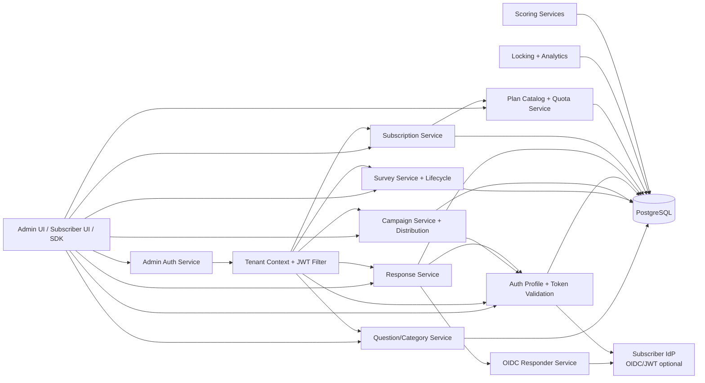

---

## 3. Flow: Tenant Onboarding (MVP)

### 3.1 Intent
Allow a new tenant to start using the platform with minimal setup.

### 3.2 ASCII Sequence
```text
Tenant Admin      Admin Auth Svc      Tenant Svc      Subscription Svc
    |                   |                |                 |
1. Register             |                |                 |
    |------------------>|                |                 |
2. Ensure tenant exists |--------------->|                 |
3. Ensure trial exists  |--------------------------------->|
4. Issue access+refresh tokens as HttpOnly cookies            
    |<------------------|                |                 |
5. Access admin APIs (cookies sent automatically)            
```

### 3.3 Mermaid Sequence
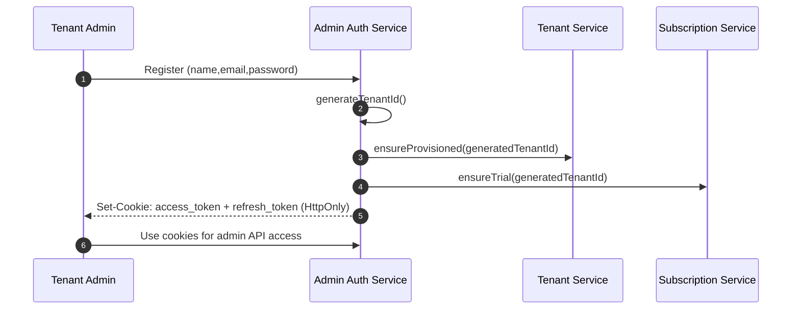

---

## 4. Flow: Admin Authentication and Authorization Baseline

### 4.1 Key Rule
Authentication is engine-issued JWT. Tenant context is derived from JWT claims.

### 4.2 ASCII Decision Flow
```text
[Admin API request]
      |
      v
[JWT present?] --no--> [401]
      |
     yes
      v
[Parse JWT claims: tenant_id, role, user]
      |
      v
[Set TenantContext for request]
      |
      v
[Route authorization checks]
      |
      +--> [Super-admin only endpoint?]
                 |yes
                 v
             [role=SUPER_ADMIN?]
               |yes      |no
               v         v
            [allow]   [403]
```

### 4.3 Mermaid Flowchart
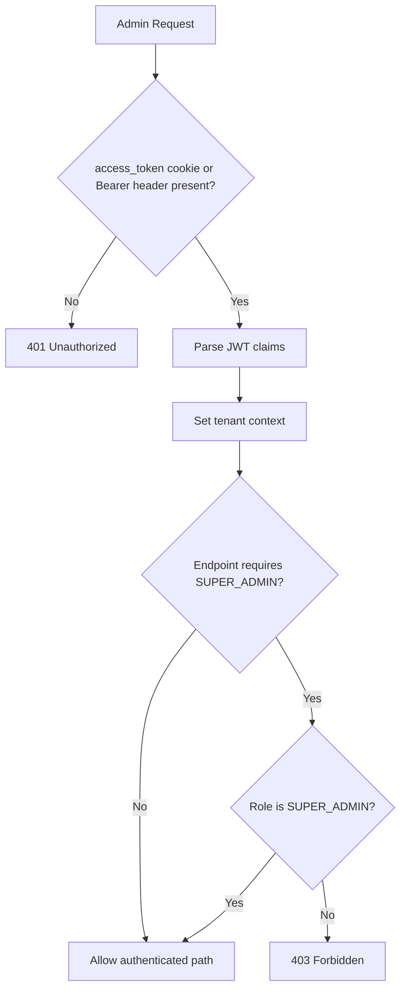

---

## 5. Flow: Question and Category Authoring

### 5.1 ASCII Sequence
```text
Admin UI       Question/Category API      Service Layer        Database
   |                    |                      |                  |
1. Create question      |--------------------->|----------------->|
2. Create category      |--------------------->|----------------->|
3. Update question      |--------------------->|----------------->|
4. Update category      |--------------------->|----------------->|
5. Deactivate records   |--------------------->|----------------->|
6. List active records  |--------------------->|<-----------------|
```

### 5.2 Mermaid Sequence
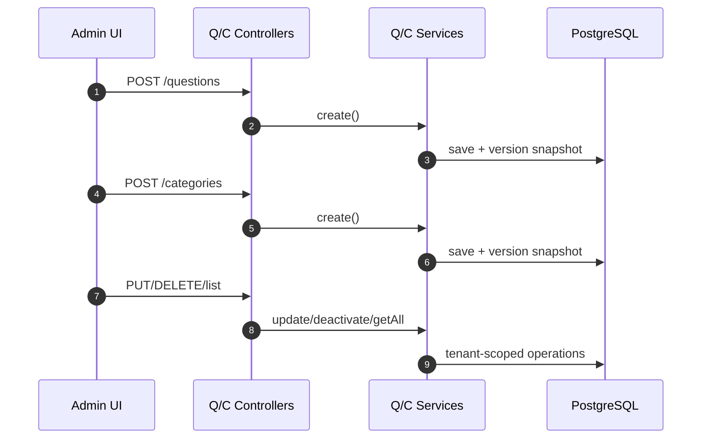

---

## 6. Flow: Survey Authoring and Lifecycle

### 6.1 ASCII Sequence
```text
Admin UI         Survey API          Survey Service          Database
   |                 |                    |                    |
1. Create draft      |------------------->|------------------->|
2. Update draft      |------------------->|------------------->|
3. Lifecycle transition request           |                    |
   |                 |------------------->|                    |
4. Validate transition and state          |                    |
5. Publish -> immutable snapshot          |------------------->|
6. Return new lifecycle state             |<-------------------|
```

### 6.2 Mermaid Sequence
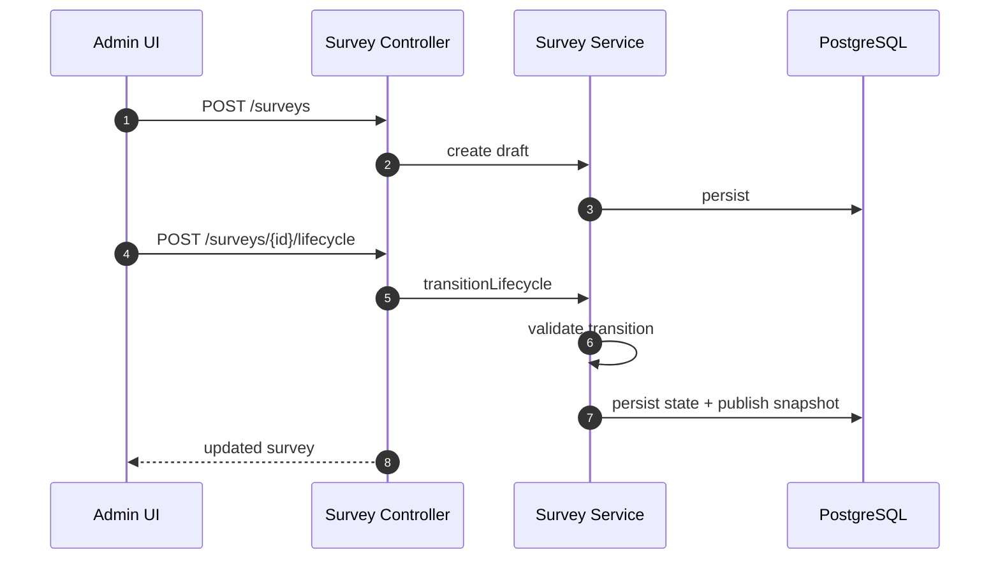

---

## 7. Flow: Campaign Setup, Activation, and Distribution

### 7.1 ASCII Sequence
```text
Admin UI        Campaign API       Campaign Service      Distribution Service
   |                |                    |                        |
1. Create campaign  |------------------->|                        |
2. Update settings  |------------------->|                        |
3. Activate         |------------------->| validate survey state  |
4. Generate channels|-------------------------------------------->|
5. List channels    |-------------------------------------------->|
```

### 7.2 Mermaid Sequence
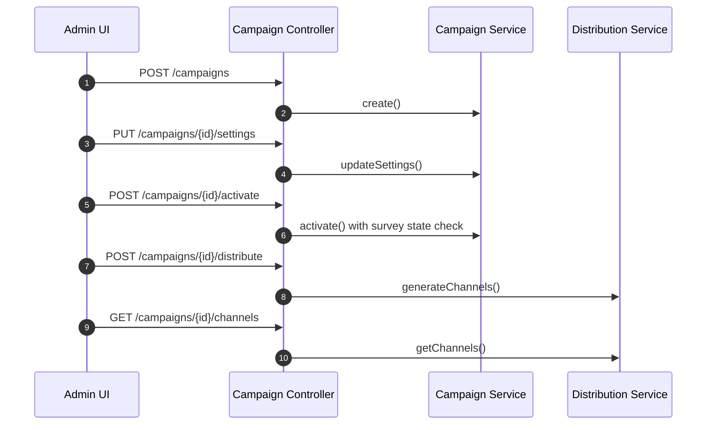

---

## 8. Flow: Tenant Auth Profile Configuration

### 8.1 Intent
Configure responder authentication once per tenant for all private campaigns.

### 8.2 ASCII Sequence
```text
Admin UI         Auth API            AuthProfile Svc          Audit Store
   |                |                     |                       |
1. Create profile   |-------------------->|                       |
2. Validate mapping/respondentId required |                       |
3. Save profile     |                     |---------------------->|
4. Write audit      |                     |---------------------->|
5. Get profile/audit|-------------------->|---------------------->|
```

### 8.3 Mermaid Sequence
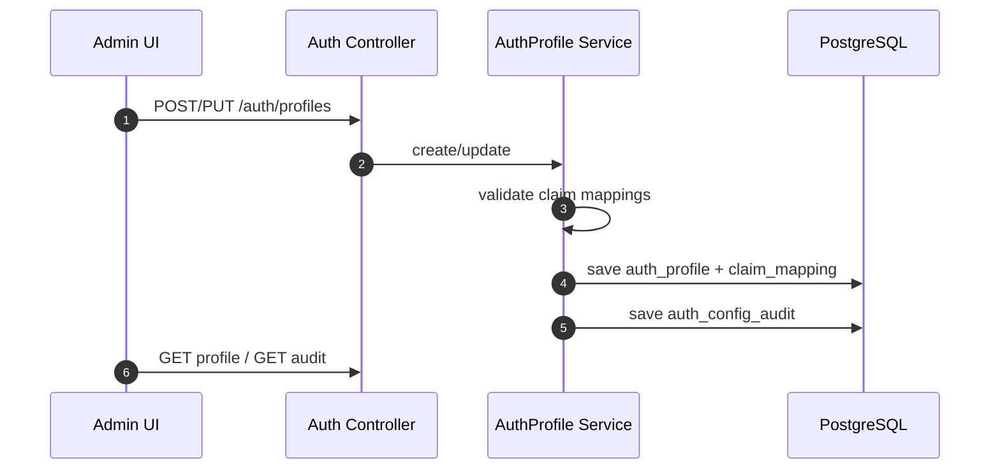

---

## 9. Flow: Private Responder Access (OIDC Path)

### 9.1 ASCII Sequence
```text
Responder UI     OIDC Auth API     OIDC Service      Subscriber IdP    Response API
    |                |                  |                  |                |
1. Start login       |----------------->|                  |                |
2. Validate tenant/campaign/private     |                  |                |
3. Return auth URL   |<-----------------|                  |                |
4. Redirect to IdP   |------------------------------------>|                |
5. IdP callback      |<------------------------------------|                |
6. Exchange code + token validation     |----------------->|                |
7. Issue one-time responder access code |                  |                |
8. Submit response with access code --------------------------------------->|
9. Consume code once and store locked response                              |
```

### 9.2 Mermaid Sequence
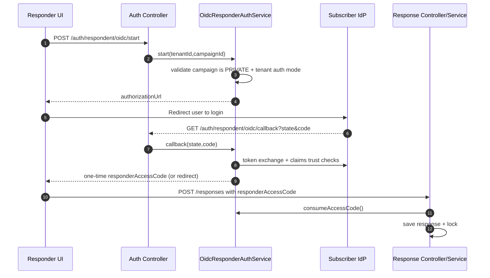

---

## 10. Flow: Private Responder Access (Signed Token Fallback)

### 10.1 ASCII Sequence
```text
Responder UI    Subscriber Backend      Response API        Token Validation
    |                  |                    |                     |
1. Get signed token    |<-------------------|                     |
2. Submit response with responderToken ---->|                     |
3. Validate signature/iss/aud/exp/jti --------------------------->|
4. Validate required claim mappings                              |
5. Save locked response  |<--------------------------------------|
```

### 10.2 Mermaid Sequence
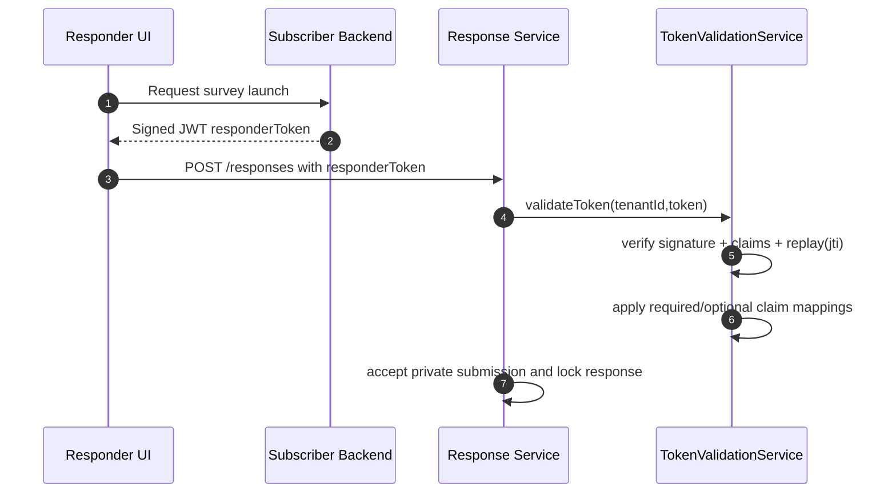

---

## 11. Flow: Public and Private Submission Decision

### 11.1 Mermaid Decision Flow
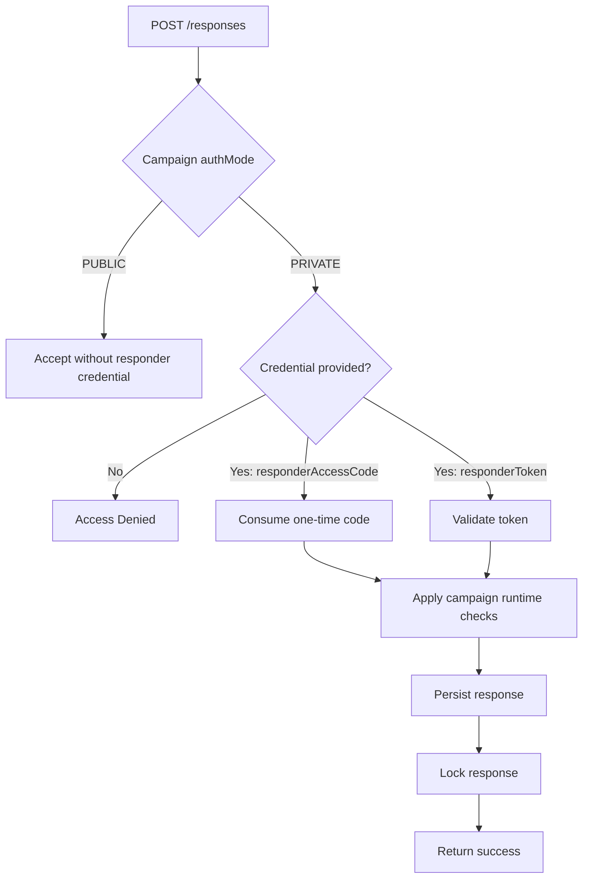

---

## 12. Flow: Response Locking, Reopen, and Analytics

### 12.1 ASCII Sequence
```text
Admin UI        Response API         Locking Service       Analytics Service
   |                |                    |                     |
1. Get response     |------------------->|                     |
2. Lock response    |------------------->|                     |
3. Reopen with reason|------------------>|                     |
4. Campaign analytics|---------------------------------------->|
```

### 12.2 Mermaid Sequence
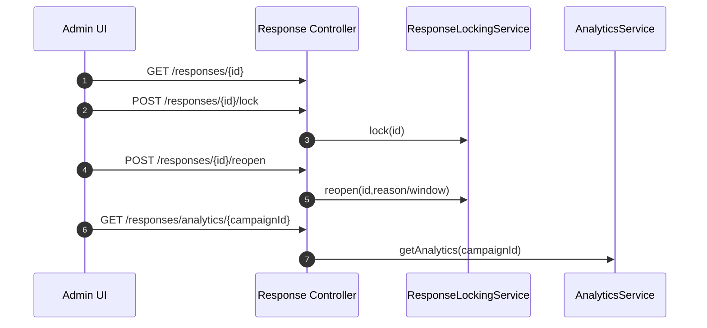

---

## 13. Flow: Scoring Profile and Score Calculation

### 13.1 ASCII Sequence
```text
Admin UI        Scoring API         WeightProfile Svc      Scoring Engine
   |                |                    |                     |
1. Create profile   |------------------->|                     |
2. Validate weights |------------------->|                     |
3. Calculate score  |----------------------------------------->|
4. Return result    |<-----------------------------------------|
```

### 13.2 Mermaid Sequence
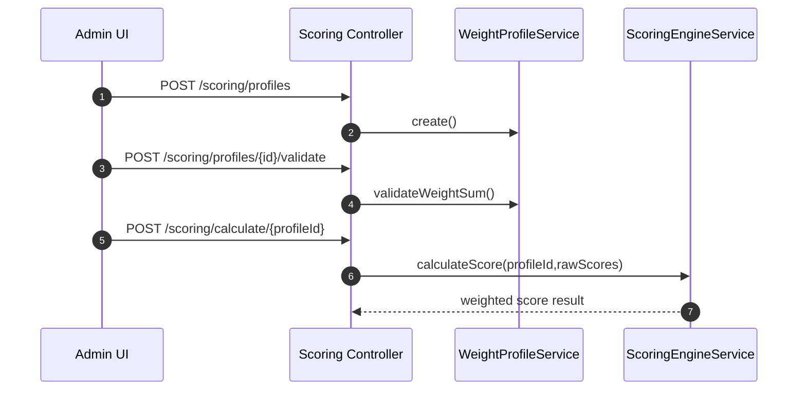

---

## 14. Flow: Subscription Enforcement on Admin APIs

### 14.1 ASCII Decision Flow
```text
[Admin request arrives]
      |
      v
[Auth cookie/token valid + tenant context?] --no--> [401]
      |
     yes
      v
[Endpoint exempt from subscription check?]
      |yes
      v
   [continue]
      |
     no
      v
[Tenant has active subscription?]
      |yes               |no
      v                  v
   [continue]       [402 Payment Required]
```

### 14.2 Mermaid Flowchart
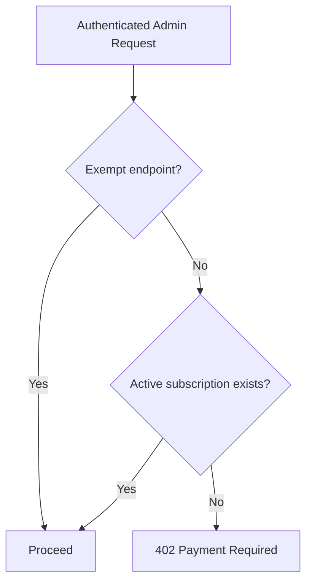

---

## 15. MVP Operational Guardrails
1. Tenant context must come from trusted admin JWT claims on protected admin APIs.
2. Private campaign submissions must pass tenant auth profile checks.
3. Required claim mapping must include `respondentId` and fail closed if missing.
4. Signed token replay is blocked by persisted `jti` usage tracking.
5. OIDC callback state and responder access code are one-time and short-lived.
6. Survey publish lifecycle and campaign activation preconditions are enforced.
7. Subscription checks block non-exempt admin endpoints when inactive.
8. Key auth profile changes are audit logged.

## 16. Out of MVP (Not in this architecture flow)
1. Native SAML protocol stack and LDAP bind engine.
2. Real payment provider webhook/reconciliation flow.
3. Roster connectors/assignment engine integration pipeline.
4. Webhook delivery subsystem with retry dead-letter architecture.
5. Setup-later bootstrap state machine and expiry gating.

---

## 17. Appendix A: Failure-Path Sequence Diagrams

### 17.1 Private Submit Fails (No Credential)
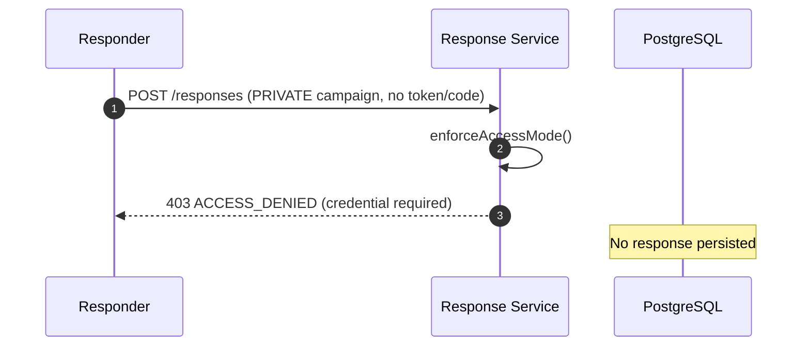

### 17.2 OIDC Callback Fails (Invalid/Expired State)
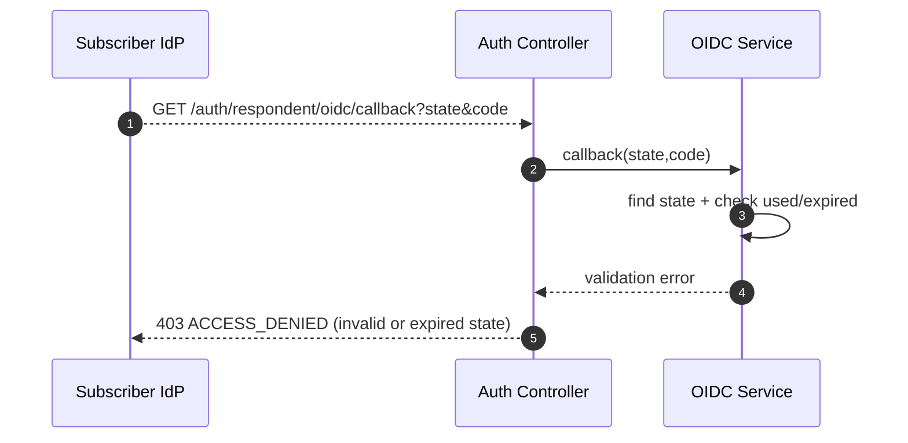

### 17.3 Signed Token Fails (Replay)
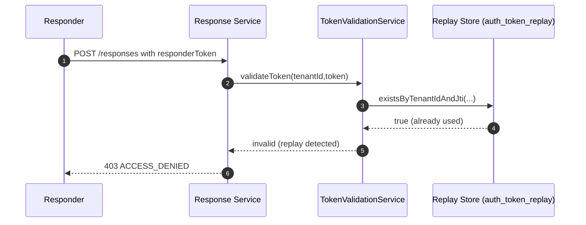

### 17.4 Admin API Blocked (Subscription Inactive)
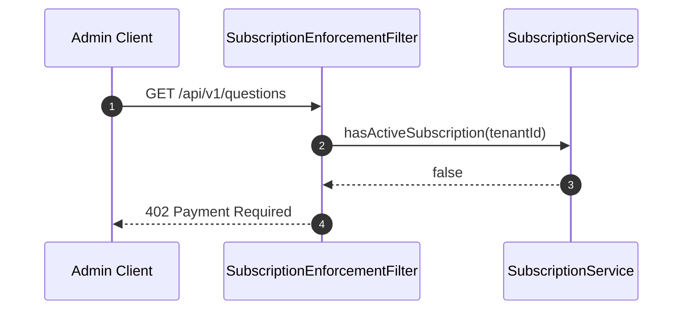

---

## 18. Appendix B: Endpoint-to-Flow Trace Matrix

| Endpoint Pattern | Primary Flow Section | Business Purpose |
| --- | --- | --- |
| `/api/v1/admin/auth/register` | 3 | Tenant bootstrap onboarding (sets HttpOnly cookies) |
| `/api/v1/admin/auth/login` | 4 | Admin authentication (sets HttpOnly cookies) |
| `/api/v1/admin/auth/refresh` | 4 | Session continuity (rotates cookies) |
| `/api/v1/admin/auth/logout` | 4 | Clears auth cookies |
| `/api/v1/admin/auth/me` | 4 | Returns current user from cookie session |
| `/api/v1/admin/subscriptions/me` | 14 | Subscription visibility |
| `/api/v1/admin/subscriptions/checkout` | 3, 14 | Plan activation/update |
| `/api/v1/admin/plans` (GET/PUT) | 14 | Plan catalog/governance |
| `/api/v1/questions/**` | 5 | Question bank management |
| `/api/v1/categories/**` | 5 | Category management |
| `/api/v1/surveys/**` | 6 | Survey authoring/lifecycle |
| `/api/v1/campaigns/**` | 7 | Campaign setup + distribution |
| `/api/v1/auth/profiles/**` | 8 | Tenant responder auth configuration |
| `/api/v1/auth/providers/templates/**` | 8 | IdP setup guidance |
| `/api/v1/auth/validate/{tenantId}` | 10, 11 | Token trust decision |
| `/api/v1/auth/respondent/oidc/start` | 9 | OIDC private responder start |
| `/api/v1/auth/respondent/oidc/callback` | 9 | OIDC callback + code exchange |
| `/api/v1/responses` | 9, 10, 11 | Public/private response ingestion |
| `/api/v1/responses/{id}/lock` | 12 | Response integrity control |
| `/api/v1/responses/{id}/reopen` | 12 | Exception handling |
| `/api/v1/responses/analytics/{campaignId}` | 12 | Campaign analytics |
| `/api/v1/scoring/profiles/**` | 13 | Scoring profile lifecycle |
| `/api/v1/scoring/calculate/{profileId}` | 13 | Weighted score output |

---

## 19. Appendix C: Core Data Relationship Diagram (MVP)

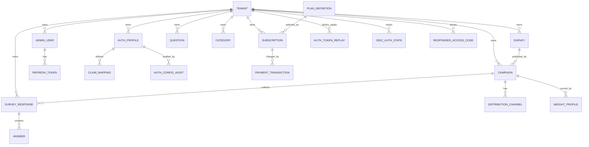

Data integrity notes:
1. Tenant ID is enforced on core domain tables.
2. Composite tenant-consistency foreign keys protect cross-tenant linkage mistakes.
3. Replay/state/access-code tables are time-bound and cleaned during auth operations.

---

## 20. Appendix D: SLO, Monitoring, and Incident Runbook Starters

### 20.1 Suggested MVP SLO Targets
1. Admin API availability: 99.9% monthly.
2. Responder submit API availability (`POST /responses`): 99.95% monthly.
3. Private OIDC callback success (excluding IdP downtime): >= 99.5%.
4. P95 response submit latency: <= 800 ms under normal load.
5. P95 admin read latency: <= 500 ms.

### 20.2 Key Metrics to Track
1. Auth:
- Admin login success/failure rate
- Refresh token rotation failure rate
- OIDC start/callback success and error counts
- Token replay detection count (`jti` collisions)

2. Campaign/Response:
- Submit success/failure by campaign
- Access denied count by reason (missing credential, invalid token, quota)
- Response lock/reopen counts

3. SaaS/Billing:
- Subscription inactive blocks (`402`) by tenant
- Checkout success/failure rate
- Quota-exceeded events

### 20.3 Alert Starter Rules
1. `POST /responses` 5xx > 2% for 5 minutes.
2. OIDC callback failures > 10% for 10 minutes.
3. Auth validation failures spike > 3x baseline.
4. DB connectivity errors > threshold for 2 minutes.
5. Subscription block rate spike for a single tenant (possible billing/config issue).

### 20.4 Incident Runbook (Short)
1. Private responder cannot submit:
- Check campaign `authMode=PRIVATE` and active status.
- Check tenant auth profile mode and required claim mappings.
- If OIDC: verify discovery URL, client credentials, callback URL, and state expiration.
- If signed token: verify signature inputs, issuer/audience, exp, and `jti` reuse.

2. Unexpected 402 Payment Required:
- Check tenant subscription status and current period.
- Validate endpoint exemption behavior.
- Confirm recent plan change and quota values.

3. OIDC callback failures:
- Validate IdP availability.
- Verify system clock skew.
- Check state table cleanup and callback state lifecycle.

4. Elevated ACCESS_DENIED on private campaigns:
- Break down by error reason in logs.
- Confirm claim mapping still contains required `respondentId` mapping.
- Validate latest auth profile changes via audit endpoint.
