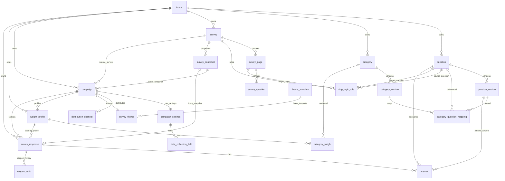
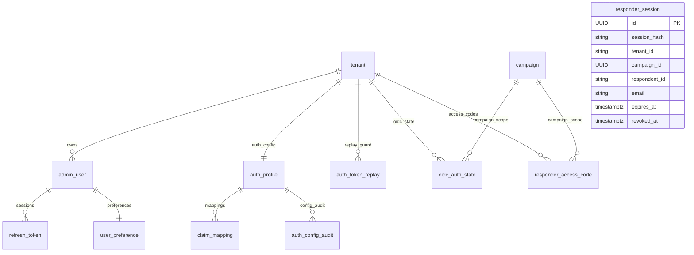
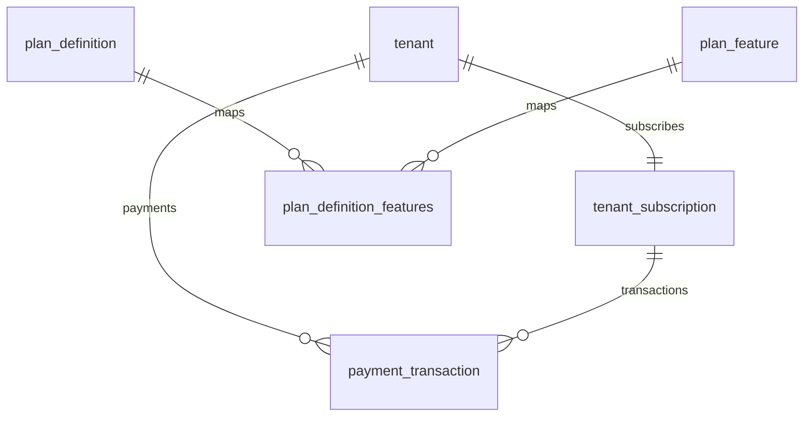
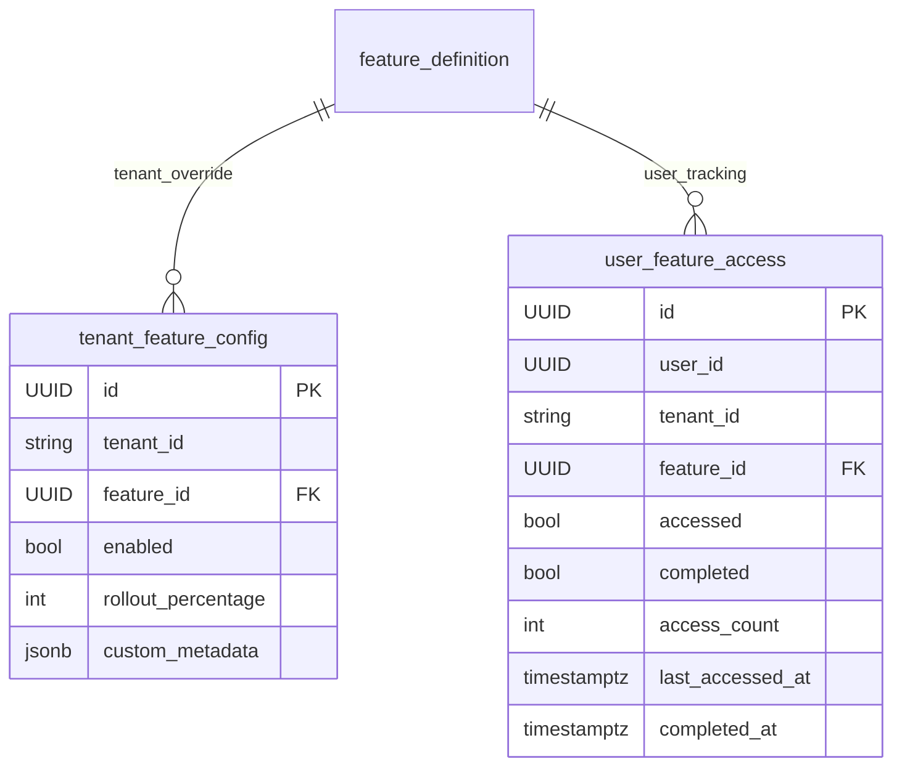
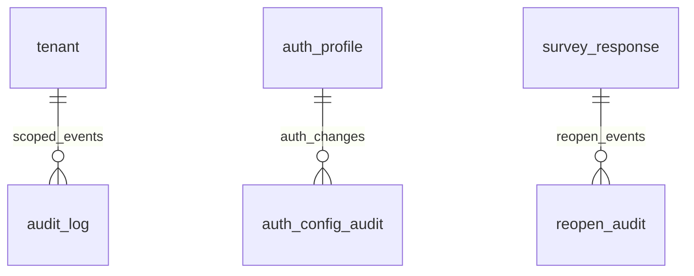

# Survey Engine Production ERD (Full Coverage)
## Schema Baseline: Flyway `V1` .. `V34`
## Date: March 11, 2026

## Scope
This ERD reflects the production schema generated by migrations in:
`src/main/resources/db/migration`

It covers all tables currently in the project, including:
1. Core survey/campaign domains.
2. Auth and responder-session domains.
3. SaaS subscription/plan domains.
4. Feature management/onboarding domains.
5. Audit and operational domains.

## Reading Guide
1. `PK` = Primary key.
2. `FK` = Physical database foreign key.
3. Some links are intentionally logical (application-enforced), not DB FK constrained.

---

## 1. Physical Table Inventory
1. `tenant`
2. `admin_user`
3. `refresh_token`
4. `user_preference`
5. `audit_log`
6. `question`
7. `question_version`
8. `category`
9. `category_version`
10. `category_question_mapping`
11. `survey`
12. `survey_page`
13. `survey_question`
14. `skip_logic_rule`
15. `survey_snapshot`
16. `campaign`
17. `campaign_settings`
18. `distribution_channel`
19. `theme_template`
20. `survey_theme`
21. `data_collection_field`
22. `weight_profile`
23. `category_weight`
24. `survey_response`
25. `answer`
26. `reopen_audit`
27. `auth_profile`
28. `claim_mapping`
29. `auth_config_audit`
30. `auth_token_replay`
31. `oidc_auth_state`
32. `responder_access_code`
33. `responder_session`
34. `tenant_subscription`
35. `payment_transaction`
36. `plan_definition`
37. `plan_feature`
38. `plan_definition_features`
39. `feature_definition`
40. `tenant_feature_config`
41. `user_feature_access`

---

## 2. Domain ERD: Core Survey + Campaign + Response

---

## 3. Domain ERD: Authentication + Private Responder

Notes:
1. `responder_session` currently has no physical FK constraints (by design) but is logically scoped to `tenant` + `campaign`.
2. `oidc_auth_state` and `responder_access_code` are composite-FK scoped to `(campaign_id, tenant_id)`.

---

## 4. Domain ERD: SaaS Billing + Plan Features

Notes:
1. `tenant_subscription.plan` stores plan code as value; there is no physical FK from `tenant_subscription.plan` to `plan_definition.plan_code`.
2. The join table `plan_definition_features` is the authoritative plan-feature mapping.

---

## 5. Domain ERD: Feature Management + Onboarding

Notes:
1. `tenant_feature_config.tenant_id` is logical (no DB FK in current migration).
2. `user_feature_access.user_id` and `tenant_id` are logical (no DB FK in current migration).

---

## 6. Domain ERD: Audit and Governance

---

## 7. Full Coverage Integrated ERD

```mermaid
erDiagram
    tenant ||--o{ admin_user : owns
    admin_user ||--o{ refresh_token : has
    admin_user ||--|| user_preference : has

    tenant ||--o{ question : owns
    question ||--o{ question_version : versions

    tenant ||--o{ category : owns
    category ||--o{ category_version : versions
    category_version ||--o{ category_question_mapping : has
    question ||--o{ category_question_mapping : uses
    question_version ||--o{ category_question_mapping : uses

    tenant ||--o{ survey : owns
    survey ||--o{ survey_page : has
    survey_page ||--o{ survey_question : has
    question ||--o{ survey_question : uses
    question_version ||--o{ survey_question : pins
    category ||--o{ survey_question : tags
    survey ||--o{ skip_logic_rule : has
    question ||--o{ skip_logic_rule : source_target
    survey_page ||--o{ skip_logic_rule : target
    survey ||--o{ survey_snapshot : publishes

    tenant ||--o{ campaign : owns
    survey ||--o{ campaign : source
    survey_snapshot ||--o{ campaign : snapshot
    campaign ||--|| campaign_settings : settings
    campaign ||--o{ distribution_channel : channels
    campaign ||--|| survey_theme : theme
    theme_template ||--o{ survey_theme : template
    campaign_settings ||--o{ data_collection_field : fields

    tenant ||--o{ weight_profile : owns
    campaign ||--o{ weight_profile : scoring
    weight_profile ||--o{ category_weight : weights
    category ||--o{ category_weight : weighted

    tenant ||--o{ survey_response : owns
    campaign ||--o{ survey_response : responses
    survey_snapshot ||--o{ survey_response : context
    weight_profile ||--o{ survey_response : scored_by
    survey_response ||--o{ answer : answers
    question ||--o{ answer : answered
    question_version ||--o{ answer : versioned
    survey_response ||--o{ reopen_audit : reopen_log

    tenant ||--|| auth_profile : auth
    auth_profile ||--o{ claim_mapping : maps
    auth_profile ||--o{ auth_config_audit : audits
    tenant ||--o{ auth_token_replay : replay

    tenant ||--o{ oidc_auth_state : oidc_state
    campaign ||--o{ oidc_auth_state : scoped
    tenant ||--o{ responder_access_code : access_code
    campaign ||--o{ responder_access_code : scoped

    tenant ||--|| tenant_subscription : subscription
    tenant_subscription ||--o{ payment_transaction : payments
    tenant ||--o{ payment_transaction : pays
    plan_definition ||--o{ plan_definition_features : has
    plan_feature ||--o{ plan_definition_features : included

    feature_definition ||--o{ tenant_feature_config : tenant_rules
    feature_definition ||--o{ user_feature_access : user_rules

    tenant ||--o{ audit_log : audit
```

---

## 8. Logical (Application-Enforced) Relationships Not Backed by DB FK
1. `responder_session.tenant_id -> tenant.id`
2. `responder_session.campaign_id -> campaign.id`
3. `tenant_feature_config.tenant_id -> tenant.id`
4. `user_feature_access.user_id -> admin_user.id`
5. `user_feature_access.tenant_id -> tenant.id`
6. `tenant_subscription.plan -> plan_definition.plan_code` (logical code binding)

---

## 9. Production Notes
1. Composite tenant integrity is enforced on critical chains:
   - `campaign(survey_id, tenant_id) -> survey(id, tenant_id)`
   - `weight_profile(campaign_id, tenant_id) -> campaign(id, tenant_id)`
   - `survey_response(campaign_id, tenant_id) -> campaign(id, tenant_id)`
2. Question-version consistency is enforced via composite constraints on:
   - `survey_question(question_version_id, question_id)`
   - `answer(question_version_id, question_id)`
3. For private responder flows, session tables (`responder_session`) are intentionally decoupled from strict FK constraints to support operational revocation and low-friction auth exchange handling.

