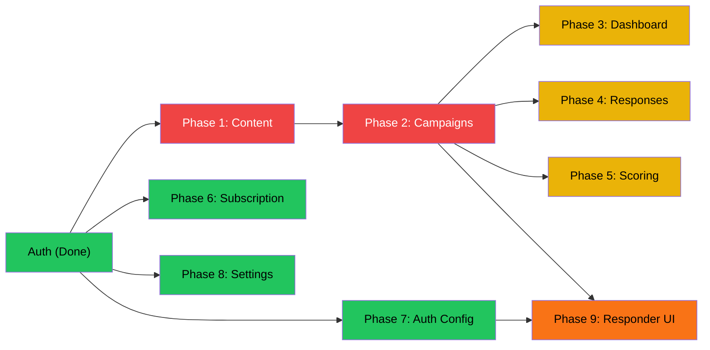

# Survey Engine — Frontend Implementation Phases
## Product: Admin Dashboard + Responder Experience
## Version: 1.0
## Date: March 4, 2026

---

## Current State

### What Exists

| Layer | Status | Details |
|-------|--------|---------|
| **Auth Flow** | ✅ Done | Login, Register pages. Cookie-based auth (HttpOnly). Session hydration via `/me`. |
| **Layout Shell** | ✅ Done | Sidebar navigation, header with user menu, responsive layout. |
| **Landing Page** | ✅ Done | Public marketing/home page at `/`. |
| **Pricing Page** | ✅ Done | Plan comparison at `/pricing`. |
| **Dashboard Shell** | 🟡 Shell only | Empty `/dashboard` page exists but has no functional content. |
| **Settings Shell** | 🟡 Shell only | Empty `/settings` page exists but has no functional content. |
| **UI Component Library** | ✅ Done | 12 component families (63 files): alert, avatar, badge, button, card, dropdown-menu, input, label, separator, sheet, sonner, tooltip. |
| **API Client** | ✅ Done | Axios with `withCredentials`, auto-refresh interceptor, cookie-based auth. |
| **Types** | ✅ Done | Full DTO type coverage for all backend endpoints. |

### What's Missing

All **CRUD admin pages** for questions, categories, surveys, campaigns, responses, scoring, and subscription management. The responder-facing survey-taking experience is also not built.

---

## Phase 1 — Core Content Management (Questions, Categories, Surveys)

### Goal
Enable admins to build and manage the fundamental building blocks of a survey.

### Backend APIs Consumed

| Controller | Endpoints |
|------------|-----------|
| `QuestionController` | POST, GET, GET/{id}, PUT/{id}, DELETE/{id} |
| `CategoryController` | POST, GET, GET/{id}, PUT/{id}, DELETE/{id} |
| `SurveyController` | POST, GET, GET/{id}, PUT/{id}, DELETE/{id}, POST/{id}/lifecycle |

### Pages to Build

#### 1.1 Question Bank (`/questions`)
- **List view**: Table of all active questions with type, max score, created date
- **Create dialog/page**: Form with text, type picker (RANK, RATING_SCALE, SINGLE_CHOICE, MULTIPLE_CHOICE), max score
- **Edit dialog/page**: Pre-filled form, version tracking indicator
- **Delete**: Soft-deactivate with confirmation dialog
- **Search/filter**: By type, text search

#### 1.2 Category Management (`/categories`)
- **List view**: Categories with mapped question count
- **Create dialog/page**: Name, description, question mappings (sortable drag list with weight assignment)
- **Edit dialog/page**: Update name/description, add/remove/reorder question mappings
- **Delete**: Soft-deactivate with confirmation

#### 1.3 Survey Builder (`/surveys`)
- **List view**: Surveys with lifecycle state badge (DRAFT, PUBLISHED, CLOSED, RESULTS_PUBLISHED, ARCHIVED)
- **Create page**: Title, description, page builder with drag-and-drop question assignment
- **Edit page**: Modify draft surveys; read-only view for published+
- **Lifecycle controls**: State transition buttons (Publish, Close, Publish Results, Archive) with confirmation dialogs
- **Delete**: Soft-deactivate

### New Components Needed
- Data table (sortable, filterable)
- Dialog/modal
- Form builder
- Drag-and-drop sortable list
- State badge (lifecycle states)
- Confirmation dialog
- Empty state placeholder

### Estimated Effort
~3–4 weeks for one frontend developer

---

## Phase 2 — Campaign Management & Distribution

### Goal
Enable admins to turn published surveys into live campaigns and generate distribution channels.

### Backend APIs Consumed

| Controller | Endpoints |
|------------|-----------|
| `CampaignController` | POST, GET, GET/{id}, PUT/{id}, DELETE/{id}, PUT/{id}/settings, POST/{id}/activate, POST/{id}/distribute, GET/{id}/channels |

### Pages to Build

#### 2.1 Campaign List (`/campaigns`)
- **List view**: Campaigns with status badge (DRAFT, ACTIVE, PAUSED, COMPLETED, ARCHIVED), linked survey name, auth mode
- **Create dialog**: Name, description, survey picker (published surveys only), auth mode (PUBLIC/PRIVATE)
- **Edit dialog**: Update metadata for non-active campaigns
- **Delete**: Soft-deactivate with confirmation

#### 2.2 Campaign Detail (`/campaigns/{id}`)
- **Overview tab**: Campaign metadata, status, linked survey info
- **Settings tab**: Full campaign settings form
  - Security: password, captcha, IP/email restrictions, one-response-per-device
  - Limits: response quota, close date, session timeout
  - UX: question numbers, progress indicator, back button, start/finish messages
  - Branding: header/footer HTML, data collection toggles (name, email, phone, address)
- **Distribution tab**: Generate channels button, channel list with copy-to-clipboard
  - Channel types: PUBLIC_LINK, PRIVATE_LINK, HTML_EMBED, WORDPRESS_EMBED, JS_EMBED, EMAIL
- **Actions**: Activate button (with survey state pre-check), status controls

### New Components Needed
- Tabbed interface
- Copy-to-clipboard snippet
- Status stepper/timeline
- Settings form sections (collapsible groups)
- Survey picker (select from published surveys)

### Estimated Effort
~2–3 weeks

---

## Phase 3 — Dashboard & Analytics

### Goal
Give admins a meaningful landing page with key metrics and per-campaign analytics.

### Backend APIs Consumed

| Controller | Endpoints |
|------------|-----------|
| `ResponseController` | GET /analytics/{campaignId} |
| `CampaignController` | GET (for campaign list summary) |
| `SubscriptionController` | GET /me (subscription status) |

### Pages to Build

#### 3.1 Dashboard Home (`/dashboard`)
- **Summary cards**: Total campaigns, active campaigns, total responses, subscription status
- **Recent campaigns**: Quick-access list with status, response count, completion rate
- **Quick actions**: Create survey, create campaign, view responses

#### 3.2 Campaign Analytics (`/campaigns/{id}/analytics`)
- **Metrics summary**: Total responses, submitted, locked, in-progress counts, completion rate
- **Charts**: Response submission over time, completion funnel
- **Export capability**: CSV/JSON data export (future, placeholder UI)

### New Components Needed
- Stat card
- Bar/line chart (lightweight chart library)
- Progress ring/bar
- Activity feed / recent items list

### Estimated Effort
~1–2 weeks

---

## Phase 4 — Response Management

### Goal
Enable admins to view, lock, and reopen individual survey responses.

### Backend APIs Consumed

| Controller | Endpoints |
|------------|-----------|
| `ResponseController` | GET /{id}, GET /campaign/{campaignId}, POST /{id}/lock, POST /{id}/reopen |

### Pages to Build

#### 4.1 Response List (`/campaigns/{id}/responses`)
- **Table view**: Respondent identifier, status (IN_PROGRESS, SUBMITTED, LOCKED, REOPENED), timestamps
- **Filters**: By status, date range
- **Bulk actions**: Lock selected (future)

#### 4.2 Response Detail (`/responses/{id}`)
- **Answer viewer**: Question text → answer value + score, grouped by survey page
- **Status controls**: Lock / Reopen buttons with reason input for reopen
- **Metadata**: Started at, submitted at, locked at timestamps

### New Components Needed
- Read-only answer renderer (per question type)
- Reason input dialog (for reopen)
- Status timeline/history

### Estimated Effort
~1–2 weeks

---

## Phase 5 — Scoring & Weight Profiles

### Goal
Enable admins to define weighted scoring models and calculate scores for campaigns.

### Backend APIs Consumed

| Controller | Endpoints |
|------------|-----------|
| `ScoringController` | POST /profiles, GET /profiles/{id}, GET /profiles/campaign/{campaignId}, PUT /profiles/{id}, DELETE /profiles/{id}, POST /profiles/{id}/validate, POST /calculate/{profileId} |

### Pages to Build

#### 5.1 Scoring Profiles (`/campaigns/{id}/scoring`)
- **List view**: Profiles for a campaign with validation status
- **Create/edit form**: Name, category weight assignments (slider or percentage input per category, must sum to 100%)
- **Validate button**: Server-side weight sum validation with result feedback
- **Delete**: Soft-deactivate

#### 5.2 Score Calculator (`/campaigns/{id}/scoring/{profileId}/calculate`)
- **Input form**: Raw category scores (per-category number input)
- **Result display**: Category breakdown (raw, normalized, weighted) + total weighted score
- **Visual summary**: Radar chart or stacked bar of category contributions

### New Components Needed
- Percentage slider / weight allocator
- Validation result indicator
- Score result breakdown table
- Radar or stacked bar chart

### Estimated Effort
~1–2 weeks

---

## Phase 6 — Subscription & Billing

### Goal
Let admins view and manage their subscription plan and billing status.

### Backend APIs Consumed

| Controller | Endpoints |
|------------|-----------|
| `SubscriptionController` | GET /me, POST /checkout |
| `PlanAdminController` | GET (list plans), PUT (super-admin only) |

### Pages to Build

#### 6.1 Subscription Status (`/settings/subscription`)
- **Current plan card**: Plan name, status (TRIAL, ACTIVE, CANCELED, EXPIRED), period dates
- **Usage meters**: Campaigns used vs. quota, responses used vs. quota, admin users vs. quota
- **Upgrade flow**: Plan comparison with checkout button per plan

#### 6.2 Plan Administration (`/admin/plans`) — Super Admin Only
- **Plan list**: All plans with pricing, quotas, billing cycle
- **Create/edit form**: Plan code, display name, price, currency, trial days, quotas
- **Role guard**: Page only accessible to SUPER_ADMIN role

### New Components Needed
- Plan comparison card
- Usage meter / progress bar with quota
- Checkout confirmation dialog
- Role-based route guard

### Estimated Effort
~1 week

---

## Phase 7 — Tenant Auth Configuration (Private Campaigns)

### Goal
Let admins configure external identity provider settings for private campaign responder authentication.

### Backend APIs Consumed

| Controller | Endpoints |
|------------|-----------|
| `AuthController` | POST /profiles, PUT /profiles/{id}, GET /profiles/tenant/{tenantId}, POST /profiles/{id}/rotate-key, GET /profiles/{id}/audit, GET /providers/templates, GET /providers/templates/{providerCode} |

### Pages to Build

#### 7.1 Auth Profile Configuration (`/settings/auth`)
- **Current profile view**: Auth mode, provider details, claim mappings, key version
- **Edit form**: Auth mode selector, provider config fields (discovery URL, client ID/secret), claim mapping editor
- **Provider templates**: Template picker (OKTA, AUTH0, AZURE_AD, KEYCLOAK) that pre-fills form fields
- **Key rotation**: Rotate signing key with confirmation
- **Audit log**: Change history table (who changed what, when)

### New Components Needed
- JSON/key-value mapping editor
- Provider template selector
- Audit log timeline
- Sensitive field masking (client secret)

### Estimated Effort
~1–2 weeks

---

## Phase 8 — Settings & Account Management

### Goal
Centralize tenant and user account settings.

### Pages to Build

#### 8.1 Settings Hub (`/settings`)
- **Profile section**: Current user info (email, name, role), password change
- **Tenant section**: Tenant name/ID display
- **Navigation**: Links to Subscription settings (Phase 6) and Auth settings (Phase 7)
- **Theme/preferences**: Dark mode toggle, sidebar collapse preference

### New Components Needed
- Settings section layout
- Password change form with strength indicator
- Theme toggle

### Estimated Effort
~1 week

---

## Phase 9 — Responder-Facing Survey Experience (Future)

### Goal
Build the public/private survey-taking UI for end respondents.

### Backend APIs Consumed

| Controller | Endpoints |
|------------|-----------|
| `ResponseController` | POST /responses |
| `AuthController` | POST /respondent/oidc/start, GET /respondent/oidc/callback, POST /validate/{tenantId} |

### Pages to Build

#### 9.1 Survey Landing (`/s/{channelCode}`)
- Campaign info, start button, optional password gate

#### 9.2 Survey Taking (`/s/{channelCode}/respond`)
- Page-by-page question renderer (RANK, RATING_SCALE, SINGLE_CHOICE, MULTIPLE_CHOICE)
- Progress indicator, back/next navigation, session timeout handling
- Answer auto-save (optional)

#### 9.3 Private Auth Gate
- OIDC redirect flow for private campaigns
- Signed token validation path

#### 9.4 Completion Page
- Custom finish message, submission confirmation

### New Components Needed
- Question renderer (per question type)
- Survey navigation (page stepper)
- Answer input components (radio, checkbox, ranking drag, slider)
- Timer / session timeout warning
- Completion/thank-you page

### Estimated Effort
~3–4 weeks

---

## Phase Summary

| Phase | Name | Dependencies | Effort | Priority |
|-------|------|-------------|--------|----------|
| 1 | Core Content Management | Auth (done) | 3–4 weeks | 🔴 Critical |
| 2 | Campaign Management | Phase 1 | 2–3 weeks | 🔴 Critical |
| 3 | Dashboard & Analytics | Phase 2 | 1–2 weeks | 🟡 High |
| 4 | Response Management | Phase 2 | 1–2 weeks | 🟡 High |
| 5 | Scoring & Weights | Phase 2 | 1–2 weeks | 🟡 High |
| 6 | Subscription & Billing | Auth (done) | 1 week | 🟢 Medium |
| 7 | Tenant Auth Config | Auth (done) | 1–2 weeks | 🟢 Medium |
| 8 | Settings & Account | Auth (done) | 1 week | 🟢 Medium |
| 9 | Responder Experience | Phase 2 + Phase 7 | 3–4 weeks | 🟠 High (separate track) |

### Dependency Graph

### Total Estimated Effort
**14–21 weeks** for a single frontend developer across all phases. Phases 6, 7, and 8 can be worked on in parallel with Phases 1–2 since they only depend on auth.

---

## Tech Stack Reference

| Layer | Technology |
|-------|-----------|
| Framework | SvelteKit |
| Language | TypeScript |
| Styling | Vanilla CSS |
| HTTP Client | Axios (withCredentials, cookie auth) |
| State | Svelte 5 Runes ($state, $derived) |
| Components | Custom UI library (shadcn-svelte pattern) |
| Auth | HttpOnly cookie-based JWT |
| Build | Vite |
| Package Manager | pnpm |
