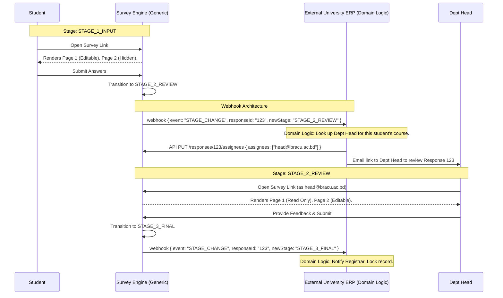

# Architectural Proposal: Generic Response Workflows

## 1. Executive Summary
Currently, the Survey Engine assumes a single-actor linear lifecycle for responses: `IN_PROGRESS` → `SUBMITTED` → `LOCKED`.
To support multi-actor processes (e.g., Student → Dept Head → Registrar, or Employee → Manager → HR) without injecting domain-specific logic into the core engine, we propose implementing a **Generic Workflow State Machine** combined with **Stage-Based Access Control**.

This approach allows the engine to remain a purely generic form and data processor, while pushing the business logic out to integrating systems via webhooks and generic assignment APIs.

---

## 2. Core Concepts

### 2.1 Generic State Machine (Stages)
Instead of hardcoding states like "Student Evaluation" or "Manager Review," a Campaign will define an array of generic **Stages**. The engine treats these as opaque string identifiers.

*   `STAGE_01_INITIAL`
*   `STAGE_02_REVIEW`
*   `STAGE_03_APPROVAL`

### 2.2 Stage-Based Access Control (Field-Level Permissions)
The `SurveySnapshot` (JSON schema defining the survey structure) must be updated to support **Stage-Based Visibility and Editability**. This applies at the Page or individual Question level.

*   `visibleInStages`: An array of generic stages where this component is rendered on the UI.
*   `editableInStages`: An array of generic stages where this component accepts user input.

### 2.3 Generic Assignment (The Baton Pass)
The `SurveyResponse` model currently has `respondentIdentifier`. We will add a new string array or generic field for `assignees`.
The Engine does not care who the assignees are. They could be emails (`head@brac.ac.bd`), internal user IDs (`user-123`), or group IDs. The Engine only checks if the user opening the link holds the required credential/identifier based on the current stage's assignees.

### 2.4 Extensibility via Webhooks
To drive the state transitions, the Engine broadcasts state changes. External domain systems listen to these webhooks, apply their business logic, and command the Engine via API to assign the response to the next logical person.

---

## 3. Data Model Changes

### 3.1 `Campaign` Settings Update
Add a new property to `Campaign` to declare the valid stages, if the campaign intends to use multi-stage workflows.
```json
{
  "workflowEnabled": true,
  "stages": [
    { "id": "STAGE_1_INPUT", "label": "Initial Submission", "isFinal": false },
    { "id": "STAGE_2_REVIEW", "label": "Review", "isFinal": false },
    { "id": "STAGE_3_FINAL", "label": "Completed", "isFinal": true }
  ]
}
```

### 3.2 `SurveyDefinition` Schema Update
Every logical block (Page or Question) within the `SurveySnapshot` JSON can now define access rules:
```json
{
  "id": "page_student_eval",
  "title": "Module Evaluation",
  "visibleInStages": ["STAGE_1_INPUT", "STAGE_2_REVIEW", "STAGE_3_FINAL"],
  "editableInStages": ["STAGE_1_INPUT"]
},
{
  "id": "page_head_approval",
  "title": "Head of Department Feedback",
  "visibleInStages": ["STAGE_2_REVIEW", "STAGE_3_FINAL"],
  "editableInStages": ["STAGE_2_REVIEW"]
}
```

### 3.3 `SurveyResponse` Model Update
The `SurveyResponse` document must track the *current stage* and *who* is assigned to it.
```java
public class SurveyResponse {
    @Id
    private String id;
    private String campaignId;
    
    // Core Respondent (e.g. Student)
    private String respondentIdentifier; 
    
    // The current state of the workflow
    private String currentStage; // e.g. "STAGE_2_REVIEW"
    
    // Who is currently allowed to process this stage?
    private List<String> currentAssignees; // ["john.doe@university.edu"]
    
    // ... answers map, timestamps, etc.
}
```

---

## 4. System Flow & Sequence Diagram

The following sequence illustrates a Student evaluating a course, passing to the Department Head, and finally to the Registrar. Notice how the Survey Engine never knows these organizational roles.



---

## 5. UI Implementation (`s/[id]/+page.svelte`)

The beauty of this architecture is that it uses a **single Respondent UI application**.

When the Svelte UI loads the response data, it computes read/write access dynamically:
1. `currentStage` = `response.currentStage`
2. Iterate through `survey.pages`.
3. If `page.visibleInStages` excludes `currentStage`, skip rendering the page entirely.
4. If `page.editableInStages` excludes `currentStage`, render the page's questions in **disabled/read-only mode**. The questions act as a display view of the previous actor's input.
5. Provide a dynamic "Submit" button that essentially acts as a "Move to Next Stage" trigger based on the Campaign's defined stages arrays.

## 6. Development Phasing

**Phase 1: Engine Schema Updates**
- Add `currentStage` and `currentAssignees` to `SurveyResponse`.
- Update the UI Builder tool to allow setting `visibleInStages` and `editableInStages` on Pages.

**Phase 2: Core API Handlers**
- Expose a `PUT /api/v1/responses/{id}/stage` endpoint (to move forward/backward).
- Expose a `PUT /api/v1/responses/{id}/assignees` endpoint (to lock down who can act).

**Phase 3: The Live UI (Svelte)**
- Refactor `s/[id]/+page.svelte` to conditionally disable inputs or hide pages based on the `currentStage` and the survey JSON's rules mapping.

## 7. API Payload Definitions

To make this architecture concrete, here are the exact JSON payloads that the REST APIs will consume and produce.

### 7.1 Campaign Configuration (Creation/Update)
When a tenant creates a campaign, they define the stages.

**`POST /api/v1/campaigns`**
```json
{
  "name": "Faculty Evaluation",
  "surveyId": "123e4567-e89b-12d3-a456-426614174000",
  "workflowEnabled": true,
  "stages": [
    { "id": "STAGE_1_STUDENT", "label": "Student Input", "isFinal": false },
    { "id": "STAGE_2_HEAD", "label": "Department Head Review", "isFinal": false },
    { "id": "STAGE_3_FINAL", "label": "Registrar Record", "isFinal": true }
  ]
}
```

### 7.2 Survey Structure Definition (Schema)
When building the survey, pages and questions use the generic stage IDs to control rendering.

**`PUT /api/v1/surveys/{id}/snapshot`**
```json
{
  "pages": [
    {
      "id": "page_student",
      "title": "Module Assessment",
      "visibleInStages": ["STAGE_1_STUDENT", "STAGE_2_HEAD", "STAGE_3_FINAL"],
      "editableInStages": ["STAGE_1_STUDENT"],
      "questions": [
        { "id": "q1", "type": "RATING", "questionText": "Rate the course material." }
      ]
    },
    {
      "id": "page_head",
      "title": "Head Official Review",
      "visibleInStages": ["STAGE_2_HEAD", "STAGE_3_FINAL"],
      "editableInStages": ["STAGE_2_HEAD"],
      "questions": [
        { "id": "q2", "type": "TEXTAREA", "questionText": "Provide faculty feedback notes." }
      ]
    }
  ]
}
```

### 7.3 Response Submission (Moving the Stage Forward)
When a user finishes their stage, the UI calls a new endpoint to push the survey to the next logical stage.

**`PUT /api/v1/responses/{id}/stage`**
```json
{
  "targetStage": "STAGE_2_HEAD",
  "comment": "Student has completed their initial evaluation."
}
```
*Note: The Engine validates that the current response state actually allows transitioning to this `targetStage` based on the Campaign's defined array.*

### 7.4 Webhook Egress Payload (To External System)
When the student transitions to `STAGE_2_HEAD`, the Survey Engine's event bus fires this webhook out to the University's ERP system.

**Webhook Payload `POST https://api.bracu.ac.bd/webhooks/survey`**
```json
{
  "eventId": "evt_987654321",
  "eventType": "RESPONSE_STAGE_CHANGED",
  "timestamp": "2026-03-08T16:05:00Z",
  "payload": {
    "campaignId": "camp_abc",
    "responseId": "resp_123",
    "respondentIdentifier": "student123@bracu.ac.bd",
    "previousStage": "STAGE_1_STUDENT",
    "newStage": "STAGE_2_HEAD"
  }
}
```

### 7.5 Assigning the Baton (From External System)
The University ERP receives the webhook, uses its internal database to find out that "Dr. Smith" is the Head of the Department for this student's course, and sets Dr. Smith as the **assignee** for this generic stage.

**`PUT /api/v1/responses/{id}/assignees`**
*(Called server-to-server by the ERP)*
```json
{
  "assignees": ["dr.smith@bracu.ac.bd"],
  "notifyAssignees": true
}
```

When Dr. Smith clicks the link in their email, the Survey Engine validates their identity (`dr.smith@bracu.ac.bd`) against the `assignees` array. Because they match, they are granted access. Furthermore, because the stage is `STAGE_2_HEAD`, the frontend automatically renders Page 1 as Read-Only and Page 2 as an Editable text area.

---

## 8. Why This Keeps the Engine 100% Generic (The "Ping-Pong" Rule)

To understand how this architecture prevents any domain-specific business logic from bleeding into the Survey Engine, we must look at the strict boundaries of responsibility:

### 8.1 The Survey Engine Only Knows About:
1. **Strings**: It doesn't know what `STAGE_2` or `STAGE_HEAD_REVIEW` means. It's just a string variable on a database record.
2. **Boolean Array Matching**: It checks "Does the string `"STAGE_2"` exist in the `"editableInStages"` array for this question?" -> Yes/No. If No, it renders the question disabled.
3. **Array Lookups for Security**: It checks "Does the user opening this link (`dr.smith@bracu.ac.bd`) exist in the `assignees` array for this response?" -> Yes/No. If Yes, let them in.
4. **Triggering Webhooks**: When the string changes from `STAGE_1` to `STAGE_2`, it blindly pushes an HTTP request out saying "State Changed" and forgets about it.

### 8.2 Your Domain System (e.g., University ERP) Knows About:
1. **Roles & Titles**: It knows Dr. Smith is the "Head of Computer Science".
2. **Business Rules**: It knows that "After a student submits, the Head of the department must review it next."
3. **Routing**: It receives the "State Changed to STAGE_2" webhook from the Survey Engine, looks up Dr. Smith in its own database, and tells the Survey Engine: *"Hey, put `dr.smith@bracu.ac.bd` into the `assignees` array for this response."*

### 8.3 The Result: Infinite Sellability
Because the Survey Engine only handles **JSON Field Permissions, Opaque State Strings, and Webhooks**, you could take this exact same compiled engine (`.jar`) and sell it to:
*   **A Hospital:** The stages are `STAGE_TRIAGE` ➔ `STAGE_DOCTOR` ➔ `STAGE_BILLING`.
*   **A Logistics Company:** The stages are `STAGE_WAREHOUSE` ➔ `STAGE_TRANSIT` ➔ `STAGE_DELIVERED`.

The Survey Engine code never has to change. The domain logic always lives entirely in the external application that is purchasing your SaaS engine and listening to your webhooks.
