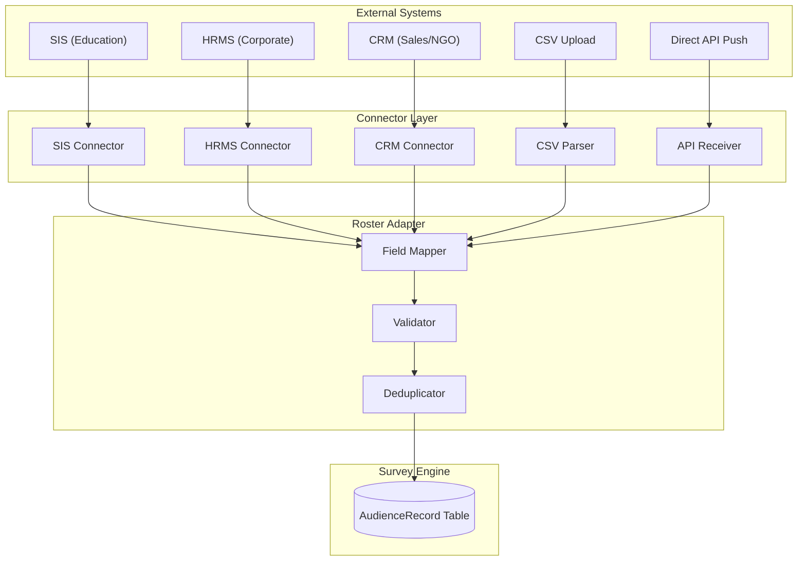
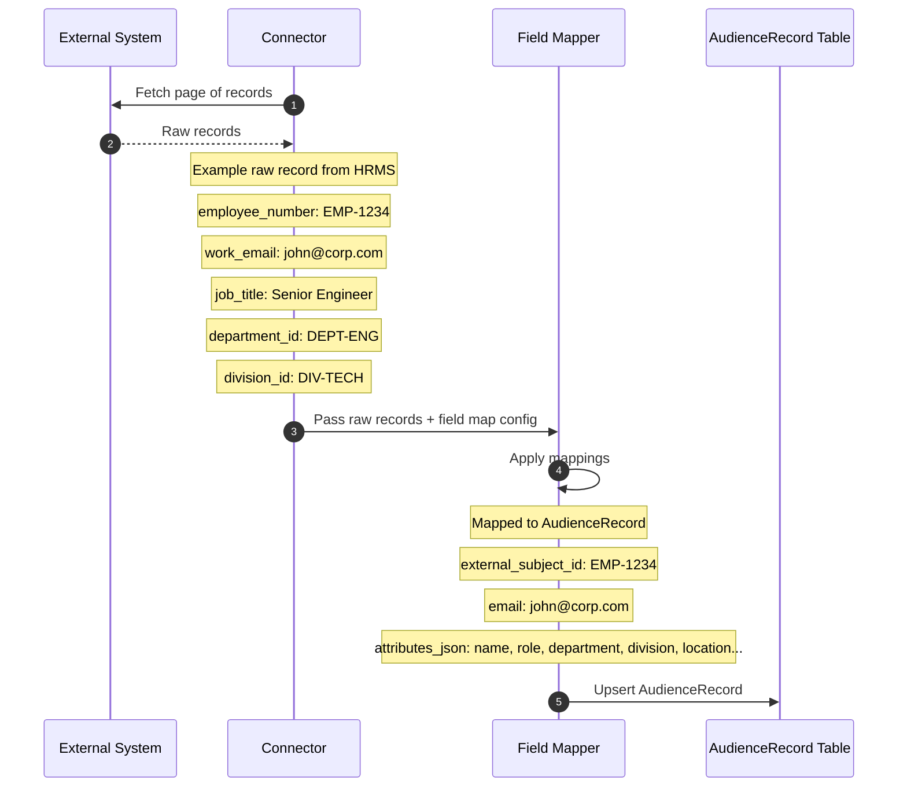
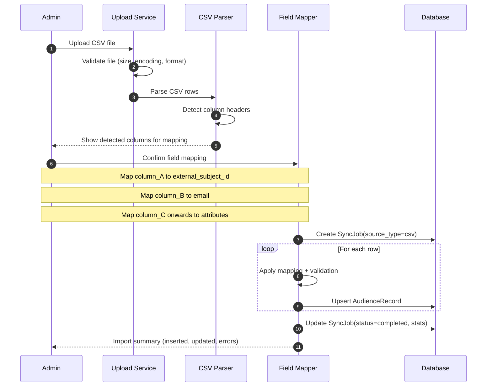
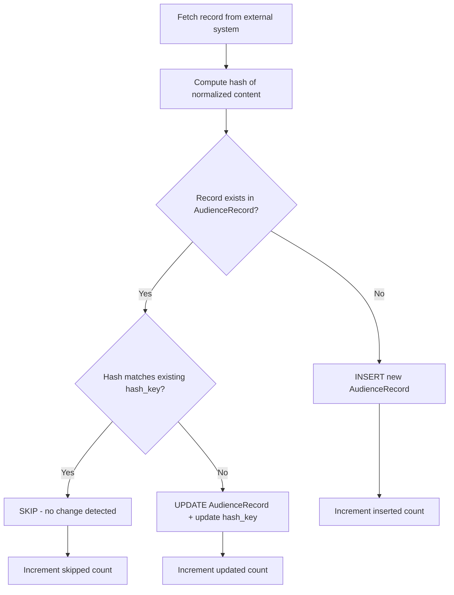
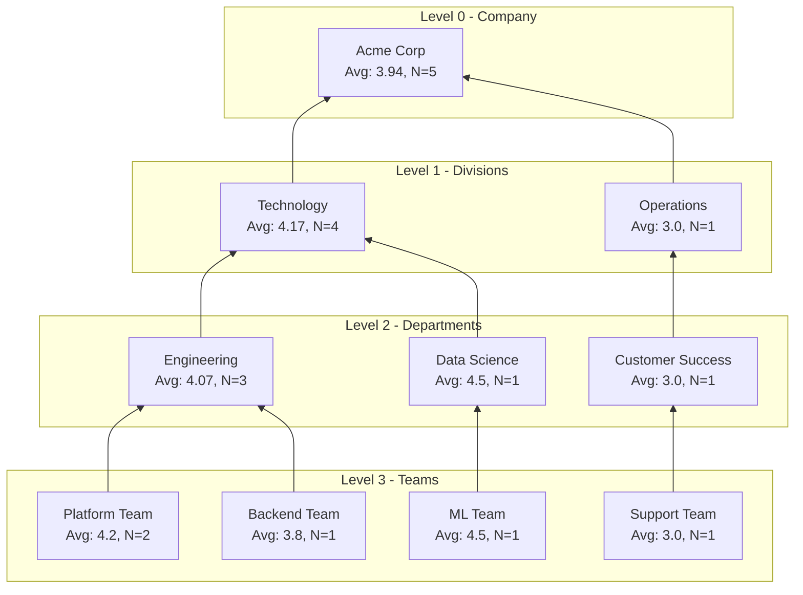
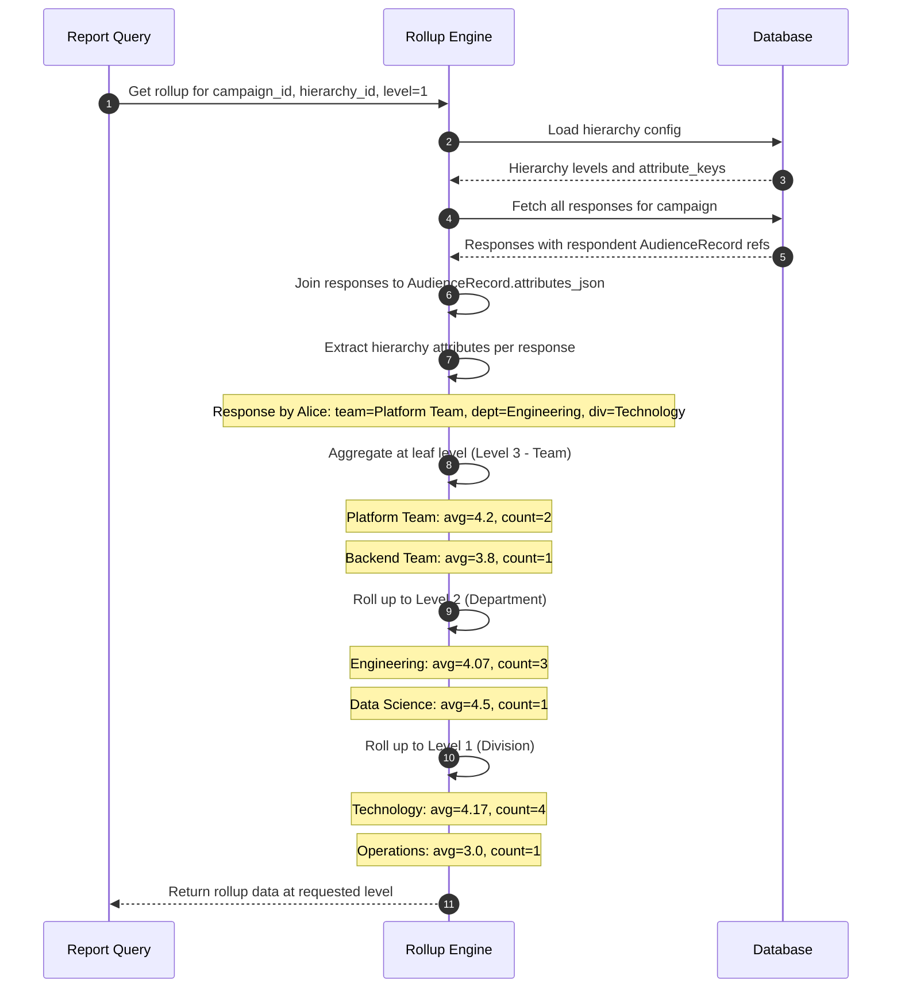
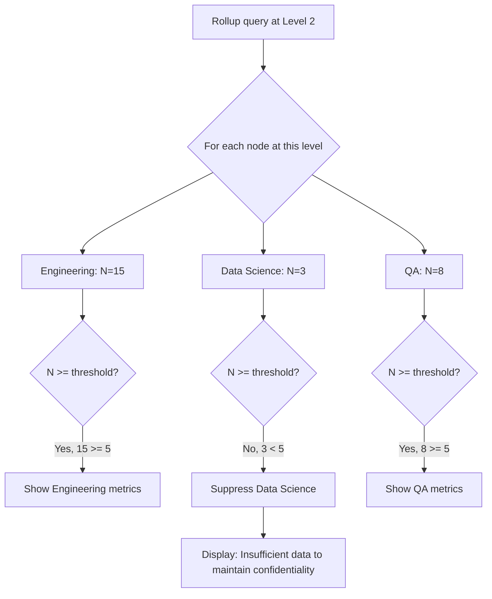
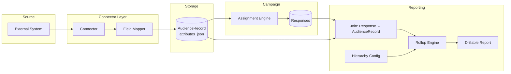

# Survey Engine — Audience Roster Connectors and Hierarchical Rollup Reporting
## Version: 1.0
## Date: March 2, 2026

## Document Revision History

| Version | Date | Author | Description |
|---|---|---|---|
| 1.0 | March 2, 2026 | Engineering | Detailed technical specification for roster connector architecture and hierarchical rollup reporting |

## References
- `survey-engine-srs-implementation-ready.md`: FR-102 through FR-107 (Roster), FR-096 (Rollups)
- `lifecycle-flows.md`: Section 4 (Roster Sync Flow), Section 7 (Reporting Pipeline)

---

# Part 1: Audience Roster via Connectors

## 1. The Problem

Survey campaigns need to know **who should participate**. This audience data lives in different systems depending on the domain:

| Domain | Where Audience Data Lives | Example Records |
|---|---|---|
| Education | Student Information System (SIS) | Students, instructors, courses, departments |
| Corporate | HR Management System (HRMS) | Employees, managers, teams, divisions |
| Healthcare | EHR / Staff Directory | Doctors, nurses, patients, departments |
| Non-profit | CRM / Volunteer DB | Donors, volunteers, beneficiaries |
| Government | Citizen Registry / Internal Directory | Staff, departments, regions |
| E-commerce | CRM / Customer Platform | Customers, product categories, segments |

The engine **cannot hard-code** the shape of this data. A university's "student" record looks nothing like a corporation's "employee" record. The connector architecture solves this.

---

## 2. Connector Architecture

### 2.1 Core Concept

A connector is a **pluggable adapter** that:
1. Knows how to **authenticate** with an external system
2. Knows how to **fetch** records (paginated)
3. Knows how to **map** external fields to the engine's internal schema
4. Does **not** define the business meaning of the data — that's left to the campaign's assignment rules



### 2.2 The Connector Interface

Every connector implements a standard interface. This is what makes the system extensible — new integrations plug in without changing the core engine.

```text
┌──────────────────────────────────────────────────────┐
│                 RosterConnector Interface             │
├──────────────────────────────────────────────────────┤
│  getSourceType()       → "sis" | "hrms" | "crm" ... │
│  authenticate(config)  → connection handle           │
│  fetchPage(cursor)     → { records[], nextCursor }   │
│  getFieldSchema()      → { field definitions }       │
│  close()               → void                        │
└──────────────────────────────────────────────────────┘
```

**Key point**: the connector only fetches raw data. It does NOT interpret what "student" or "employee" or "department" means. That interpretation happens later, in the field mapping and assignment rules.

### 2.3 Connector Configuration (Per Tenant)

Each tenant configures their connector(s) with:

```json
{
  "connector_id": "conn_001",
  "tenant_id": "tenant_42",
  "source_type": "hrms",
  "display_name": "BambooHR Integration",
  "auth": {
    "type": "oauth2_client_credentials",
    "token_url": "https://api.bamboohr.com/oauth/token",
    "client_id": "...",
    "client_secret_ref": "vault://secrets/tenant_42/bamboohr_secret"
  },
  "endpoint": {
    "base_url": "https://api.bamboohr.com/api/gateway.php/company_xyz/v1",
    "resource_path": "/employees/directory",
    "pagination_type": "offset",
    "page_size": 100
  },
  "schedule": {
    "type": "cron",
    "expression": "0 2 * * *",
    "timezone": "America/New_York"
  }
}
```

---

## 3. Field Mapping — The Key to Domain-Agnosticism

### 3.1 The Problem It Solves

External systems have different field names for the same concept:

| Concept | SIS (Education) | HRMS (Corporate) | CRM (Sales) |
|---|---|---|---|
| Person ID | `student_id` | `employee_number` | `contact_id` |
| Email | `email_address` | `work_email` | `primary_email` |
| Name | `full_name` | `display_name` | `contact_name` |
| Group | `course_section_id` | `department_id` | `account_id` |
| Role | `enrollment_role` | `job_title` | `contact_type` |
| Org unit | `department_code` | `division_id` | `territory` |

The engine stores **one universal record format** (`AudienceRecord`). The field mapping bridges external schemas to this format.

### 3.2 Mapping Configuration

The admin configures a field map per connector:

```json
{
  "connector_id": "conn_001",
  "field_map": {
    "external_subject_id": {
      "source_field": "employee_number",
      "transform": null
    },
    "email": {
      "source_field": "work_email",
      "transform": "lowercase"
    },
    "attributes": {
      "name": { "source_field": "display_name" },
      "role": { "source_field": "job_title" },
      "department": { "source_field": "department_id" },
      "division": { "source_field": "division_id" },
      "location": { "source_field": "office_location" },
      "hire_date": { "source_field": "start_date", "transform": "iso_date" },
      "manager_id": { "source_field": "reports_to" }
    }
  }
}
```

### 3.3 How It Flows



### 3.4 The AudienceRecord — Universal Internal Format

No matter what source the data comes from, it's stored in **one format**:

```text
AudienceRecord
├── id                    (system-generated UUID)
├── tenant_id             (tenant isolation)
├── source_type           ("hrms" | "sis" | "crm" | "csv" | "api")
├── source_ref            (reference to sync job / upload batch)
├── external_subject_id   (the person's ID in the external system)
├── email                 (optional, used for dedup and access control)
├── attributes_json       (flexible JSON — any fields from the source)
│   ├── name
│   ├── role
│   ├── department
│   ├── division
│   ├── location
│   ├── manager_id
│   └── ... (any custom attributes)
├── hash_key              (SHA-256 of normalized content, for change detection)
├── synced_at             (last sync timestamp)
├── created_at
└── updated_at
```

**Why `attributes_json` is critical**: It's a flexible JSON column that holds **whatever the external system provides**. The engine doesn't define the schema of attributes — the tenant does via their field mapping. This is what makes the engine domain-agnostic.

### 3.5 How Attributes Are Used Downstream

The `attributes_json` fields are referenced by:

1. **Assignment rules**: Filter respondents and subjects based on any attribute
   ```json
   { "attribute": "role", "operator": "eq", "value": "Senior Engineer" }
   ```

2. **Reporting segments**: Group results by any attribute
   ```text
   "Group by: department" → aggregates responses per department value
   ```

3. **Hierarchical rollups**: Build the org hierarchy from attribute relationships
   ```text
   "Roll up: team → division → company"
   ```

4. **Access controls**: Email-based restrictions use the mapped email field

---

## 4. CSV Upload — The Simplest Connector

For users who don't have API-accessible systems, CSV upload works as a manual connector:

### 4.1 Upload Flow



### 4.2 Example CSV

```csv
id,email,name,department,role,region
EMP-001,alice@corp.com,Alice Chen,Engineering,Senior Engineer,US-West
EMP-002,bob@corp.com,Bob Lee,Marketing,Marketing Manager,US-East
EMP-003,carol@corp.com,Carol Davis,Engineering,Tech Lead,US-West
```

Mapping: `id → external_subject_id`, `email → email`, rest → `attributes_json`

---

## 5. Supported Transforms

During field mapping, optional transforms can be applied:

| Transform | Description | Example |
|---|---|---|
| `lowercase` | Convert to lowercase | `John@Corp.COM` → `john@corp.com` |
| `uppercase` | Convert to uppercase | `dept-eng` → `DEPT-ENG` |
| `trim` | Remove leading/trailing whitespace | `  Alice  ` → `Alice` |
| `iso_date` | Parse any date format to ISO-8601 | `03/02/2026` → `2026-03-02` |
| `prefix` | Add a prefix | `1234` → `EMP-1234` |
| `split` | Split string into array | `"eng,qa"` → `["eng", "qa"]` |
| `default` | Use default if source field empty | `null` → `"unassigned"` |
| `map_values` | Map specific values to others | `"M"` → `"Manager"` |

---

## 6. Change Detection on Re-Sync

When a connector re-syncs (e.g., nightly cron):



This makes re-syncs efficient — only changed records are written. For a 50,000-record roster where 200 records changed, only 200 writes happen.

---

---

# Part 2: Hierarchical Rollup Reporting

## 1. The Problem

Organizations have **nested structures**, and survey results need to be aggregated at every level of that structure. But every organization's structure is different:

| Domain | Example Hierarchy |
|---|---|
| University | University → College → Department → Program |
| Corporation | Company → Division → Department → Team |
| Retail | Company → Region → District → Store |
| Government | Ministry → Directorate → Division → Branch |
| NGO | Organization → Country Office → Program Area → Project |
| Hospital | Hospital → Service Line → Department → Unit |

The engine **cannot hard-code** any of these. The hierarchy must be configurable per tenant.

---

## 2. Hierarchy Configuration

### 2.1 Hierarchy Definition

The tenant admin defines their hierarchy as a **tree configuration**:

```json
{
  "hierarchy_id": "org_hierarchy_v1",
  "tenant_id": "tenant_42",
  "display_name": "Organizational Structure",
  "levels": [
    {
      "level": 0,
      "name": "Company",
      "attribute_key": "company_name",
      "is_root": true
    },
    {
      "level": 1,
      "name": "Division",
      "attribute_key": "division",
      "parent_level": 0
    },
    {
      "level": 2,
      "name": "Department",
      "attribute_key": "department",
      "parent_level": 1
    },
    {
      "level": 3,
      "name": "Team",
      "attribute_key": "team",
      "parent_level": 2
    }
  ]
}
```

**Key point**: the `attribute_key` references fields in `AudienceRecord.attributes_json`. The same attributes used for roster sync drive the reporting hierarchy. No separate configuration needed.

### 2.2 How Hierarchy Links to Roster Data

```text
AudienceRecord.attributes_json:
{
  "name": "Alice Chen",
  "role": "Senior Engineer",
  "team": "Platform Team",         ← level 3
  "department": "Engineering",     ← level 2
  "division": "Technology",        ← level 1
  "company_name": "Acme Corp"      ← level 0 (root)
}
```

The hierarchy config tells the engine: *"When you see `team=Platform Team`, that belongs under `department=Engineering`, which belongs under `division=Technology`, which belongs under `company_name=Acme Corp`."*

### 2.3 Hierarchy Tree Data Structure

The engine builds a tree from the roster data based on the hierarchy config:

```text
Acme Corp (company_name)                          ← Level 0 (root)
├── Technology (division)                         ← Level 1
│   ├── Engineering (department)                  ← Level 2
│   │   ├── Platform Team (team)                  ← Level 3 (leaf)
│   │   │   ├── Alice Chen (respondent)
│   │   │   └── Carol Davis (respondent)
│   │   └── Backend Team (team)
│   │       └── Eve Miller (respondent)
│   └── Data Science (department)
│       └── ML Team (team)
│           └── Frank Wu (respondent)
├── Operations (division)
│   └── Customer Success (department)
│       └── Support Team (team)
│           └── Bob Lee (respondent)
```

---

## 3. How Rollup Aggregation Works

### 3.1 Bottom-Up Aggregation

Rollup works **bottom-up**: start at the leaf nodes (individual responses), aggregate at each level, and roll up to the root.



### 3.2 Aggregation Sequence



### 3.3 What Metrics Get Rolled Up

| Metric | Aggregation Method | Example |
|---|---|---|
| Response count | SUM up the tree | Team: 2, Dept: 5, Division: 12 |
| Completion rate | COUNT(complete) / COUNT(all) per node | Team: 85%, Dept: 78% |
| Average score (rating/Likert) | Weighted average by response count | Team: 4.2, Dept: 3.9, Division: 4.1 |
| Score distribution | Merge histograms | Team: [0,1,3,5,11], Dept: [2,4,8,12,24] |
| NPS (if applicable) | (Promoters - Detractors) / Total | Team: +42, Dept: +35 |
| Text response count | COUNT per node | Team: 8 comments, Dept: 23 comments |

---

## 4. Querying Rollup Data

### 4.1 API Endpoint

```
GET /api/v1/reports/campaigns/{campaign_id}/rollups
  ?hierarchy_id=org_hierarchy_v1
  &level=2
  &parent_node=Technology
  &metrics=avg_score,completion_rate,response_count
```

### 4.2 Response Shape

```json
{
  "hierarchy_id": "org_hierarchy_v1",
  "campaign_id": "campaign_42",
  "level": 2,
  "level_name": "Department",
  "parent": {
    "level": 1,
    "level_name": "Division",
    "node": "Technology"
  },
  "nodes": [
    {
      "node": "Engineering",
      "metrics": {
        "response_count": 15,
        "completion_rate": 0.87,
        "avg_score": 4.07,
        "score_distribution": { "1": 0, "2": 1, "3": 3, "4": 5, "5": 6 }
      },
      "children_count": 3,
      "has_children": true
    },
    {
      "node": "Data Science",
      "metrics": {
        "response_count": 8,
        "completion_rate": 0.91,
        "avg_score": 4.5,
        "score_distribution": { "1": 0, "2": 0, "3": 1, "4": 3, "5": 4 }
      },
      "children_count": 2,
      "has_children": true
    }
  ],
  "rollup_total": {
    "response_count": 23,
    "completion_rate": 0.88,
    "avg_score": 4.23
  }
}
```

### 4.3 Drill-Down Pattern

The admin starts at the top level and drills down:

```text
Step 1: GET /rollups?level=0
        → "Acme Corp: avg 3.94, 150 responses"

Step 2: GET /rollups?level=1&parent_node=Acme Corp
        → "Technology: 4.17 (120), Operations: 3.0 (30)"

Step 3: GET /rollups?level=2&parent_node=Technology
        → "Engineering: 4.07 (80), Data Science: 4.5 (25), QA: 3.6 (15)"

Step 4: GET /rollups?level=3&parent_node=Engineering
        → "Platform: 4.2 (30), Backend: 3.8 (25), Frontend: 4.1 (25)"
```

---

## 5. Cross-Domain Examples

### 5.1 University Example

**Hierarchy config**:
```text
Level 0: University    (attribute: "university")
Level 1: College       (attribute: "college")
Level 2: Department    (attribute: "department")
Level 3: Program       (attribute: "program")
```

**Use case**: Course evaluation survey. Students evaluate instructors. Results roll up from Program → Department → College → University.

**Drill-down**: Dean sees college-level scores → clicks Engineering → sees departments → clicks Computer Science → sees program-level breakdown.

### 5.2 Retail Chain Example

**Hierarchy config**:
```text
Level 0: Company       (attribute: "brand")
Level 1: Region        (attribute: "region")
Level 2: District      (attribute: "district")
Level 3: Store         (attribute: "store_id")
```

**Use case**: Customer satisfaction survey. Results roll up from Store → District → Region → Company.

**Drill-down**: VP sees regional scores → clicks "West Coast" → sees districts → clicks "Bay Area" → sees individual store scores.

### 5.3 Government Example

**Hierarchy config**:
```text
Level 0: Ministry      (attribute: "ministry")
Level 1: Directorate   (attribute: "directorate")
Level 2: Division      (attribute: "division")
Level 3: Branch        (attribute: "branch_office")
```

**Use case**: Employee engagement survey. Results roll up from Branch → Division → Directorate → Ministry.

---

## 6. Anonymity Threshold at Rollup Levels

When anonymity mode is enabled, threshold suppression applies **at every level** of the hierarchy:



A department with only 3 respondents would be **suppressed** to prevent re-identification, even if the parent division has 50 responses total.

---

## 7. Multiple Hierarchies per Tenant

A tenant can define **multiple hierarchies** for different reporting perspectives:

| Hierarchy | Levels | Use Case |
|---|---|---|
| Organizational | Company → Division → Department → Team | Standard management reporting |
| Geographic | Global → Region → Country → Office | Location-based analysis |
| Functional | Function → Sub-function → Specialty | Cross-cutting functional view |
| Project-based | Portfolio → Program → Project → Workstream | Project team analysis |

The same `AudienceRecord.attributes_json` feeds all hierarchies — different attributes are used for different rollup dimensions. No data duplication needed.

---

## 8. How Roster Connectors Feed Hierarchical Rollups — End-to-End



**The chain**: External data → Connector → Field Mapping → AudienceRecord → Campaign Assignment → Responses → Join with AudienceRecord attributes → Hierarchy config drives rollup → Drillable report.

This is why the connector architecture and the rollup reporting are deeply connected: **the same attributes that the connector maps into `attributes_json` are the same attributes that the hierarchy config uses for rollup dimensions**. One configuration feeds the other, and neither assumes any domain-specific structure.
