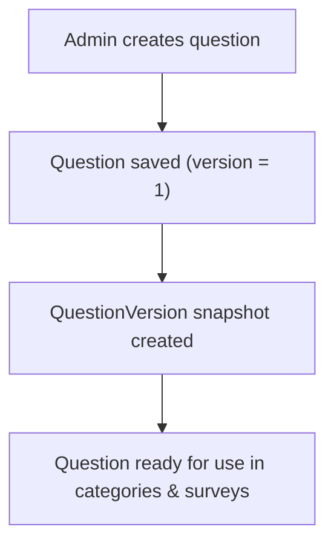
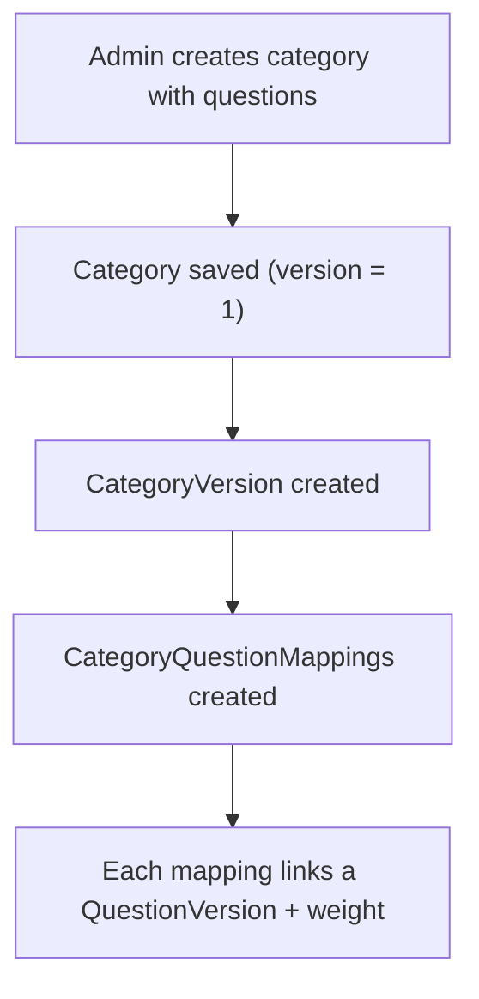
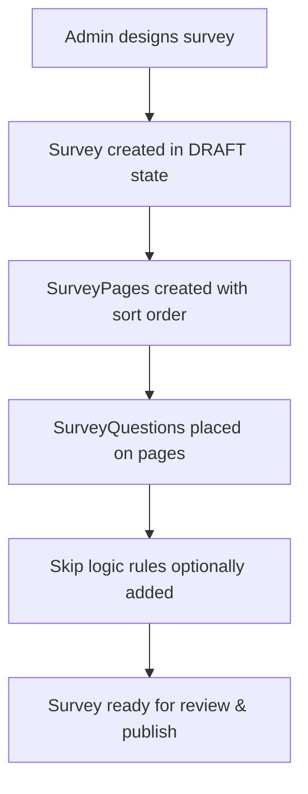
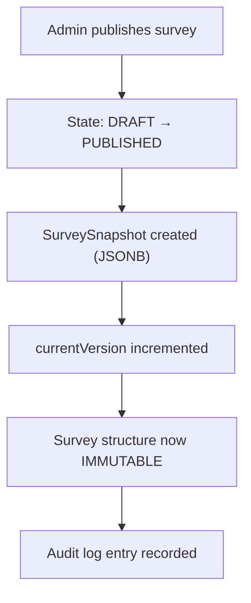
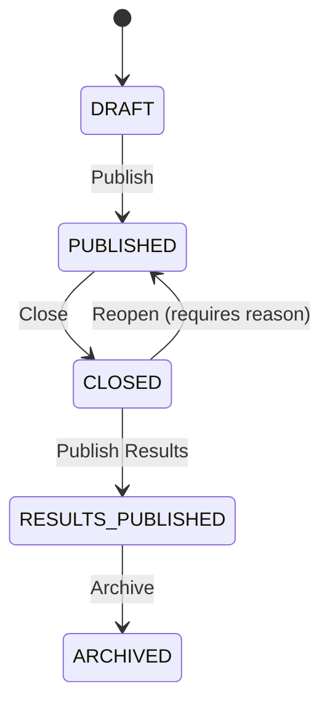
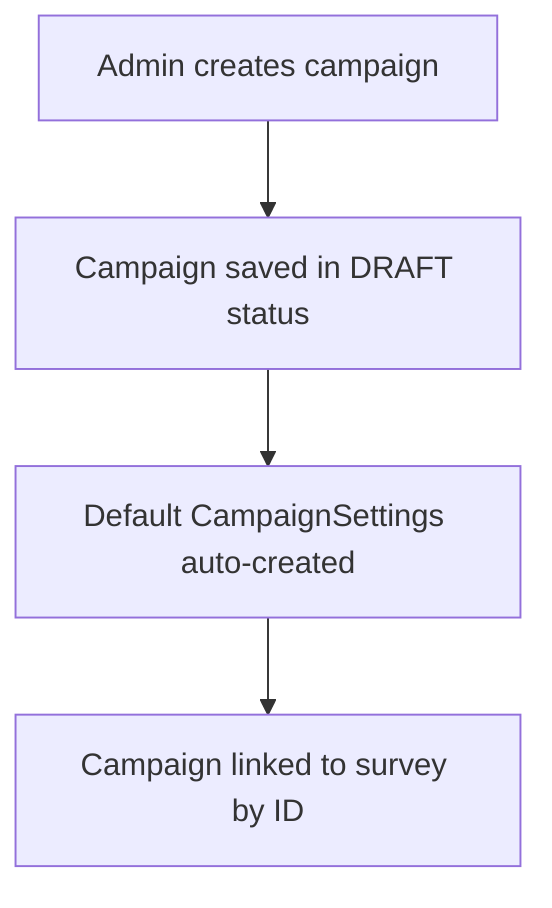
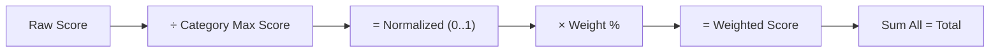
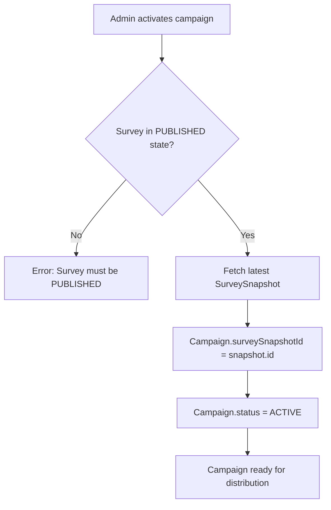
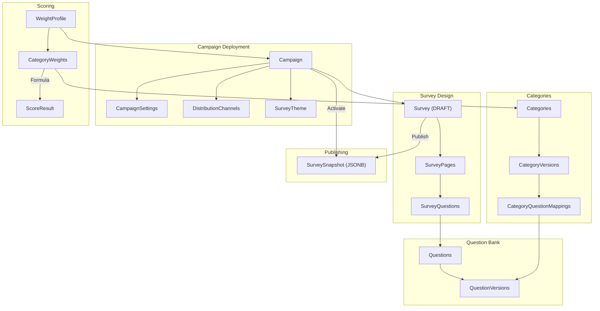

# Survey Engine — System Flow Guide

> A complete guide covering **what to do, how to do it, and why** — with data flows and API actions for every step.

---

## System Overview

```mermaid
flowchart LR
    A["1. Build Question Bank"] --> B["2. Create Categories"]
    B --> C["3. Design Survey"]
    C --> D["4. Publish Survey"]
    D --> E["5. Create Campaign"]
    E --> F["6. Configure Settings"]
    F --> G["7. Set Weight Profile"]
    G --> H["8. Distribute"]
    H --> I["9. Collect Responses"]
    I --> J["10. Score & Analyze"]
```



---

## Step 1 — Build the Question Bank

### What
Create reusable questions that can be placed in any survey.

### Why
Questions are the atomic building blocks. Storing them in a centralized bank avoids duplication and enables consistent scoring across surveys.

### API Action
```
POST /api/v1/questions
```
```json
{
  "text": "How satisfied are you with our service?",
  "type": "RATING_SCALE",
  "maxScore": 10.00
}
```

### Data Flow


### Key Rules
- `type` must be one of: `SINGLE_CHOICE`, `MULTIPLE_CHOICE`, `TEXT`, `RATING_SCALE`, `LIKERT_SCALE`, `YES_NO`, `DATE`, `FILE_UPLOAD`
- `maxScore` must be > 0 (validated by scoring engine)
- Questions are **mutable** while not referenced by a published survey
- Editing after publish creates a **new version** — existing snapshots remain untouched

---

## Step 2 — Create Categories

### What
Group related questions into scored categories (e.g., "Customer Satisfaction", "Product Quality").

### Why
Categories enable **grouped scoring** — each category gets a weighted percentage of the total score. Without categories, you can't apply the weighted scoring formula.

### API Action
```
POST /api/v1/categories
```
```json
{
  "name": "Customer Satisfaction",
  "description": "Questions measuring overall customer satisfaction",
  "questionMappings": [
    { "questionId": "<uuid>", "sortOrder": 1, "weight": 1.00 },
    { "questionId": "<uuid>", "sortOrder": 2, "weight": 1.50 }
  ]
}
```

### Data Flow


### Key Rules
- Each `questionMapping.weight` determines how much a question contributes within the category
- Categories are versioned — edits after publish create new versions
- A question can belong to **multiple categories**

---

## Step 3 — Design the Survey

### What
Create a survey with pages and ordered questions pulled from the question bank.

### Why
The survey is the **form template** — it defines what the respondent sees: which questions, in what order, on which pages, with optional skip logic.

### API Action
```
POST /api/v1/surveys
```
```json
{
  "title": "Annual Customer Feedback 2026",
  "description": "Yearly satisfaction assessment",
  "pages": [
    {
      "title": "General Satisfaction",
      "sortOrder": 1,
      "questions": [
        { "questionId": "<uuid>", "sortOrder": 1, "mandatory": true },
        { "questionId": "<uuid>", "sortOrder": 2, "mandatory": false }
      ]
    },
    {
      "title": "Product Feedback",
      "sortOrder": 2,
      "questions": [
        { "questionId": "<uuid>", "sortOrder": 1, "mandatory": true }
      ]
    }
  ]
}
```

### Data Flow


### Key Rules
- Survey starts in `DRAFT` state — fully editable
- Questions reference bank questions by ID
- Pages provide visual grouping for the respondent
- Each question can be marked `mandatory`

---

## Step 4 — Publish the Survey

### What
Transition the survey from DRAFT to PUBLISHED, freezing its structure.

### Why
Publishing creates an **immutable snapshot** — a frozen copy of the entire survey structure (pages, questions, skip logic). This guarantees that all respondents see the exact same form, even if bank questions are later edited.

### API Action
```
POST /api/v1/surveys/{id}/lifecycle
```
```json
{
  "targetState": "PUBLISHED"
}
```

### Data Flow


### Full Lifecycle State Machine


### Key Rules
- **After publish**: No structural changes allowed (pages, questions). Returns `SURVEY_IMMUTABLE_AFTER_PUBLISH` error
- **Reopen** (CLOSED → PUBLISHED): Requires an audited `reason`
- Each transition is audit-logged

---

## Step 5 — Create a Campaign

### What
Create a campaign that deploys a published survey to respondents.

### Why
A campaign is a **deployment instance**. The same survey can power multiple campaigns for different audiences, time periods, or configurations.

### API Action
```
POST /api/v1/campaigns
```
```json
{
  "name": "Q1 2026 Customer Survey",
  "surveyId": "<uuid>",
  "authMode": "PUBLIC"
}
```

### Data Flow


### Auth Modes
| Mode | Description |
|---|---|
| `PUBLIC` | Anyone with the link can respond |
| `PRIVATE` | Token-based access |
| `PASSWORD` | Requires a password to start |
| `EMAIL_VERIFIED` | Respondent must verify email |

---

## Step 6 — Configure Campaign Settings

### What
Customize the campaign's behavior — access controls, quotas, UI layout, and respondent data collection.

### Why
Different deployments need different rules. A public survey may need CAPTCHA; an internal one may need IP restriction. Settings control the entire respondent experience.

### API Action
```
PUT /api/v1/campaigns/{id}/settings
```
```json
{
  "captchaEnabled": true,
  "oneResponsePerDevice": true,
  "responseQuota": 500,
  "closeDate": "2026-06-30T23:59:59Z",
  "showQuestionNumbers": true,
  "showProgressIndicator": true,
  "allowBackButton": false,
  "startMessage": "Welcome! This survey takes ~5 minutes.",
  "finishMessage": "Thank you for your feedback!",
  "collectName": false,
  "collectEmail": true
}
```

### Settings Categories
| Group | Settings |
|---|---|
| **Access & Security** | Password, CAPTCHA, one-per-device, IP restriction, email restriction |
| **Quota & Scheduling** | Response quota, close date, session timeout |
| **Behavior & Layout** | Question numbers, progress bar, back button, start/finish messages, header/footer HTML |
| **Respondent Metadata** | Collect name, email, phone, address |

---

## Step 7 — Set Up Weight Profile (Scoring)

### What
Define how category scores are weighted to compute the total campaign score.

### Why
Not all categories carry equal importance. The weight profile lets you say *"Customer Satisfaction counts for 60% and Product Quality counts for 40%"*. The scoring engine uses this to normalize and weight raw scores.

### API Action
```
POST /api/v1/scoring/profiles
```
```json
{
  "name": "Default Weights",
  "campaignId": "<uuid>",
  "categoryWeights": [
    { "categoryId": "<cat-a-uuid>", "weightPercentage": 60.00 },
    { "categoryId": "<cat-b-uuid>", "weightPercentage": 40.00 }
  ]
}
```

### Validation
```
POST /api/v1/scoring/profiles/{id}/validate
```
Returns `200 OK` if weights sum to exactly 100%, otherwise `INVALID_WEIGHT_SUM` error.

### Scoring Formula


**Example**:
| Category | Raw | Max | Normalized | Weight | Weighted |
|---|---|---|---|---|---|
| Satisfaction | 8 | 10 | 0.80 | 60% | 0.48 |
| Quality | 15 | 20 | 0.75 | 40% | 0.30 |
| **Total** | | | | | **0.78** |

---

## Step 8 — Activate & Distribute

### What
Activate the campaign (linking it to the survey snapshot) and generate distribution channels.

### Why
Activation locks the campaign to a specific **frozen survey snapshot**, ensuring all respondents see the same version. Distribution generates all the links and embed codes needed to share the survey.

### API Actions
```
POST /api/v1/campaigns/{id}/activate    ← Activates (requires PUBLISHED survey)
POST /api/v1/campaigns/{id}/distribute  ← Generates all 6 channel types
GET  /api/v1/campaigns/{id}/channels    ← Lists generated channels
```

### Distribution Channels Generated
| Channel | Output |
|---|---|
| **Public Link** | `https://survey.example.com/s/{campaignId}` |
| **Private Link** | Public link + unique token |
| **HTML Embed** | `<iframe>` snippet |
| **WordPress Embed** | `[survey_engine id="..."]` shortcode |
| **JS Embed** | `<script>` tag |
| **Email** | Link with respondent placeholder |

### Activation Data Flow


---

## Step 9 — Apply a Theme (Optional)

### What
Select a predefined theme template or customize colors, fonts, and branding for the survey.

### Why
Theming makes the survey match the organization's brand identity, improving professionalism and response rates.

### Available Templates (Seeded)
| Template | Primary | Background | Font |
|---|---|---|---|
| Modern Dark | `#1a1a2e` | `#0f3460` | Inter |
| Classic Light | `#ffffff` | `#f8f9fa` | Georgia |
| Ocean Blue | `#0077b6` | `#caf0f8` | Roboto |
| Forest Green | `#2d6a4f` | `#d8f3dc` | Lato |
| Sunset Warm | `#e63946` | `#fdf0d5` | Poppins |

Per-campaign overrides can customize any template property.

---

## Step 10 — Score & Analyze

### What
Trigger score calculation against the weight profile using raw category scores.

### Why
This is the final output — a normalized, weighted score that tells you how the respondent (or aggregate) performed across all categories.

### API Action
```
POST /api/v1/scoring/calculate/{profileId}
```
```json
{
  "<category-a-uuid>": 8.00,
  "<category-b-uuid>": 15.00
}
```

### Response
```json
{
  "campaignId": "<uuid>",
  "weightProfileId": "<uuid>",
  "totalScore": 0.7800,
  "categoryScores": [
    {
      "categoryId": "<cat-a>",
      "rawScore": 8.00,
      "maxScore": 10.00,
      "normalizedScore": 0.800000,
      "weightPercentage": 60.00,
      "weightedScore": 0.480000
    },
    {
      "categoryId": "<cat-b>",
      "rawScore": 15.00,
      "maxScore": 20.00,
      "normalizedScore": 0.750000,
      "weightPercentage": 40.00,
      "weightedScore": 0.300000
    }
  ]
}
```

---

## Complete End-to-End Data Flow



---

## Error Handling Reference

| Error Code | When | Resolution |
|---|---|---|
| `INVALID_LIFECYCLE_TRANSITION` | Invalid state change (e.g., DRAFT → CLOSED) | Follow the state machine |
| `SURVEY_IMMUTABLE_AFTER_PUBLISH` | Editing published survey structure | Create a new survey version |
| `INVALID_WEIGHT_SUM` | Weight percentages ≠ 100% | Adjust weights to total exactly 100% |
| `CATEGORY_MAX_SCORE_ZERO` | Category has no scored questions | Add questions with maxScore > 0 |
| `QUESTION_MAX_SCORE_INVALID` | Question has null or ≤ 0 maxScore | Fix the question's maxScore |
| `RESOURCE_NOT_FOUND` | Referenced entity doesn't exist | Verify the UUID |
